前面两天，我们已经学习了前端网页开发的三剑客：HTML、CSS、JS。那通过这三种技术呢，我们就可以开发出一个网页程序了，但是如果我们使用原生的JS来处理界面的交互行为，开发效率呢，是比较低的。而在现在的企业项目开发中，一般会借助于Vue这样的js框架来简化操作、提高开发效率。 那么我们今天呢，就来学习Vue这个框架。

---

<details>
<summary>🔍 <strong>本站源码对照：Vue 项目入口与结构</strong>（点击展开）</summary>

**📄 index.tsx** - 项目入口文件（对应 `createApp` 挂载）

```typescript
import { createApp } from 'vue';
import { createPinia } from 'pinia';
import piniaPluginPersistedstate from 'pinia-plugin-persistedstate';
import App from './App.vue';

const app = createApp(App);         // 创建 Vue 应用实例

// 安装 Pinia 状态管理
const pinia = createPinia();
pinia.use(piniaPluginPersistedstate);
app.use(pinia);

app.mount('#app');                  // 挂载到 #app 容器
```

**📄 App.vue (template 部分)** - 根组件结构

```vue
<template>
  <!-- 花瓣背景组件（条件渲染 v-if） -->
  <PetalBackground v-if="appStore.showParticles" 
    :speed="appStore.userSettings.petalSpeed" 
    :isDark="appStore.isDark" />

  <!-- 全局音频播放器 -->
  <GlobalAudio />

  <div class="flex flex-col md:flex-row w-full h-full">
    
    <!-- 侧边栏组件（传递多个 props） -->
    <AppSidebar 
      :lang="lang"
      :t="t"
      v-model:viewMode="viewMode"
      :current-file="currentFile"
      @toggle-lang="toggleLang"
      @select-file="handleSidebarFileSelect"
    />

    <!-- 主内容区 -->
    <main class="flex-1 flex flex-col h-full">
      <AppHeader :lang="lang" :t="t" :current-file="currentFile" />
      
      <!-- 内容显示区域 -->
      <div class="flex-1 overflow-hidden">
        <!-- 文章内容或其他视图 -->
      </div>
    </main>
  </div>
</template>
```

**📄 composables/useFile.ts** - 组合式函数（响应式数据管理）

```typescript
import { ref, computed, type Ref } from 'vue'
import type { FileNode } from '../types'

export function useFile(fileSystem: Ref<FileNode[]>, lang: Ref<'en' | 'zh'>) {
  // 响应式状态
  const currentFile = ref<FileNode | null>(null)
  const currentFolder = ref<FileNode | null>(null)
  const expandedFolders = ref<string[]>([])
  
  // 计算属性：根据语言过滤文件
  const filteredFileSystem = computed(() => {
    const root = fileSystem.value?.find(node => node.name === lang.value)
    return root ? root.children : []
  })
  
  // 方法：查找节点
  const findNodeByPath = (nodes: FileNode[], path: string): FileNode | null => {
    for (const node of nodes) {
      if (node.path === path) return node
      if (node.children) {
        const found = findNodeByPath(node.children, path)
        if (found) return found
      }
    }
    return null
  }
  
  return { currentFile, filteredFileSystem, findNodeByPath }
}
```

</details>

---


# 1. Vue概述

Vue（读音 /vjuː/, 类似于 **view**），是一款用于**构建用户界面**的**渐进式**的JavaScript**框架**（官方网站：https://cn.vuejs.org）。

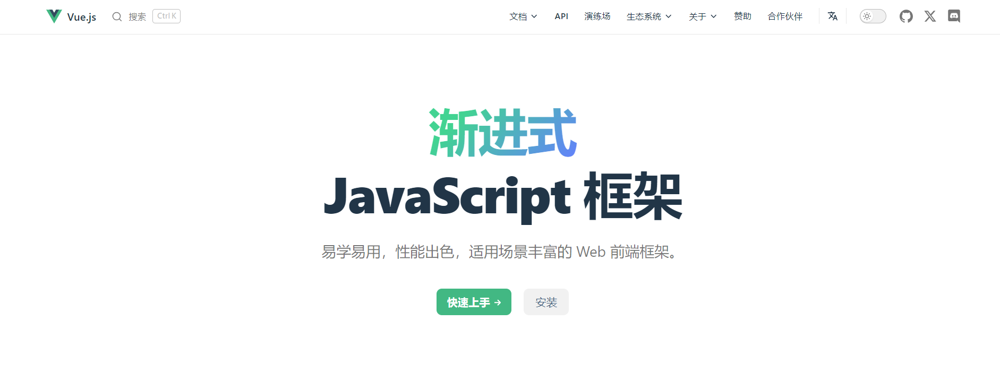 

在上面的这句话中呢，出现了三个词，分别是：构建用户界面、渐进式、框架。

**1). 构建用户界面**

构建用户界面是指，在Vue中，可以基于数据渲染出用户看到的界面。 那这句话什么意思呢？我们来举一个例子，比如将来服务器端返回给前端的原始数据呢，就是如下这个样子：

```js
userList: [
    {"id": 1, "name": "谢逊", "image": "1.jpg", "gender": 1, "job": "班主任"},
    {"id": 2, "name": "韦一笑", "image": "2.jpg", "gender": 1, "job": "班主任"}
]
```

而上面的这些原始数据，用户是看不懂的。 而我们开发人员呢，可以使用Vue中提供的操作，将原始数据遍历、解析出来，从而渲染呈现出用户所能看懂的界面，如下所示：

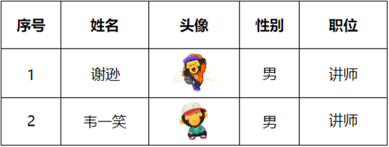 

那这个过程呢，就是基于数据渲染出用户看到的界面，也就是所谓的 构建用户界面。


**2). 渐进式**

渐进式中的渐进呢，字面意思就是 "循序渐进"。Vue生态中的语法呢是非常多的，比如声明式渲染、组件系统、客户端路由（VueRouter）、状态管理（Vuex、Pinia）、构建工具（Webpack、Vite）等等。

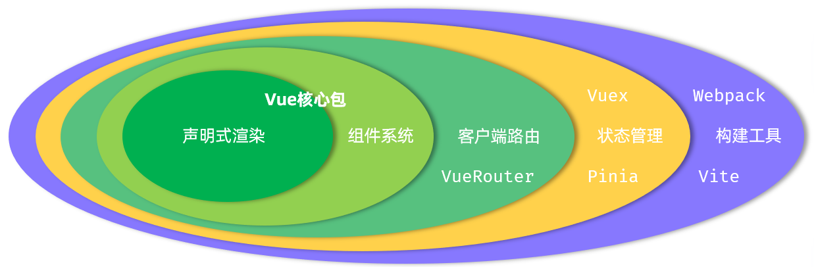 

所谓渐进，指的是我们使用Vue框架呢，我们不需要把所有的组件、语法全部学习完毕才可以使用Vue。 而是，我们学习一点就可以使用一点了，比如：

- 我们学习了声明式渲染，我们就可以使用Vue来构建用户界面了。 
- 我们再学习了组件系统，我们就可以使用Vue中的组件，从而来复用了。
- 我们再学习了路由VueRouter，就可以使用Vue中的中的路由功能了。

也就是说，并不需要全部学习完毕就可以直接使用Vue进行开发，简化操作、提高效率了。 Vue是一个框架，但其实也是一个生态。

> 💡 **本站工程化实践**：本项目使用 Vite + Vue 3 + TypeScript + Pinia 构建，体现了渐进式开发——从核心 Vue 逐步集成构建工具、类型系统和状态管理。

那由此呢，也就引出了Vue中两种常见的开发模式：

1. 基于Vue提供的核心包，完成项目局部模块的改造了。
2. 基于Vue提供的核心包、插件进行工程化开发，也就是做整站开发。

那上面的这两种Vue的使用形式，我们都会学习，今天我们先来学习第一种方式，就是使用Vue来完成局部模块改造。


**3). 框架**

- 框架：就是一套完整的项目解决方案，用于快速构建项目 。这是我们接触的第一个框架，那在我们后面的学习中，我们还会学习很多的java语言中的框架，那通过这些框架呢，就可以来快速开发java项目，提高开发效率。

- 优点：大大提升前端项目的开发效率 。

- 缺点：需要理解记忆框架的使用规则 。（参照官网）


好，那我们知道了什么是Vue之后，接下来，就要正式进入Vue的学习，我们今天主要讲解以下几个方面：

1. Vue快速入门
2. Vue常用指令
3. Ajax
4. Vue生命周期


# 2. 快速入门

接下来我们通过一个vue的快速入门案例，来体验一下Vue开发，并掌握Vue的开发步骤 。那在这个入门程序中，我们就要完成刚才上面提到的，基于数据渲染出用户看到的页面，也就是数据驱动视图（这个视图指的就是页面的展示）操作。

## 2.1 需求

在入门程序中，最终我们需要将准备的数据 message 的值，基于Vue渲染展示在页面中，最终呈现的形式如下：

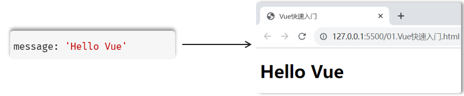 


## 2.2 步骤

**1). 准备工作：**

- 准备一个html文件，并在其中引入Vue模块 （参考官方文档，复制过来即可）【注意：模块化的js，引入时，需要设置 `type="module"`】
- 创建Vue程序的应用实例，控制视图的元素
- 准备元素（div），交给Vue控制

​	 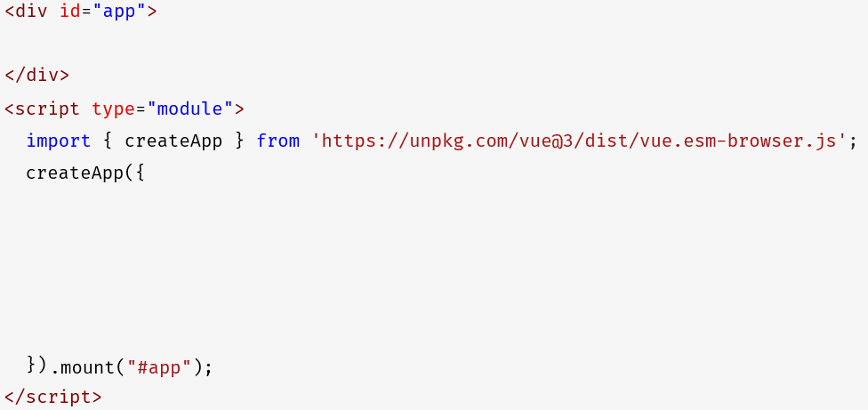 

​	 这三步准备工作，是我们使用Vue时，都需要做的，是固定步骤。 这样我们就搭建好了一个基本的Vue的结构了。

​	

**2). 数据驱动视图：**

- 准备数据。 在创建Vue应用实例的时候，传入了一个js对象，在这个js对象中，我们要定义一个data方法，这个data方法的返回值就是Vue中的数据。

- 通过插值表达式渲染页面。 插值表达式的写法：{{...}}

  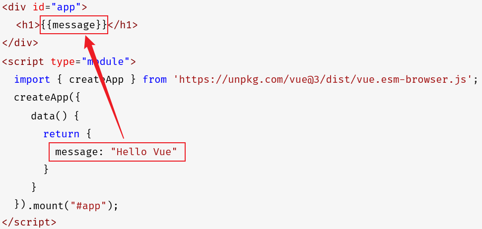 


## 2.3 实现

```html
<!DOCTYPE html>
<html lang="en">
<head>
  <meta charset="UTF-8">
  <meta name="viewport" content="width=device-width, initial-scale=1.0">
  <title>Vue-快速入门</title>
</head>
<body>
  <div id="app">
    {{message}}
  </div>
  
  <script type="module">
    import { createApp } from 'https://unpkg.com/vue@3/dist/vue.esm-browser.js'
    createApp({
      data(){
        return {
          message: 'Hello Vue'
        }
      }
    }).mount('#app')
  </script>
</body>
</html>
```

在上述入门程序编写时，需要注意这么几点：

- Vue中定义数据，必须通过data方法来定义，data方法返回值是一个对象，在这个对象中定义数据。
- 插值表达式中编写的变量，一定是Vue中定义的数据，如果插值表达式中编写了一个变量，但是在Vue中未定义，将会报错 。
- Vue应用实例接管的区域是 '#app'，超出这个范围，就不受Vue控制了，所以vue的插值表达式，一定写在 `<div id="app">...</div>` 的里面 。


# 3. Vue指令

## 3.1 介绍

刚才通过一个快速入门程序，大家快速感受了一下Vue的开发，并明确了Vue的开发步骤。那接下来，我们要来学习的是Vue中的常用指令，通过Vue中的指令，就可以将原始的数据，根据不同的需求，渲染展示在界面中。


而在讲解Vue指令的时候呢，我们将会通过一个小案例来贯穿始终。 那就是用户列表渲染的案例，需求如下所示：

将Vue中定义的数据userList，渲染展示在视图的表格之中。 在原始数据中，性别gender如果为1，展示为"男"；如果为2，展示为"女"。 在原始数据中，职位job如果为1，展示为"讲师"；如果为2，展示为"班主任"；如果为3，展示为"其他"。

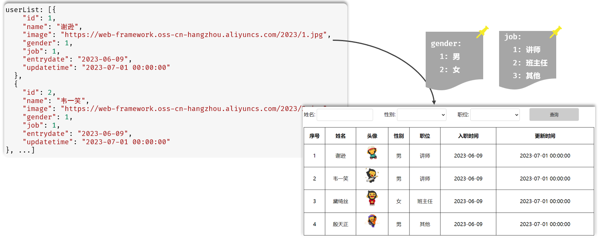 

而要想完成这个需求，就需要用到Vue中的一些常用指令，那接下来呢，我们就来介绍一下Vue中的常用指令。


**指令：**指的是HTML 标签上带有 v- 前缀的特殊属性，不同指令具有不同含义，可以实现不同的功能 。例如：v-if，v-for…

| **指令**              | **作用**                                            |
| --------------------- | --------------------------------------------------- |
| v-for                 | 列表渲染，遍历容器的元素或者对象的属性              |
| v-bind                | 为HTML标签绑定属性值，如设置 href , css样式等       |
| v-if/v-else-if/v-else | 条件性的渲染某元素，判定为true时渲染,否则不渲染     |
| v-show                | 根据条件展示某元素，区别在于切换的是display属性的值 |
| v-model               | 在表单元素上创建双向数据绑定                        |
| v-on                  | 为HTML标签绑定事件                                  |


## 3.2 v-for

### 3.2.1 介绍

作用：列表渲染，遍历容器的元素或者对象的属性

语法：`v-for = "(item,index) in items"`

参数：

- items 为遍历的数组

- item 为遍历出来的元素

- index 为索引/下标，从0开始 ；可以省略，省略index语法： `v-for = "item in items"`

示例：

​    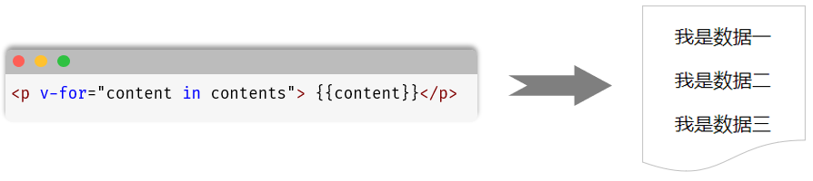 

 

### 3.2.2 演示

```html
<!DOCTYPE html>
<html lang="en">
<head>
  <meta charset="UTF-8">
  <meta name="viewport" content="width=device-width, initial-scale=1.0">
  <title>v-for入门</title>
</head>
<body>
  
  <div id="app">
    <p v-for="(name,index) in names">{{index + 1}}: {{name}}</p>
  </div>
  
  <script type="module">
    import { createApp } from 'https://unpkg.com/vue@3/dist/vue.esm-browser.js'
    createApp({
      data(){
        return {
          names: ['张无忌', '张三丰', '韦一笑', '殷天正']
        }
      }
    }).mount('#app')
  </script>
</body>
</html>
```

经过浏览器的解析渲染之后，展示出如下界面：

 


### 3.2.3 v-for的key

作用：给元素添加的唯一标识，便于vue进行列表项的正确排序复用

语法： `v-for="(item,index) in items" :key="唯一值"`

注意点:

- key的值只能是字符串 或 数字类型

-	key的值必须具有唯一性

- 推荐使用id作为key（唯一），不推荐使用index作为key（会变化，不对应）

写法：

​    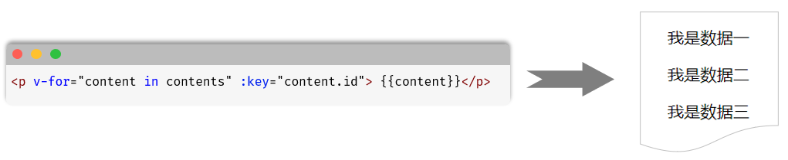 

   

> 提示：官方推荐在使用 v-for 时提供一个key属性，以遍可以追踪每个节点，提升渲染性能。

---

<details>
<summary>🔍 <strong>本站源码对照：v-for 实战应用</strong>（点击展开）</summary>

**📄 components/FileTree.vue** - 递归文件树渲染

```vue
<template>
  <ul class="pl-2">
    <!-- v-for 遍历文件节点数组，:key 使用唯一路径 -->
    <li v-for="node in nodes" :key="node.path" class="select-none mb-0.5">
      
      <!-- 文件夹（条件渲染 v-if） -->
      <div v-if="node.type === 'directory'" class="mb-1">
        <div class="flex items-center gap-1">
          <span>📁</span>
          <span>{{ node.name }}</span>
        </div>
        
        <!-- ✨ 递归调用自身渲染子目录 -->
        <div v-show="isOpen(node.path)">
          <FileTree 
            v-if="node.children" 
            :nodes="node.children" 
            :expanded-paths="expandedPaths"
            @select-file="$emit('select-file', $event)"
          />
        </div>
      </div>

      <!-- 文件（v-else 分支） -->
      <div v-else @click="$emit('select-file', node)">
        <span>{{ getFileIcon(node) }}</span>
        <span>{{ node.name }}</span>
      </div>
    </li>
  </ul>
</template>

<script setup lang="ts">
import type { FileNode } from '../types';

defineOptions({ name: 'FileTree' });  // 递归组件需要命名

const props = defineProps<{
  nodes: FileNode[];
  expandedPaths: string[];
}>();

const isOpen = (path: string) => props.expandedPaths.includes(path);
</script>
```

**要点解析：**
- `v-for="node in nodes"` 遍历数组
- `:key="node.path"` 使用唯一标识符
- 递归组件通过 `defineOptions({ name: 'FileTree' })` 自引用

</details>

---


### 3.2.4 案例-列表渲染

`v-for` 指令的作用及语法我们清楚之后，那接下来，我们就来完成案例中的列表渲染。 

```html
<!DOCTYPE html>
<html lang="en">

<head>
  <meta charset="UTF-8">
  <meta http-equiv="X-UA-Compatible" content="IE=edge">
  <meta name="viewport" content="width=device-width, initial-scale=1.0">
  <title>Vue3-案例1</title>
  <style>
    table,th,td {
      border: 1px solid #000;
      border-collapse: collapse;
      line-height: 50px;
      text-align: center;
    }

    #center,table {
      width: 60%;
      margin: auto;
    }

    #center {
      margin-bottom: 20px;
    }

    img {
      width: 50px;
    }

    input,select {
      width: 17%;
      padding: 10px;
      margin-right: 30px;
      border: 1px solid #ccc;
      border-radius: 4px;
    }

    .btn {
      background-color: #ccc;
    }
  </style>
</head>

<body>
  <div id="app">
    <div id="center">
      姓名: <input type="text" name="name">
      性别:
      <select name="gender">
        <option value="1">男</option>
        <option value="2">女</option>
      </select>
      职位:
      <select name="job">
        <option value="1">讲师</option>
        <option value="2">班主任</option>
        <option value="3">其他</option>
      </select>

      <input class="btn" type="button" value="查询">
    </div>

    <table>
      <tr>
        <th>序号</th>
        <th>姓名</th>
        <th>头像</th>
        <th>性别</th>
        <th>职位</th>
        <th>入职时间</th>
        <th>更新时间</th>
      </tr>
	  
      <!-- 基于 v-for 指令循环遍历用户数据列表 -->
      <tr v-for="(user, index) in userList" :key="user.id">
        <td>{{index + 1}}</td>
        <td>{{user.name}}</td>
        <td>  </td>
        <td>{{user.gender}}</td>
        <td>{{user.job}}</td>
        <td>{{user.entrydate}}</td>
        <td>{{user.updatetime}}</td>
      </tr>
    </table>
  </div>

  <script type="module">
    import { createApp } from 'https://unpkg.com/vue@3/dist/vue.esm-browser.js'

    createApp({
      data() {
        return {
          userList: [
            {
              "id": 1,
              "name": "谢逊",
              "image": "https://web-framework.oss-cn-hangzhou.aliyuncs.com/2023/1.jpg",
              "gender": 1,
              "job": 1,
              "entrydate": "2023-06-09",
              "updatetime": "2023-07-01 00:00:00"
            },
            {
              "id": 2,
              "name": "韦一笑",
              "image": "https://web-framework.oss-cn-hangzhou.aliyuncs.com/2023/2.jpg",
              "gender": 1,
              "job": 1,
              "entrydate": "2023-06-09",
              "updatetime": "2023-07-01 00:00:00"
            },
            {
              "id": 3,
              "name": "黛绮丝",
              "image": "https://web-framework.oss-cn-hangzhou.aliyuncs.com/2023/3.jpg",
              "gender": 2,
              "job": 2,
              "entrydate": "2023-06-09",
              "updatetime": "2023-07-01 00:00:00"
            },
            {
              "id": 4,
              "name": "殷天正",
              "image": "https://web-framework.oss-cn-hangzhou.aliyuncs.com/2023/4.jpg",
              "gender": 1,
              "job": 3,
              "entrydate": "2023-06-09",
              "updatetime": "2023-07-01 00:00:00"
            }
          ]
        }
      }
    }).mount("#app");
  </script>
</body>

</html>
```

浏览器打开此页面，最终浏览器中展示效果如下：

 

> 注意：插值表达式 {{...}} 只能用在标签内的文本区域，不能使用在标签的属性中，是无法解析的。所以上述的图片展示，是存在问题的（稍后解决）。


## 3.3 v-bind

### 3.3.1 介绍

作用：动态为HTML标签绑定属性值，如设置href，src，style样式等。

语法：`v-bind:属性名="属性值"`

简化：`:属性名="属性值"`

注意：v-bind 所绑定的数据，必须在data中定义。


### 3.3.2 演示

```html
<!DOCTYPE html>
<html lang="en">
<head>
  <meta charset="UTF-8">
  <meta name="viewport" content="width=device-width, initial-scale=1.0">
  <title>v-bind入门</title>
</head>
<body>
  
  <div id="app">
    <a v-bind:href="url">链接1</a> <br><br>
    <a :href="url">链接2</a>
  </div>
  
  <script type="module">
    import { createApp } from 'https://unpkg.com/vue@3/dist/vue.esm-browser.js'
    createApp({
      data(){
        return {
          url: 'https://www.itcast.cn'
        }
      }
    }).mount('#app')
  </script>
</body>
</html>
```

通过上述代码，已经为a标签的href属性绑定上了url变量，如果数据 url 发生变化，v-bind绑定的属性也会自动发生变化。 我们可以F12打开浏览器的开发者工具，通过Vue插件，来修改Vue的数据url，我们会看到超链接的链接的地址会自动发生变化 。 

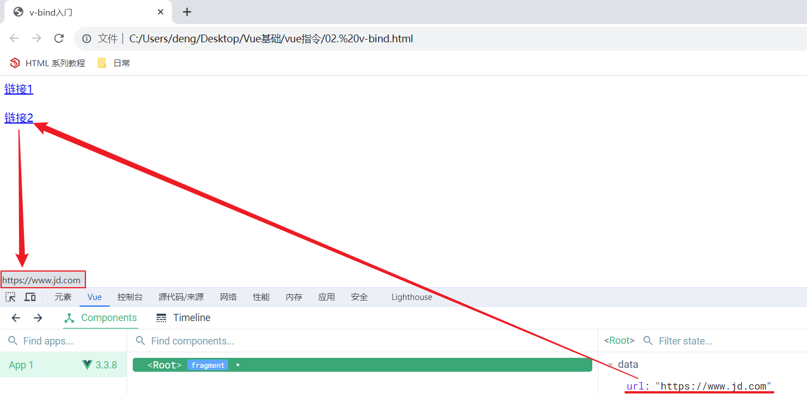 


### 3.3.3 案例-图片展示

接下来，我们就可以通过 `v-bind` 指令，来动态为 `` 的src属性绑定值，从而动态展示出图片内容。

```html
<!DOCTYPE html>
<html lang="en">

<head>
  <meta charset="UTF-8">
  <meta http-equiv="X-UA-Compatible" content="IE=edge">
  <meta name="viewport" content="width=device-width, initial-scale=1.0">
  <title>Vue3-案例1</title>
  <style>
    table,th,td {
      border: 1px solid #000;
      border-collapse: collapse;
      line-height: 50px;
      text-align: center;
    }

    #center,table {
      width: 60%;
      margin: auto;
    }

    #center {
      margin-bottom: 20px;
    }

    img {
      width: 50px;
    }

    input,select {
      width: 17%;
      padding: 10px;
      margin-right: 30px;
      border: 1px solid #ccc;
      border-radius: 4px;
    }

    .btn {
      background-color: #ccc;
    }
  </style>
</head>

<body>
  <div id="app">
    <div id="center">
      姓名: <input type="text" name="name">
      性别:
      <select name="gender">
        <option value="1">男</option>
        <option value="2">女</option>
      </select>
      职位:
      <select name="job">
        <option value="1">讲师</option>
        <option value="2">班主任</option>
        <option value="3">其他</option>
      </select>

      <input class="btn" type="button" value="查询">
    </div>

    <table>
      <tr>
        <th>序号</th>
        <th>姓名</th>
        <th>头像</th>
        <th>性别</th>
        <th>职位</th>
        <th>入职时间</th>
        <th>更新时间</th>
      </tr>

      <tr v-for="(user, index) in userList" :key="user.id">
        <td>{{index + 1}}</td>
        <td>{{user.name}}</td>
        <!-- 基于v-bind指令绑定src属性, 动态展示图片, 该指令简写为 : -->
        <td>  </td>
        <td>{{user.gender}}</td>
        <td>{{user.job}}</td>
        <td>{{user.entrydate}}</td>
        <td>{{user.updatetime}}</td>
      </tr>
    </table>
  </div>

  <script type="module">
    import { createApp } from 'https://unpkg.com/vue@3/dist/vue.esm-browser.js'

    createApp({
      data() {
        return {
          userList: [
            {
              "id": 1,
              "name": "谢逊",
              "image": "https://web-framework.oss-cn-hangzhou.aliyuncs.com/2023/1.jpg",
              "gender": 1,
              "job": 1,
              "entrydate": "2023-06-09",
              "updatetime": "2023-07-01 00:00:00"
            },
            {
              "id": 2,
              "name": "韦一笑",
              "image": "https://web-framework.oss-cn-hangzhou.aliyuncs.com/2023/2.jpg",
              "gender": 1,
              "job": 1,
              "entrydate": "2023-06-09",
              "updatetime": "2023-07-01 00:00:00"
            },
            {
              "id": 3,
              "name": "黛绮丝",
              "image": "https://web-framework.oss-cn-hangzhou.aliyuncs.com/2023/3.jpg",
              "gender": 2,
              "job": 2,
              "entrydate": "2023-06-09",
              "updatetime": "2023-07-01 00:00:00"
            },
            {
              "id": 4,
              "name": "殷天正",
              "image": "https://web-framework.oss-cn-hangzhou.aliyuncs.com/2023/4.jpg",
              "gender": 1,
              "job": 3,
              "entrydate": "2023-06-09",
              "updatetime": "2023-07-01 00:00:00"
            }
          ]
        }
      },
    }).mount("#app");
  </script>
</body>

</html>
```

上述代码经过浏览器的解析之后，我们会看到图片就可以正常显示出来了。

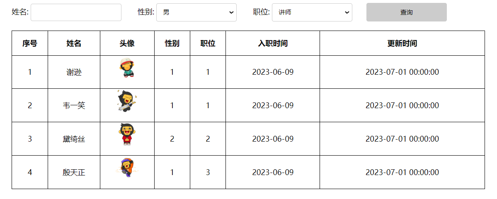 


> 注意：表格的基本内容，以及图片信息已经展示出来了，但是我们看到性别显示的确实1、2，那最终要展示出来的得是 男、女。


## 3.4 v-if & v-show

### 3.4.1 介绍

作用：这两类指令，都是用来控制元素的显示与隐藏的

v-if：

- 语法：v-if="表达式"，表达式值为 true，显示；false，隐藏

- 原理：基于条件判断，来控制创建或移除元素节点（条件渲染）

- 场景：要么显示，要么不显示，不频繁切换的场景

- 其它：可以配合 v-else-if / v-else 进行链式调用条件判断

   

v-show：

- 语法：v-show="表达式"，表达式值为 true，显示；false，隐藏

-	原理：基于CSS样式display来控制显示与隐藏

- 场景：频繁切换显示隐藏的场景


> 注意：v-else-if必须出现在v-if之后，可以出现多个； v-else 必须出现在v-if/v-else-if之后 。 

---

<details>
<summary>🔍 <strong>本站源码对照：v-if 与 v-show 实战应用</strong>（点击展开）</summary>

**📄 components/AppSidebar.vue** - 条件渲染不同视图模式

```vue
<template>
  <!-- 加载状态 (v-if) -->
  <div v-if="loading" class="flex flex-col items-center">
    <div class="animate-bounce text-2xl">🌸</div>
    <span>{{ t.reading_notes }}</span>
  </div>

  <!-- 实验室模式 (v-else-if) -->
  <div v-else-if="viewMode === 'lab'" class="animate-fade-in">
    <h3>{{ t.lab_tools }}</h3>
    <!-- 实验室工具列表 -->
  </div>

  <!-- 最新文章模式 (v-if，不同区域) -->
  <div v-if="viewMode === 'latest'" class="space-y-3">
    <ArticleCard v-for="file in filteredFlatFiles" :key="file.path" />
  </div>

  <!-- 归档模式 (v-else，默认分支) -->
  <div v-else class="animate-fade-in">
    <FileTree :nodes="filteredFileSystem" />
  </div>
</template>
```

**📄 App.vue** - v-show 控制弹窗（频繁切换）

```vue
<template>
  <!-- v-show 用于频繁切换的场景（弹窗） -->
  <div v-show="selectionMenu.show" class="fixed z-50 bg-white rounded-xl">
    <!-- 选择菜单内容 -->
  </div>

  <!-- 设置弹窗 -->
  <SettingsModal v-if="showSettings" @close="showSettings = false" />
  
  <!-- 搜索弹窗 -->
  <SearchModal v-if="showSearch" @close="showSearch = false" />
</template>
```

**v-if vs v-show 选择原则：**
| 指令 | 原理 | 适用场景 |
|------|------|----------|
| v-if | 销毁/创建 DOM | 条件很少改变 |
| v-show | CSS display | 频繁切换显示 |

</details>

---


### 3.4.2 案例-性别职位展示

那接下来，我们就通过 `v-if` 和 `v-show` 指令来完成性别 、职位数据的展示。 

```html
<!DOCTYPE html>
<html lang="en">

<head>
  <meta charset="UTF-8">
  <meta http-equiv="X-UA-Compatible" content="IE=edge">
  <meta name="viewport" content="width=device-width, initial-scale=1.0">
  <title>Vue3-案例1</title>
  <style>
    table,th,td {
      border: 1px solid #000;
      border-collapse: collapse;
      line-height: 50px;
      text-align: center;
    }

    #center,table {
      width: 60%;
      margin: auto;
    }

    #center {
      margin-bottom: 20px;
    }

    img {
      width: 50px;
    }

    input,select {
      width: 17%;
      padding: 10px;
      margin-right: 30px;
      border: 1px solid #ccc;
      border-radius: 4px;
    }

    .btn {
      background-color: #ccc;
    }
  </style>
</head>

<body>
  <div id="app">
    <div id="center">
      姓名: <input type="text" name="name">
      性别:
      <select name="gender">
        <option value="1">男</option>
        <option value="2">女</option>
      </select>
      职位:
      <select name="job">
        <option value="1">讲师</option>
        <option value="2">班主任</option>
        <option value="3">其他</option>
      </select>

      <input class="btn" type="button" value="查询">
    </div>

    <table>
      <tr>
        <th>序号</th>
        <th>姓名</th>
        <th>头像</th>
        <th>性别</th>
        <th>职位</th>
        <th>入职时间</th>
        <th>更新时间</th>
      </tr>

      <tr v-for="(user, index) in userList" :key="user.id">
        <td>{{index + 1}}</td>
        <td>{{user.name}}</td>
        <td>  </td>
        <td>
          <!-- v-if 控制显示或隐藏 -->
          <span v-if="user.gender == 1">男</span>
          <span v-else-if="user.gender == 2">女</span>
          <span v-else>其他</span>
        </td>
        <td>
          <!-- v-show 控制显示或隐藏 -->
          <span v-show="user.job == 1">讲师</span>
          <span v-show="user.job == 2">班主任</span>
          <span v-show="user.job == 3">其他</span>
        </td>
        <td>{{user.entrydate}}</td>
        <td>{{user.updatetime}}</td>
      </tr>
    </table>
  </div>

  <script type="module">
    import { createApp } from 'https://unpkg.com/vue@3/dist/vue.esm-browser.js'

    createApp({
      data() {
        return {
          userList: [
            {
              "id": 1,
              "name": "谢逊",
              "image": "https://web-framework.oss-cn-hangzhou.aliyuncs.com/2023/1.jpg",
              "gender": 1,
              "job": 1,
              "entrydate": "2023-06-09",
              "updatetime": "2023-07-01 00:00:00"
            },
            {
              "id": 2,
              "name": "韦一笑",
              "image": "https://web-framework.oss-cn-hangzhou.aliyuncs.com/2023/2.jpg",
              "gender": 1,
              "job": 1,
              "entrydate": "2023-06-09",
              "updatetime": "2023-07-01 00:00:00"
            },
            {
              "id": 3,
              "name": "黛绮丝",
              "image": "https://web-framework.oss-cn-hangzhou.aliyuncs.com/2023/3.jpg",
              "gender": 2,
              "job": 2,
              "entrydate": "2023-06-09",
              "updatetime": "2023-07-01 00:00:00"
            },
            {
              "id": 4,
              "name": "殷天正",
              "image": "https://web-framework.oss-cn-hangzhou.aliyuncs.com/2023/4.jpg",
              "gender": 1,
              "job": 3,
              "entrydate": "2023-06-09",
              "updatetime": "2023-07-01 00:00:00"
            }
          ]
        }
      },
    }).mount("#app");
  </script>
</body>

</html>
```

浏览器打开此页面后，经过浏览器的解析，数据可以正确的显示出来了 。

 


通过F12，打开浏览器的开发者工具，我们可以看到 `v-if` 控制元素的显示与隐藏时，如果条件不成立，压根就不会渲染对应的元素。 而通过 `v-show` 控制元素的显示或隐藏，基于 CSS 样式display来控制显示与隐藏。

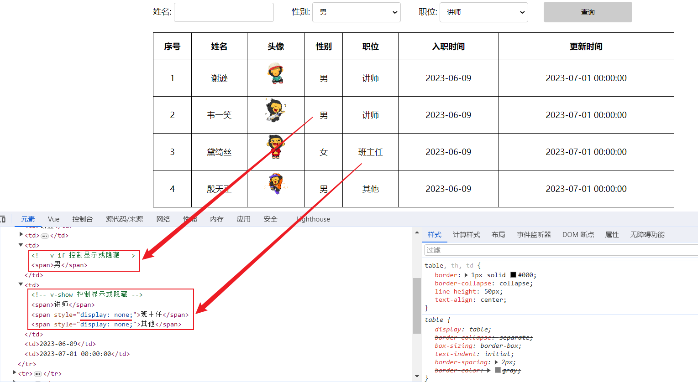 


所以，对于 `v-if` 适用于控制显示或隐藏不频繁的场景。 而 `v-show` 适用于显示与隐藏切换频繁的场景。


## 3.6 v-model

### 3.6.1 介绍

作用：在表单元素上使用，双向数据绑定。可以方便的 获取 或 设置 表单项数据 

语法：`v-model="变量名"`


这里的双向数据绑定，是指 Vue中的数据变化，会影响视图中的数据展示。 视图中的输入的数据变化，也会影响Vue的数据模型 。

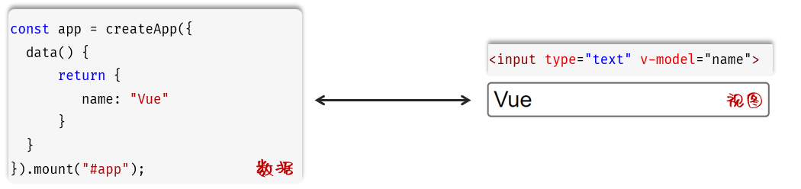 


> 注意：v-model 中绑定的变量，必须在data中定义。


### 3.6.2 演示

```html
<!DOCTYPE html>
<html lang="en">
<head>
  <meta charset="UTF-8">
  <meta name="viewport" content="width=device-width, initial-scale=1.0">
  <title>v-model入门</title>
</head>
<body>
  <div id="app">
    <input type="text" v-model="name"> <br>
    {{name}}
  </div>
  
  <script type="module">
    import { createApp } from 'https://unpkg.com/vue@3/dist/vue.esm-browser.js'
    createApp({
      data(){
        return {
          name: 'Vue'
        }
      }
    }).mount('#app')
  </script>
</body>
</html>
```

最终的效果如下： 视图中的数据变化，会影响Vue的数据模型。 Vue的属性模型变化，也会影响视图的展示 。

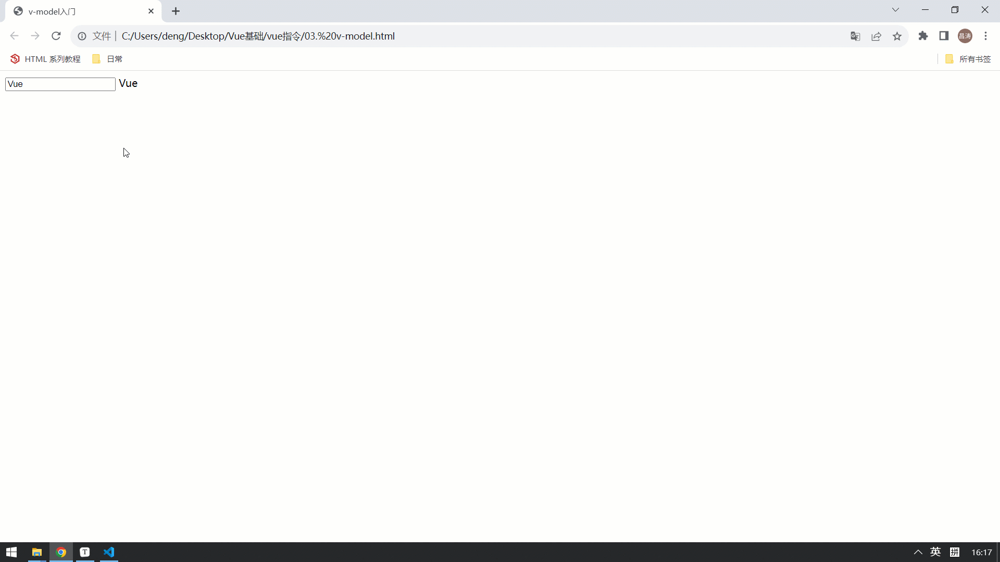


### 3.6.3 案例-获取搜索条件

接下来，我们要来完成案例中，搜索栏中用户输入的表单数据，用户输入表单项数据后，要将数据展示出来 。

```html
<!DOCTYPE html>
<html lang="en">

<head>
  <meta charset="UTF-8">
  <meta http-equiv="X-UA-Compatible" content="IE=edge">
  <meta name="viewport" content="width=device-width, initial-scale=1.0">
  <title>Vue3-案例1</title>
  <style>
    table,th,td {
      border: 1px solid #000;
      border-collapse: collapse;
      line-height: 50px;
      text-align: center;
    }

    #center,table {
      width: 60%;
      margin: auto;
    }

    #center {
      margin-bottom: 20px;
    }

    img {
      width: 50px;
    }

    input,select {
      width: 17%;
      padding: 10px;
      margin-right: 30px;
      border: 1px solid #ccc;
      border-radius: 4px;
    }

    .btn {
      background-color: #ccc;
    }
  </style>
</head>

<body>
  <div id="app">
    <div id="center">
      <!-- 通过 v-model 绑定表单项数据，而这些变量，必须在data中定义 -->
      姓名: <input type="text" v-model="name">
      性别:
      <select v-model="gender">
        <option value="1">男</option>
        <option value="2">女</option>
      </select>
      职位:
      <select v-model="job">
        <option value="1">讲师</option>
        <option value="2">班主任</option>
        <option value="3">其他</option>
      </select>
      
      <input class="btn" type="button" value="查询">
    </div>
    
    <table>
      <tr>
        <th>序号</th>
        <th>姓名</th>
        <th>头像</th>
        <th>性别</th>
        <th>职位</th>
        <th>入职时间</th>
        <th>更新时间</th>
      </tr>

      <tr v-for="(user, index) in userList" :key="user.id">
        <td>{{index + 1}}</td>
        <td>{{user.name}}</td>
        <td>  </td>
        <td>
          <span v-if="user.gender == 1">男</span>
          <span v-else-if="user.gender == 2">女</span>
          <span v-else>其他</span>
        </td>
        <td>
          <span v-if="user.job == 1">讲师</span>
          <span v-else-if="user.job == 2">班主任</span>
          <span v-else>其他</span>
        </td>
        <td>{{user.entrydate}}</td>
        <td>{{user.updatetime}}</td>
      </tr>
    </table>
    {{name}} - {{gender}} - {{job}}
  </div>

  <script type="module">
    import { createApp } from 'https://unpkg.com/vue@3/dist/vue.esm-browser.js'

    createApp({
      data() {
        return {
          //定义数据
          name: '',
          gender: '',
          job: '',
          
          userList: [
            {
              "id": 1,
              "name": "谢逊",
              "image": "https://web-framework.oss-cn-hangzhou.aliyuncs.com/2023/1.jpg",
              "gender": 1,
              "job": 1,
              "entrydate": "2023-06-09",
              "updatetime": "2023-07-01 00:00:00"
            },
            {
              "id": 2,
              "name": "韦一笑",
              "image": "https://web-framework.oss-cn-hangzhou.aliyuncs.com/2023/2.jpg",
              "gender": 1,
              "job": 1,
              "entrydate": "2023-06-09",
              "updatetime": "2023-07-01 00:00:00"
            },
            {
              "id": 3,
              "name": "黛绮丝",
              "image": "https://web-framework.oss-cn-hangzhou.aliyuncs.com/2023/3.jpg",
              "gender": 2,
              "job": 2,
              "entrydate": "2023-06-09",
              "updatetime": "2023-07-01 00:00:00"
            },
            {
              "id": 4,
              "name": "殷天正",
              "image": "https://web-framework.oss-cn-hangzhou.aliyuncs.com/2023/4.jpg",
              "gender": 1,
              "job": 3,
              "entrydate": "2023-06-09",
              "updatetime": "2023-07-01 00:00:00"
            }
          ]
        }
      },
    }).mount("#app");
  </script>
</body>

</html>
```

最终在浏览器中执行，我们会看到，我们是可以实时获取到表单的数据的，因为已经将其绑定到了 name、gender、job 数据模型中 。

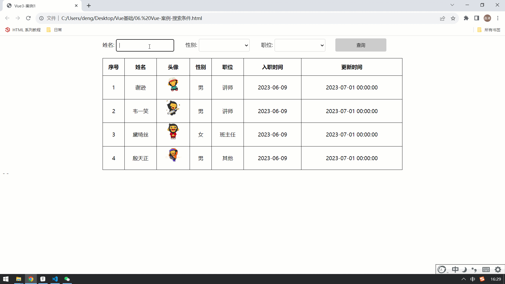


那现在我们已经可以正常的获取到表单的数据，正常的业务操作应该是点击 "查询" 之后，要执行查询操作。 那接下来，我们就先来为 "查询" 按钮绑定事件，点击查询按钮，获取到表单数据，并输出出来 。


## 3.7 v-on

### 3.7.1 介绍

作用：为html标签绑定事件（添加时间监听）

语法：

- `v-on:事件名="内联语句"`

  - ```html
    <input type="button" value="点我一下试试" v-on:click="console.log('试试就试试');">
    ```

- `v-on:事件名="函数名"`

  - ```html
    <input type="button" value="点我一下试试" v-on:click="handle">
    ```

    这里的handle函数，就需要在Vue应用实例创建的时候创建出来，在methods定义。

- 简写为 `@事件名="…"` 


### 3.7.2 演示

```html
<!DOCTYPE html>
<html lang="en">
<head>
  <meta charset="UTF-8">
  <meta name="viewport" content="width=device-width, initial-scale=1.0">
  <title>v-on入门</title>
</head>
<body>
  
  <div id="app">
    <input type="button" value="点我一下试试" v-on:click="handle">
    <input type="button" value="再点我一下试试" @click="handle">
  </div>
  
  <script type="module">
    import { createApp } from 'https://unpkg.com/vue@3/dist/vue.esm-browser.js'
    createApp({
      data(){
        return {
          name: 'Vue'
        }
      },
      methods: {
        handle(){
          console.log('试试就试试');
        }
      }
    }).mount('#app')
  </script>
</body>
</html>
```


### 3.7.3 案例-事件绑定

那接下来，我们就案例中的 "查询" 按钮绑定事件。 就需要用到上述的 v-on 指令。

```html
<!DOCTYPE html>
<html lang="en">

<head>
  <meta charset="UTF-8">
  <meta http-equiv="X-UA-Compatible" content="IE=edge">
  <meta name="viewport" content="width=device-width, initial-scale=1.0">
  <title>Vue3-案例1</title>
  <style>
    table,th,td {
      border: 1px solid #000;
      border-collapse: collapse;
      line-height: 50px;
      text-align: center;
    }

    #center,table {
      width: 60%;
      margin: auto;
    }

    #center {
      margin-bottom: 20px;
    }

    img {
      width: 50px;
    }

    input,select {
      width: 17%;
      padding: 10px;
      margin-right: 30px;
      border: 1px solid #ccc;
      border-radius: 4px;
    }

    .btn {
      background-color: #ccc;
    }
  </style>
</head>

<body>
  <div id="app">
    <div id="center">
      姓名: <input type="text" v-model="name">
      性别:
      <select v-model="gender">
        <option value="1">男</option>
        <option value="2">女</option>
      </select>
      职位:
      <select v-model="job">
        <option value="1">讲师</option>
        <option value="2">班主任</option>
        <option value="3">其他</option>
      </select>
      
      <!-- <input class="btn" type="button" value="查询" v-on:click="handle"> -->
      <input class="btn" type="button" value="查询" @click="handle">
    </div>
    
    <table>
      <tr>
        <th>序号</th>
        <th>姓名</th>
        <th>头像</th>
        <th>性别</th>
        <th>职位</th>
        <th>入职时间</th>
        <th>更新时间</th>
      </tr>

      <tr v-for="(user, index) in userList" :key="user.id">
        <td>{{index + 1}}</td>
        <td>{{user.name}}</td>
        <td>  </td>
        <td>
          <span v-if="user.gender == 1">男</span>
          <span v-else-if="user.gender == 2">女</span>
          <span v-else>其他</span>
        </td>
        <td>
          <span v-if="user.job == 1">讲师</span>
          <span v-else-if="user.job == 2">班主任</span>
          <span v-else>其他</span>
        </td>
        <td>{{user.entrydate}}</td>
        <td>{{user.updatetime}}</td>
      </tr>
    </table>
  </div>

  <script type="module">
    import { createApp } from 'https://unpkg.com/vue@3/dist/vue.esm-browser.js'

    createApp({
      data() {
        return {
          name: '',
          gender: '',
          job: '',
          userList: [
            {
              "id": 1,
              "name": "谢逊",
              "image": "https://web-framework.oss-cn-hangzhou.aliyuncs.com/2023/1.jpg",
              "gender": 1,
              "job": "班主任",
              "entrydate": "2023-06-09",
              "updatetime": "2023-07-01 00:00:00"
            },
            {
              "id": 2,
              "name": "韦一笑",
              "image": "https://web-framework.oss-cn-hangzhou.aliyuncs.com/2023/2.jpg",
              "gender": 1,
              "job": "班主任",
              "entrydate": "2023-06-09",
              "updatetime": "2023-07-01 00:00:00"
            },
            {
              "id": 3,
              "name": "黛绮丝",
              "image": "https://web-framework.oss-cn-hangzhou.aliyuncs.com/2023/3.jpg",
              "gender": 2,
              "job": "班主任",
              "entrydate": "2023-06-09",
              "updatetime": "2023-07-01 00:00:00"
            },
            {
              "id": 4,
              "name": "殷天正",
              "image": "https://web-framework.oss-cn-hangzhou.aliyuncs.com/2023/4.jpg",
              "gender": 1,
              "job": "班主任",
              "entrydate": "2023-06-09",
              "updatetime": "2023-07-01 00:00:00"
            }
          ]
        }
      },
      methods: {
       handle: function(){
         console.log(`查询啦, 查询条件: name=${this.name}, gender=${this.gender}, job=${this.job}`);
       } 
      }
    }).mount("#app");
  </script>
</body>

</html>
```

浏览器打开此页面，测试，我们会看控制台输出了我们所选择的查询条件。

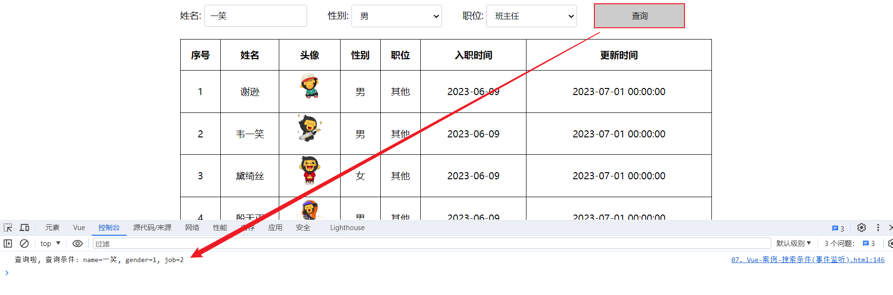 


> 注意：在methods声明的方法中，如果想要获取Vue的数据，可以通过this关键字，获取到vue应用实例，从而获取到实例中的数据信息。


# 4. Ajax

## 4.1 概述

我们前端页面中的数据，如下图所示的表格中的学生信息，应该来自于后台，那么我们的后台和前端是互不影响的2个程序，那么我们前端应该如何从后台获取数据呢？因为是2个程序，所以必须涉及到2个程序的交互，所以这就需要用到我们接下来学习的Ajax技术。

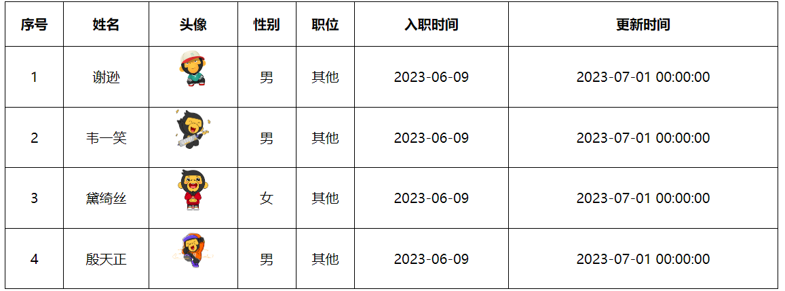 

**Ajax:** 全称Asynchronous JavaScript And XML，异步的JavaScript和XML。其作用有如下2点：

- 与服务器进行数据交换：通过Ajax可以给服务器发送请求，并获取服务器响应的数据。
- 异步交互：可以在**不重新加载整个页面**的情况下，与服务器交换数据并**更新部分网页**的技术，如：搜索联想、用户名是否可用的校验等等。


我们详细的解释一下Ajax技术的2个作用

- 与服务器进行数据交互

  如下图所示前端资源被浏览器解析，但是前端页面上缺少数据，前端可以通过Ajax技术，向后台服务器发起请求，后台服务器接受到前端的请求，从数据库中获取前端需要的资源，然后响应给前端，前端在通过我们学习的vue技术，可以将数据展示到页面上，这样用户就能看到完整的页面了。此处可以对比JavaSE中的网络编程技术来理解。

​		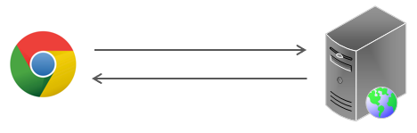 


- 异步交互：可以在**不重新加载整个页面**的情况下，与服务器交换数据并**更新部分网页**的技术。

  如下图所示，当我们再百度搜索java时，下面的联想数据是通过Ajax请求从后台服务器得到的，在整个过程中，我们的Ajax请求不会导致整个百度页面的重新加载，并且只针对搜索栏这局部模块的数据进行了数据的更新，不会对整个页面的其他地方进行数据的更新，这样就大大提升了页面的加载速度，用户体验高。

​		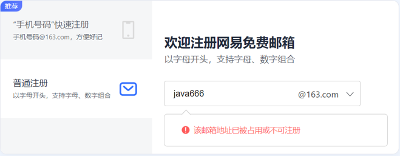 


## 4.2 同步异步

针对于上述Ajax的局部刷新功能是因为Ajax请求是异步的，与之对应的有同步请求。接下来我们介绍一下异步请求和同步请求的区别。

- 同步请求发送过程如下图所示：

  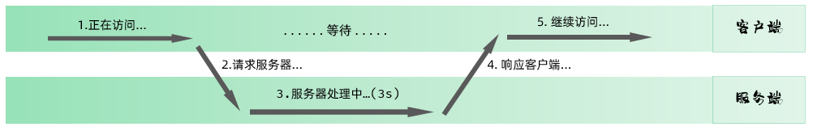 

​		 浏览器页面在发送请求给服务器，在服务器处理请求的过程中，浏览器页面不能做其他的操作。只能等到服务器响应结束后才能，浏览器页面才能继续做其他的操	    作。 


- 异步请求发送过程如下图所示：

  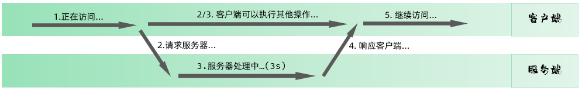 

​		浏览器页面发送请求给服务器，在服务器处理请求的过程中，浏览器页面还可以做其他的操作。 


## 4.3 原生Ajax

对于Ajax技术有了充分的认知了，我们接下来通过代码来演示Ajax的效果。此处我们先采用原生的Ajax代码来演示。因为Ajax请求是基于客户端发送请求，服务器响应数据的技术。所以为了完成快速入门案例，我们需要提供服服务器端和编写客户端。

**1). 服务器端**

因为我们暂时还没学过服务器端的代码，所以此处已经直接提供好了服务器端的请求地址，我们前端直接通过Ajax请求访问该地址即可。**后台服务器地址**：https://mock.apifox.cn/m1/3083103-0-default/emps/list

上述地址我们也可以直接通过浏览器来访问，访问结果如图所示：只截取部分数据

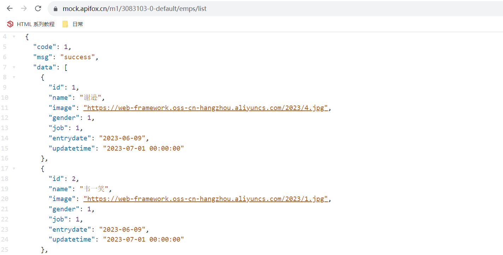 


**2). 客户端**

客户端的Ajax请求代码如下有如下4步，接下来我们跟着步骤一起操作一下。

1. 创建XMLHttpRequest对象：用于和服务器交换数据

2. 向服务器发送请求

3. 获取服务器响应数据

具体代码如下（在资料中已经提供，无需自己编写）：

```html
<!DOCTYPE html>
<html lang="en">
<head>
    <meta charset="UTF-8">
    <meta http-equiv="X-UA-Compatible" content="IE=edge">
    <meta name="viewport" content="width=device-width, initial-scale=1.0">
    <title>原生Ajax</title>
</head>
<body>  
    <input id="btn1" type="button" value="获取数据">
    
    <div id="div1"></div>

    <script>
        document.querySelector('#btn1').addEventListener('click', ()=> {
          //1. 创建XMLHttpRequest 
          var xmlHttpRequest  = new XMLHttpRequest();
          
          //2. 发送异步请求
          xmlHttpRequest.open('GET', 'https://mock.apifox.cn/m1/3083103-0-default/emps/list');
          xmlHttpRequest.send();//发送请求
          
          //3. 获取服务响应数据
          xmlHttpRequest.onreadystatechange = function(){
              if(xmlHttpRequest.readyState == 4 && xmlHttpRequest.status == 200){
                  document.getElementById('div1').innerHTML = xmlHttpRequest.responseText;
              }
          }
        })
    </script>
</body>
</html>
```

  最后我们通过浏览器打开页面，请求点击按钮，发送Ajax请求，最终显示结果如下图所示：

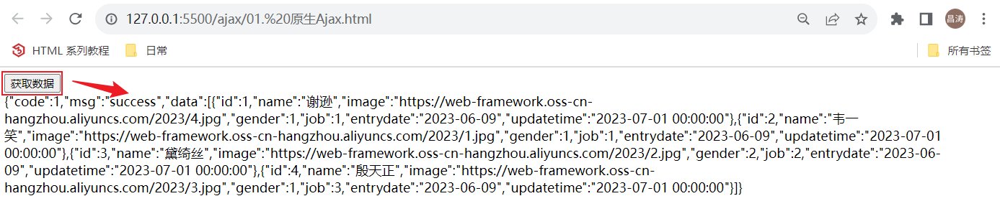


## 4.4 Axios

上述原生的Ajax请求的代码编写起来还是比较繁琐的，所以接下来我们学习一门更加简单的发送Ajax请求的技术Axios 。Axios是对原生的AJAX进行封装，简化书写。Axios官网是：`https://www.axios-http.cn`

### 4.4.1 Axios的基本使用

Axios的使用比较简单，主要分为2步：

- 引入Axios文件

  ~~~html
  <script src="js/axios-0.18.0.js"></script>
  ~~~

  

- 使用Axios发送请求，并获取响应结果，官方提供的api很多，此处给出2种，如下

  - 发送 get 请求

    ~~~js
    axios({
        method:"get",
        url:"https://mock.apifox.cn/m1/3083103-0-default/emps/list"
    }).then(function (resp){
        alert(resp.data);
    })
    ~~~

  - 发送 post 请求

    ```js
    axios({
        method:"post",
        url:"https://mock.apifox.cn/m1/3083103-0-default/emps/update",
        data:"id=1"
    }).then(function (resp){
        alert(resp.data);
    });
    ```

  axios()是用来发送异步请求的，小括号中使用 js的JSON对象传递请求相关的参数：

  - method属性：用来设置请求方式的。取值为 get 或者 post。
  - url属性：用来书写请求的资源路径。如果是 get 请求，需要将请求参数拼接到路径的后面，格式为： url?参数名=参数值&参数名2=参数值2。
  - data属性：作为请求体被发送的数据。也就是说如果是 post 请求的话，数据需要作为 data 属性的值。

  then() 需要传递一个匿名函数。我们将 then()中传递的匿名函数称为 **回调函数**，意思是该匿名函数在发送请求时不会被调用，而是在成功响应后调用的函数。而该回调函数中的 resp 参数是对响应的数据进行封装的对象，通过 resp.data 可以获取到响应的数据。

  


### 4.4.2 Axios入门程序

- 后端实现

  查询所有员工信息服务器地址(GET)：https://mock.apifox.cn/m1/3083103-0-default/emps/list

  更新员工信息服务器地址(POST)：https://mock.apifox.cn/m1/3083103-0-default/emps/update

  

- 前端实现

  A. 引入`axios.min.js`  【联网加载 或 引入下载好的本地的JS都可以】

  B. 为两个 "按钮" 绑定事件

  C. 触发事件之后，基于axios发送异步请求，分别发送GET请求、POST请求获取数据

   

  完整代码如下：

  ~~~html
  <!DOCTYPE html>
  <html lang="en">
  <head>
      <meta charset="UTF-8">
      <meta http-equiv="X-UA-Compatible" content="IE=edge">
      <meta name="viewport" content="width=device-width, initial-scale=1.0">
      <title>Ajax-Axios</title>
  </head>
  <body>
      
      <input type="button" value="获取数据GET" id="btnGet">
      <input type="button" value="删除数据POST" id="btnPost">
  
      <script src="https://unpkg.com/axios/dist/axios.min.js"></script>
      <script>
          //GET请求
          document.querySelector('#btnGet').addEventListener('click', ()=>{
              axios({
                  url: 'https://mock.apifox.cn/m1/3083103-0-default/emps/list',
                  method: 'GET'
              }).then(result => {
                  console.log(result.data);
              }).catch(err => {
                  console.log(err);
              })
          })
  
          //POST请求
          document.querySelector('#btnPost').addEventListener('click', ()=>{
              axios({
                  url: 'https://mock.apifox.cn/m1/3083103-0-default/emps/update',
                  method: 'POST',
                  data:'id=1'
              }).then(result => {
                  console.log(result.data);
              }).catch(err => {
                  console.log(err);
              })
          })
      </script>
  </body>
  </html>
  ~~~

  

  浏览器打开，f12抓包，然后分别点击2个按钮，查看控制台效果如下：

  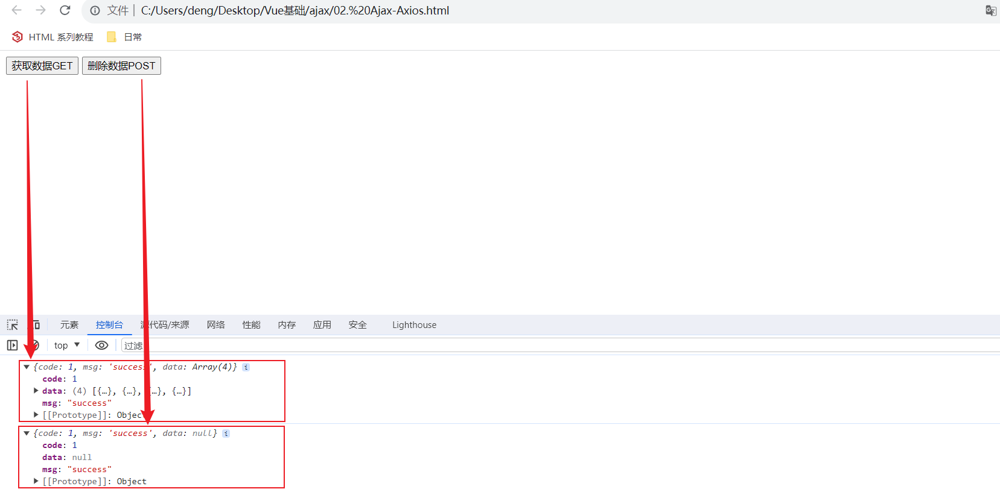 


### 4.4.3 请求方法的别名

Axios还针对不同的请求，提供了别名方式的api，具体格式如下：

```
axios.请求方式(url [, data [, config]])
```

具体如下：

| 方法                               | 描述           |
| ---------------------------------- | -------------- |
| axios.get(url [, config])          | 发送get请求    |
| axios.delete(url [, config])       | 发送delete请求 |
| axios.post(url [, data[, config]]) | 发送post请求   |
| axios.put(url [, data[, config]])  | 发送put请求    |

我们目前只关注get和post请求，所以在上述的入门案例中，我们可以将get请求代码改写成如下：

~~~js
axios.get("https://mock.apifox.cn/m1/3083103-0-default/emps/list").then(result => {
    console.log(result.data);
})
~~~

post请求改写成如下：

~~~js
axios.post("https://mock.apifox.cn/m1/3083103-0-default/emps/update","id=1").then(result => {
    console.log(result.data);
})
~~~


## 4.5 案例-Ajax异步获取数据

通过上面的学习，我们已经清楚了什么是Ajax，已经如何发送Ajax异步请求。 那解下来呢，我们就要完成员工列表数据加载的这个案例。 

需求：当点击查询按钮时，发送Ajax异步请求，根据传递的查询条件，动态获取数据，渲染列表页面。

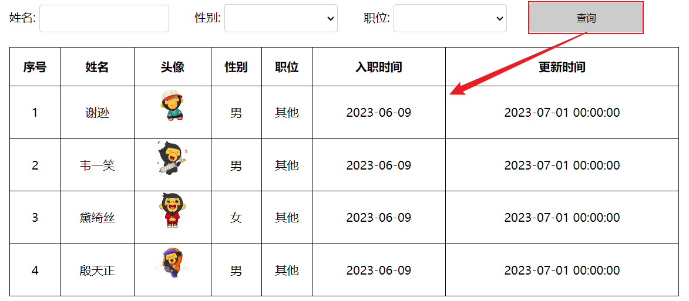 

服务端地址：https://web-server.itheima.net/emps/list


具体代码如下：

```html
<!DOCTYPE html>
<html lang="en">

<head>
  <meta charset="UTF-8">
  <meta http-equiv="X-UA-Compatible" content="IE=edge">
  <meta name="viewport" content="width=device-width, initial-scale=1.0">
  <title>Vue3-案例1</title>
  <style>
    table,th,td {
      border: 1px solid #000;
      border-collapse: collapse;
      line-height: 50px;
      text-align: center;
    }

    #center,table {
      width: 60%;
      margin: auto;
    }

    #center {
      margin-bottom: 20px;
    }

    img {
      width: 50px;
    }

    input,select {
      width: 17%;
      padding: 10px;
      margin-right: 30px;
      border: 1px solid #ccc;
      border-radius: 4px;
    }

    .btn {
      background-color: #ccc;
    }
  </style>
</head>

<body>
  <div id="app">
    <div id="center">
      姓名: <input type="text" v-model="name">
      性别:
      <select v-model="gender">
        <option value="1">男</option>
        <option value="2">女</option>
      </select>
      职位:
      <select v-model="job">
        <option value="1">讲师</option>
        <option value="2">班主任</option>
        <option value="3">其他</option>
      </select>
      
      <!-- <input class="btn" type="button" value="查询" v-on:click="handle"> -->
      <input class="btn" type="button" value="查询" @click="handle">
    </div>
    
    <table>
      <tr>
        <th>序号</th>
        <th>姓名</th>
        <th>头像</th>
        <th>性别</th>
        <th>职位</th>
        <th>入职时间</th>
        <th>更新时间</th>
      </tr>

      <tr v-for="(user, index) in userList" :key="user.id">
        <td>{{index + 1}}</td>
        <td>{{user.name}}</td>
        <td>  </td>
        <td>
          <span v-if="user.gender == 1">男</span>
          <span v-else-if="user.gender == 2">女</span>
          <span v-else>其他</span>
        </td>
        <td>
          <span v-if="user.job == 1">讲师</span>
          <span v-else-if="user.job == 2">班主任</span>
          <span v-else>其他</span>
        </td>
        <td>{{user.entrydate}}</td>
        <td>{{user.updatetime}}</td>
      </tr>
    </table>
  </div>

  <script src="https://unpkg.com/axios/dist/axios.min.js"></script>
  <script type="module">
    import { createApp } from 'https://unpkg.com/vue@3/dist/vue.esm-browser.js'

    createApp({
      data() {
        return {
          name: '',
          gender: '',
          job: '',
          userList: []
        }
      },
      methods: {
       handle: function(){
         console.log(`查询啦, 查询条件: name=${this.name}, gender=${this.gender}, job=${this.job}`);
         axios.get(`https://web-server.itheima.net/emps/list?name=${this.name}&gender=${this.gender}&job=${this.job}`).then((result) => {
            this.userList = result.data.data;
         })
       } 
      }
    }).mount("#app");
  </script>
</body>

</html>
```


打开浏览器测试：

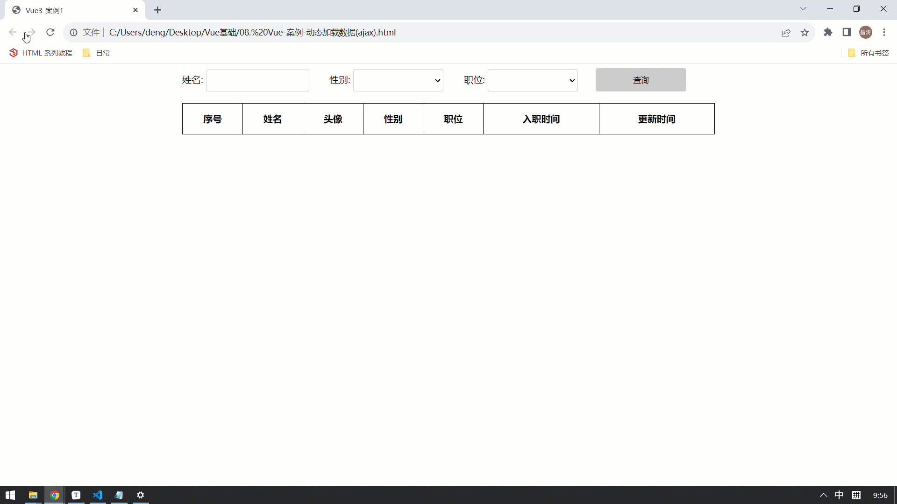


经过上面的测试之后，我们看到，当我们点击 "查询" 按钮时，确实可以发送Ajax异步请求，动态获取数据。但是，我们打开这个页面时，表格内容却是一片空白，只有点击了查询按钮才会展示出数据。 而在正常的系统中，应该是进入页面时，就会展示出表格中的数据的。

那如何在页面打开之后，就自动执行查询呢？ 那此时，我们就需要用到Vue中生命周期的相关函数了。那接下来，我们就来学习Vue的声明周期。


# 5. 生命周期

## 5.1 介绍

vue的生命周期：指的是vue对象从创建到销毁的过程。

vue的生命周期包含8个阶段：每触发一个生命周期事件，会自动执行一个生命周期方法，这些生命周期方法也被称为钩子方法。其完整的生命周期如下图所示：

| 状态          | 阶段周期 |
| ------------- | -------- |
| beforeCreate  | 创建前   |
| created       | 创建后   |
| beforeMount   | 挂载前   |
| mounted       | 挂载完成 |
| beforeUpdate  | 更新前   |
| updated       | 更新后   |
| beforeDestroy | 销毁前   |
| destroyed     | 销毁后   |

下图是 Vue 官网提供的从创建 Vue 到效果 Vue 对象的整个过程及各个阶段对应的钩子函数：

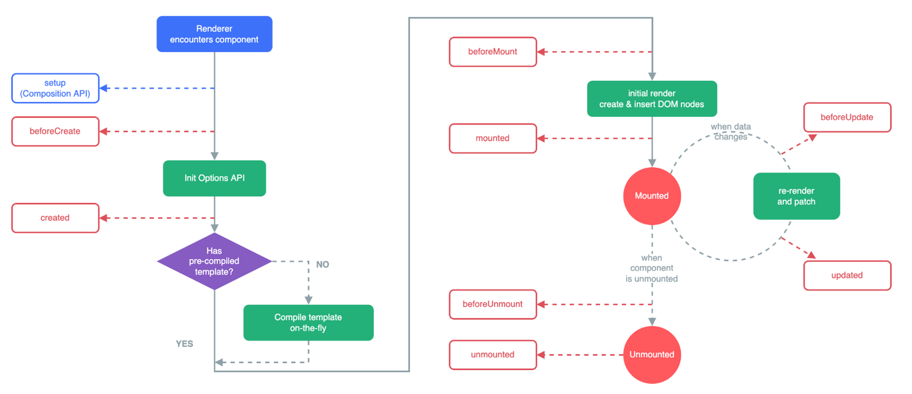 

其中我们需要重点关注的是**mounted，**其他的我们了解即可。


mounted：挂载完成，Vue初始化成功，HTML页面渲染成功。**以后我们一般用于页面初始化自动的ajax请求后台数据**

---

<details>
<summary>🔍 <strong>本站源码对照：onMounted 生命周期钩子</strong>（点击展开）</summary>

**📄 App.vue** - onMounted 实际应用

```typescript
import { ref, onMounted, watch, nextTick } from 'vue';

// =====================
// 生命周期钩子
// =====================
onMounted(async () => {
  // 1. 检测移动端
  const checkMobile = () => {
    isMobile.value = window.innerWidth < 768;
  };
  checkMobile();
  window.addEventListener('resize', checkMobile);

  // 2. 移动端滚动行为（隐藏/显示头部）
  const scrollContainer = document.getElementById('scroll-container');
  const handleScroll = () => {
    if (!isMobile.value) {
      headerHidden.value = false;
      return;
    }
    // 滚动时隐藏头部逻辑...
  };

  // 3. 注册键盘快捷键
  document.addEventListener('keydown', handleKeydown);
  
  // 4. 初始化暗色主题
  if (appStore.isDark) document.documentElement.classList.add('dark');

  // 5. 加载文件系统数据 ⭐ 核心初始化
  try {
    const res = await fetch(`./files.json?t=${Date.now()}`);
    fileSystem.value = await res.json();
  } catch (error) {
    console.error('Failed to load file system:', error);
  }

  // 6. 处理 URL 参数（深链接恢复）
  const urlParams = new URLSearchParams(window.location.search);
  const filePath = urlParams.get('file');
  if (filePath) {
    const node = findNodeByPath(fileSystem.value, filePath);
    if (node) await openFile(node);
  }
});
```

**核心要点：**
- `onMounted` 在组件挂载到 DOM 后执行
- 适合进行：DOM 操作、事件监听、初始数据加载
- 支持 `async/await` 异步操作

</details>

---

## 5.2 案例-员工列表查询

那我们要想在页面加载完毕，就查询出员工列表，就可以在mounted钩子函数中，发送异步请求查询员工数据了。 

具体代码如下：

~~~html
<!DOCTYPE html>
<html lang="en">

<head>
  <meta charset="UTF-8">
  <meta http-equiv="X-UA-Compatible" content="IE=edge">
  <meta name="viewport" content="width=device-width, initial-scale=1.0">
  <title>Vue3-案例1</title>
  <style>
    table,th,td {
      border: 1px solid #000;
      border-collapse: collapse;
      line-height: 50px;
      text-align: center;
    }

    #center,table {
      width: 60%;
      margin: auto;
    }

    #center {
      margin-bottom: 20px;
    }

    img {
      width: 50px;
    }

    input,select {
      width: 17%;
      padding: 10px;
      margin-right: 30px;
      border: 1px solid #ccc;
      border-radius: 4px;
    }

    .btn {
      background-color: #ccc;
    }
  </style>
</head>

<body>
  <div id="app">
    <div id="center">
      姓名: <input type="text" v-model="name">
      性别:
      <select v-model="gender">
        <option value="1">男</option>
        <option value="2">女</option>
      </select>
      职位:
      <select v-model="job">
        <option value="1">讲师</option>
        <option value="2">班主任</option>
        <option value="3">其他</option>
      </select>
      
      <!-- <input class="btn" type="button" value="查询" v-on:click="handle"> -->
      <input class="btn" type="button" value="查询" @click="handle">
    </div>
    
    <table>
      <tr>
        <th>序号</th>
        <th>姓名</th>
        <th>头像</th>
        <th>性别</th>
        <th>职位</th>
        <th>入职时间</th>
        <th>更新时间</th>
      </tr>

      <tr v-for="(user, index) in userList" :key="user.id">
        <td>{{index + 1}}</td>
        <td>{{user.name}}</td>
        <td>  </td>
        <td>
          <span v-if="user.gender == 1">男</span>
          <span v-else-if="user.gender == 2">女</span>
          <span v-else>其他</span>
        </td>
        <td>
          <span v-if="user.job == 1">讲师</span>
          <span v-else-if="user.job == 2">班主任</span>
          <span v-else>其他</span>
        </td>
        <td>{{user.entrydate}}</td>
        <td>{{user.updatetime}}</td>
      </tr>
    </table>
  </div>

  <script src="https://unpkg.com/axios/dist/axios.min.js"></script>
  <script type="module">
    import { createApp } from 'https://unpkg.com/vue@3/dist/vue.esm-browser.js'

    createApp({
      data() {
        return {
          name: '',
          gender: '',
          job: '',
          userList: []
        }
      },
      methods: {
       handle: function(){
         console.log(`查询啦, 查询条件: name=${this.name}, gender=${this.gender}, job=${this.job}`);
         axios.get(`https://web-server.itheima.net/emps/list?name=${this.name}&gender=${this.gender}&job=${this.job}`).then((result) => {
            this.userList = result.data.data;
         })
       } 
      },
      mounted() {
        this.handle();
      },
    }).mount("#app");
  </script>
</body>

</html>
~~~


打开浏览器，进行测试，我们看到，当我们访问这个页面之后，会自动查询所有的员工数据 。

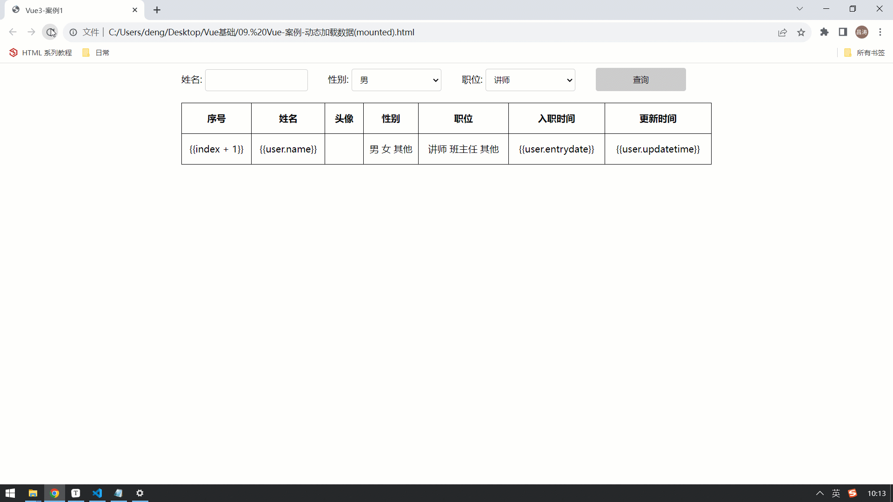


## 5.3 案例-省市区

### 5.3.1 需求

- 需求：页面加载完毕后，默认加载并展示出第一个省、第一个市、第一个区。

- 如图所示：

​	    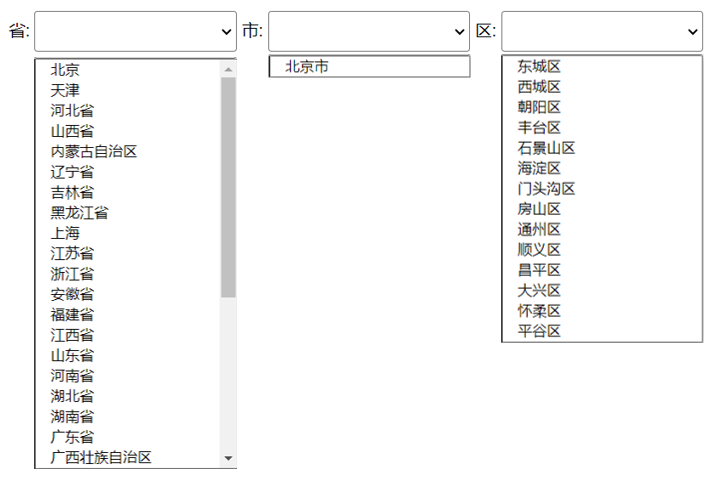 

- 获取省份：https://web-server.itheima.net/province
- 获取市：https://web-server.itheima.net/city?pid=xxx
- 获取区：https://web-server.itheima.net/area?cid=xxx


### 5.3.2 分析

1. 要想在页面加载完成后，默认加载出第一个省、第一个省对应的第一个市、第一个市对应的第一个区。 就应该用到vue的钩子函数 mounted。
2. 那要想加载出省市区，就需要发送3次异步请求，第一次获取省。 
3. 那什么时候发送第二次异步请求，获取市呢 ？  应该是在第一次异步请求完成之后，我们获取到第一个省份，然后再根据省份的ID查询市。
4. 那什么时候发送第三次异步请求，获取区呢 ？应该是在第二次异步请求完成之后，我们获取到第一个市，然后再根据市的ID查询区。从获取到区 。


​	**思考：如何在第一次异步请求成功后，再发送第二次异步请求获取数据呢 ？ **

​	那么此时，我们就可以在第一个请求的成功回调函数中，来发送第二次请求 。这样就可以保证，是第一个请求成功，才发送的第二次请求。


### 5.3.3 实现

```html
<!DOCTYPE html>
<html lang="en">
  <head>
    <meta charset="UTF-8" />
    <meta http-equiv="X-UA-Compatible" content="IE=edge" />
    <meta name="viewport" content="width=device-width, initial-scale=1.0" />
    <title>Vue3-案例1</title>
    <style>
      #center {
        margin-bottom: 20px;
      }

      input,
      select {
        width: 17%;
        padding: 10px;
        margin-right: 30px;
        border: 1px solid #ccc;
        border-radius: 4px;
      }
    </style>
  </head>

  <body>
    <div id="app">
      <div id="center">
        省:
        <select v-model="province">
          <option v-for="p in provinces" :key="p.id" :value="p.id">{{p.name}}</option>
        </select>
        市:
        <select v-model="city">
          <option v-for="c in cities" :key="c.id" :value="c.id">{{c.name}}</option>
        </select>
        区:
        <select v-model="area">
          <option v-for="a in areas" :key="a.id" :value="a.id">{{a.name}}</option>
        </select>
      </div>
    </div>

    <script src="https://unpkg.com/axios/dist/axios.min.js"></script>
    <script type="module">
      import { createApp } from "https://unpkg.com/vue@3/dist/vue.esm-browser.js";
      createApp({
        data() {
          return {
            province: '',
            city: '',
            area: '',

            provinces: [],
            cities: [],
            areas: [],
          };
        },
        methods: {
          search() {
            axios.get(`https://web-server.itheima.net/province`).then((result) => {
                this.provinces = result.data.data;
                this.province = this.provinces[0].id;
                axios.get(`https://web-server.itheima.net/city?pid=${this.province}`).then((result) => {
                    this.cities = result.data.data;
                    this.city = this.cities[0].id;
                    axios.get(`https://web-server.itheima.net/area?cid=xxx${this.city}`).then((result) => {
                        this.areas = result.data.data;
                        this.area = this.areas[0].id;
                      });
                  });
              });
          }
        },
        mounted() {
          this.search();
        },
      }).mount("#app");
    </script>
  </body>
</html>

```

打开浏览器测试：

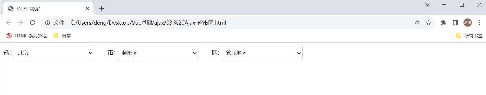 


经过测试我们看到，通过这种方案，确实可以实现该功能。在页面加载完毕后，确实默认将第一个省、第一个省对应的第一个市、第一个市对应的第一个区展示出来。但是呢，上面我们编写的代码呢，类似于 "套娃"，一层套一层，可读性、可维护性都是比较差的 。 这种问题呢，也被称为 "回调地狱"。


那如果出现这样的驱动，我们如何来优化我们的代码，以增强程序的可读性和可维护性呢？ 

那这里呢，我们是可以借助于JS中给我们提供的async/await来解决这个问题的。 


### 5.3.4 async/await

可以通过async、await来解决回调函数地狱问题。async就是来声明一个异步方法，await是用来等待异步任务执行。

await关键字只在async函数内有效，await关键字取代了原来的then成功回调函数，且await会等待获取到请求成功的结果值。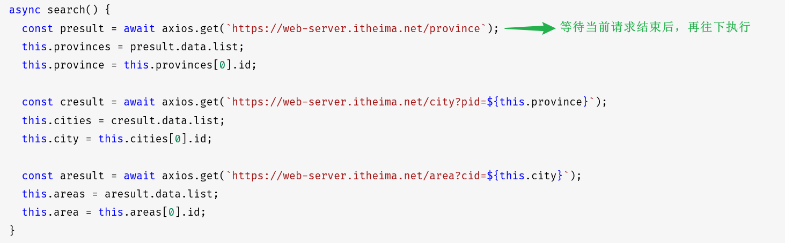 


接下来，我们就来通过async/await 来解决刚才遇到的 "回调函数地狱" 问题。

```html
<!DOCTYPE html>
<html lang="en">
  <head>
    <meta charset="UTF-8" />
    <meta http-equiv="X-UA-Compatible" content="IE=edge" />
    <meta name="viewport" content="width=device-width, initial-scale=1.0" />
    <title>Vue3-案例1</title>
    <style>
      #center {
        margin-bottom: 20px;
      }

      input,
      select {
        width: 17%;
        padding: 10px;
        margin-right: 30px;
        border: 1px solid #ccc;
        border-radius: 4px;
      }
    </style>
  </head>

  <body>
    <div id="app">
      <div id="center">
        省:
        <select v-model="province">
          <option v-for="p in provinces" :key="p.id" :value="p.id">{{p.name}}</option>
        </select>
        市:
        <select v-model="city">
          <option v-for="c in cities" :key="c.id" :value="c.id">{{c.name}}</option>
        </select>
        区:
        <select v-model="area">
          <option v-for="a in areas" :key="a.id" :value="a.id">{{a.name}}</option>
        </select>
      </div>
    </div>

    <script src="https://unpkg.com/axios/dist/axios.min.js"></script>
    <script type="module">
      import { createApp } from "https://unpkg.com/vue@3/dist/vue.esm-browser.js";
      createApp({
        data() {
          return {
            province: '',
            city: '',
            area: '',
            
            provinces: [],
            cities: [],
            areas: [],
          };
        },

        methods: {
          async search() {
            const presult = await axios.get(`https://web-server.itheima.net/province`);
            this.provinces = presult.data.data;
            this.province = this.provinces[0].id;
            
            const cresult = await axios.get(`https://web-server.itheima.net/city?pid=${this.province}`);
            this.cities = cresult.data.data;
            this.city = this.cities[0].id;

            const aresult = await axios.get(`https://web-server.itheima.net/area?cid=${this.city}`);
            this.areas = aresult.data.data;
            this.area = this.areas[0].id;
          }
        },
        mounted() {
          this.search();
        },
      }).mount("#app");
    </script>
  </body>
</html>

```

打开浏览器测试，发现实现的效果是一样的：


我们会看到，通过async、await修饰的函数，简化了原来 then 成功回调函数的编写，使我们的代码可读性更强了，也更加便于项目的维护。
