# 部门管理

在前面的课程中，我们学习了Vue工程化的基础内容、TS、ElementPlus，那接下来呢，我们要通过一个案例，加强大家对于Vue项目的理解，并掌握Vue项目的开发。 这个案例呢，就是Tlias智能学习辅助系统。项目所有相关资料和代码可以在[Github仓库](https://github.com/soft-zihan/soft-zihan.github.io/tree/main/data)下载到。

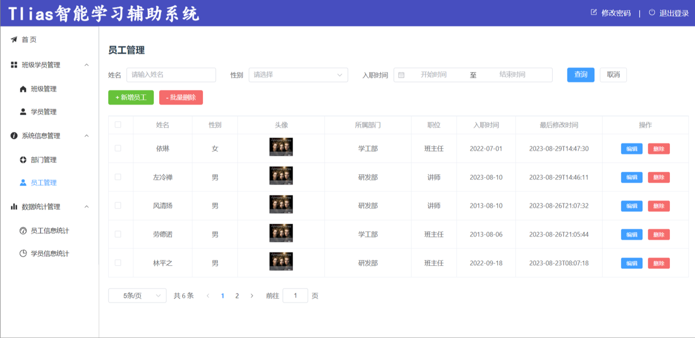 

在这个案例中，我们主要完成 **部门管理** 和 **员工管理** 的功能开发。 而今天呢，我们先来完成部门管理的功能开发，而在完成部门管理的功能开发之前，先需要完成基础的准备工作。 所以今天的课程安排如下：

- 前后端分类开发
- 准备工作
- 页面布局
- Vue-Router
- 部门管理


## 1. 前后端分离开发

现在的企业项目开发有2种开发模式：**前后台混合开发**和**前后台分离开发**。

前后台混合开发，顾名思义就是前台后台代码混在一起开发。这种开发模式有如下缺点：

- 沟通成本高：后台人员发现前端有问题，需要找前端人员修改，前端修改成功，再交给后台人员使用
- 分工不明确：后台开发人员需要开发后台代码，也需要开发部分前端代码。很难培养专业人才
- 不便管理：所有的代码都在一个工程中
- 难以维护：前端代码更新，和后台无关，但是需要整个工程包括后台一起重新打包部署。


所以我们目前基本都是采用的前后台分离开发方式，如下图所示：

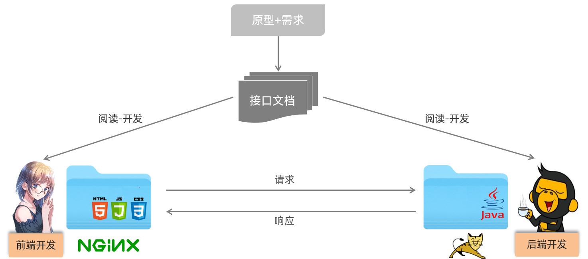 

我们将原先的工程分为前端工程和后端工程这2个工程，然后前端工程交给专业的前端人员开发，后端工程交给专业的后端人员开发。

前端页面需要数据，可以通过发送异步请求，从后台工程获取。但是，我们前后台是分开来开发的，那么前端人员怎么知道后台返回数据的格式呢？后端人员开发，怎么知道前端人员需要的数据格式呢？

所以针对这个问题，我们前后台统一制定一套规范！我们前后台开发人员都需要遵循这套规范开发，这就是我们的**接口文档**。接口文档有离线版和在线版本，接口文档示可以查询今天提供**资料/接口文档**里面的资料。

那么接口文档的内容怎么来的呢？是我们后台开发者根据产品经理提供的产品原型和需求文档所撰写出来的，产品原型示例可以参考今天提供**资料/页面原型**里面的资料。


那么基于前后台分离开发的模式下，我们后台开发者开发一个功能的具体流程如何呢？如下图所示：

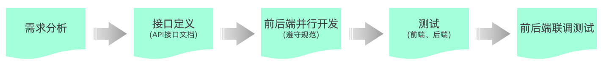  

1. 需求分析：首先我们需要阅读需求文档，分析需求，理解需求。
2. 接口定义：查询接口文档中关于需求的接口的定义，包括地址，参数，响应数据类型等等
3. 前后台并行开发：各自按照接口文档进行开发，实现需求
4. 测试：前后台开发完了，各自按照接口文档进行测试
5. 前后段联调测试：前段工程请求后端工程，测试功能


## 2. 准备工作

### 2.1 创建Vue项目

在自己工作目录下，运行 `cmd` 打开命令行，运行如下指令，来创建vue项目(也可以直接使用vue-tlias-management.zip)。

```
npm init vue@latest
```

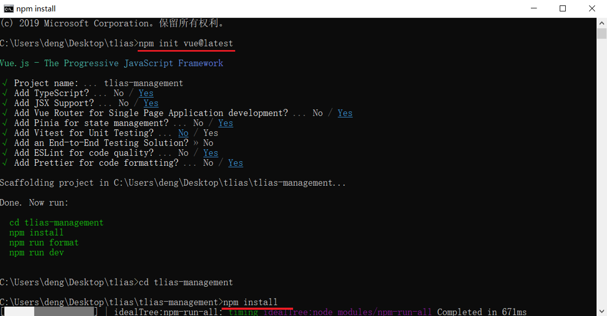 


### 2.2 安装依赖

1). 在命令行中执行如下命令，为创建好的Vue项目安装 `ElementPlus、Axios` 的依赖。

```shell
npm install element-plus --save

npm install axios
```


2). 为创建好的 Vue项目 配置ElementPlus (参照官网)，在 `main.ts` 中引入如下配置信息 【注意：是追加如下内容】:  

```ts
import ElementPlus from 'element-plus'
import 'element-plus/dist/index.css'
import zhCn from 'element-plus/dist/locale/zh-cn.mjs'
import * as ElementPlusIconsVue from '@element-plus/icons-vue'

//引入ElementPlus的Icon组件
for (const [key, component] of Object.entries(ElementPlusIconsVue)) {
  app.component(key, component)
}
app.use(ElementPlus, {locale: zhCn})

app.mount('#app')
```


**最终完整的 `main.ts` 文件内容如下：**

```ts
import { createApp } from 'vue'
import { createPinia } from 'pinia'

import App from './App.vue'
import router from './router'
import ElementPlus from 'element-plus'
import 'element-plus/dist/index.css'
import './assets/main.css'

import zhCn from 'element-plus/dist/locale/zh-cn.mjs'
import * as ElementPlusIconsVue from '@element-plus/icons-vue'

const app = createApp(App)

for (const [key, component] of Object.entries(ElementPlusIconsVue)) {
  app.component(key, component)
}
app.use(createPinia())
app.use(router)
app.use(ElementPlus, {locale: zhCn})

app.mount('#app')
```


3). 在 `env.d.ts` 中引入ElementPlus的语言包

```ts
declare module 'element-plus/dist/locale/zh-cn.mjs'
```


<font color='red' size='4'> 注意：以上的这些，我们都不需要操作，因为在提供的资料中已经准备好了基础工程，我们直接导入进来即可。</font>


### 2.3 精简项目

由于基于Vue脚手架创建的项目中，里面携带了很多的多余的Vue组件。  并准备对应的组件存放目录 。 

- 删除 `components` 目录中的vue文件
- 删除 `views` 目录中的vue文件
- 清空根组件文件 `App.vue` 中的内容，只保留基础的vue组件文件的结构标签 `<script>`  `<template>`  `<style>`

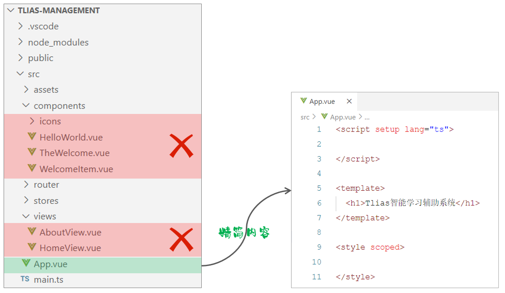 


<font color='red' size='4'> 注意：以上的这些，我们都不需要操作，因为在提供的资料中已经准备好了基础工程，我们直接导入进来即可。</font>


## 3. 页面布局

### 3.1 介绍

我们在制作一个页面的时候，一定是先关注整体的页面布局，然后再关注具体的细节处理 。 所以这一小节，我们就先来完成页面的整体布局。

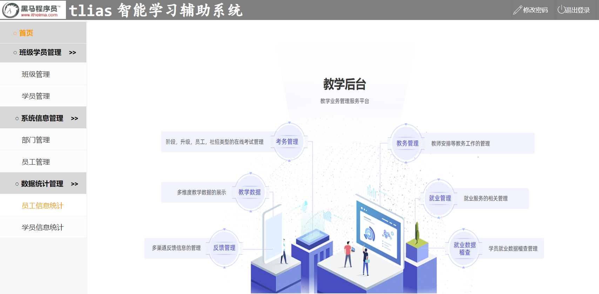 

 我们会看到，整个页面分为这么三个部分：

①. 页头部分 

②. 侧边栏

③. 主区域


而要完成这样的页面布局，我们其实是可以借助于 `ElementPlus` 中提供的 `Container布局容器` 来实现：

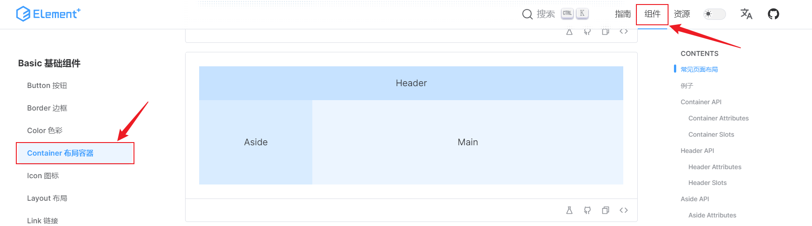 


Container布局容器，用于布局的容器组件，方便快速搭建页面的基本结构：

`<el-container>`：外层容器。 当子元素中包含 `<el-header>` 或 `<el-footer>` 时，全部子元素会垂直上下排列， 否则会水平左右排列。

`<el-header>`：顶栏容器。

`<el-aside>`：侧边栏容器。

`<el-main>`：主要区域容器。

`<el-footer>`：底栏容器。


而针对于我们当前案例的页面布局，基本的结构如下：

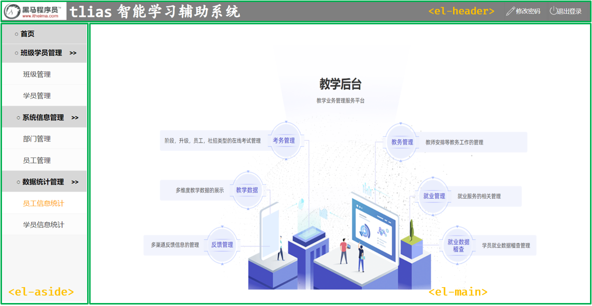 


> 提示：当  `<el-container>` 子元素中包含  `<el-header> ` 或  `<el-footer>`  时，全部子元素会垂直上下排列， 否则会水平左右排列。 


### 3.2 整体布局

我们可以参照 `ElementPlus` 的官方网站中的 布局，拷贝其源码，然后对其做一个改造。 具体参照的源码如下：

 


1). 在 `src/views` 目录下，再创建一个子目录 `layout` ，在其中新建一个页面，页面命名为：`index.vue`。

2). 在 `index.vue` 中准备好基础的组件结构后，就可以将代码直接复制到 `<template> </template>` 标签中。

```html
<script setup lang="ts">

</script>

<template>
   <div class="common-layout">
    <el-container>
      <!-- 顶栏 - header -->
      <el-header>Header</el-header>

      <!-- 左侧菜单 & 主区域 -->
      <el-container>
        <el-aside width="200px">Aside</el-aside>
        <el-main>Main</el-main>
      </el-container>
    </el-container>
  </div>
</template>

<style scoped>

</style>
```


然后，我们先根据页面原型中的布局显示进行调整。 先完成顶栏部分的制作，具体的代码如下：

```html
<script setup lang="ts">

</script>

<template>
   <div class="common-layout">
    <el-container>
      <!-- 顶栏 - header -->
      <el-header class="header">
        <span class="title">Tlias智能学习辅助系统</span>
        <span class="right_tool">
          <a href=""><el-icon><EditPen /></el-icon> 修改密码 &nbsp;&nbsp;&nbsp;&nbsp;</a>
          <a href=""><el-icon><SwitchButton /></el-icon> 退出登录&nbsp;&nbsp;&nbsp;&nbsp;</a>
        </span>
      </el-header>

      <!-- 左侧菜单 & 主区域 -->
      <el-container>
        <el-aside width="200px">Aside</el-aside>
        <el-main>Main</el-main>
      </el-container>
    </el-container>
  </div>
</template>

<style scoped>
.header {
  background-image: linear-gradient(to right, #e70cc5, #e94dcf, #eb6fd8, #ec8bdf, #eea5e6);
  line-height: 60px;
}

.title {
  color: white;
  font-size: 35px;
  font-family: 楷体;
  
}

.right_tool {
  float: right;
}

a {
  text-decoration: none;
  color: white;
}
</style>
```


最终的顶栏布局效果如下所示：

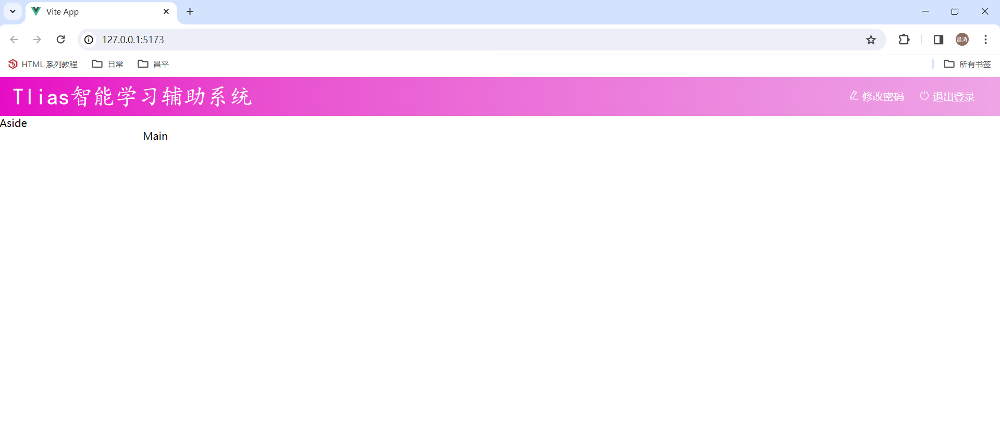 


### 3.3 左侧菜单

顶栏布局完毕之后，接下来，我们再来完成左侧菜单栏的制作。 左侧菜单栏的制作，也不需要我们自己实现，其实在 `ElementPlus` 中已经提供了对应的菜单组件，我们可以直接参考【PS: 其实就是复制过来，参考页面原型和需求，将其改造成我们需要的样子就可以了】。

参考代码的出处如下：

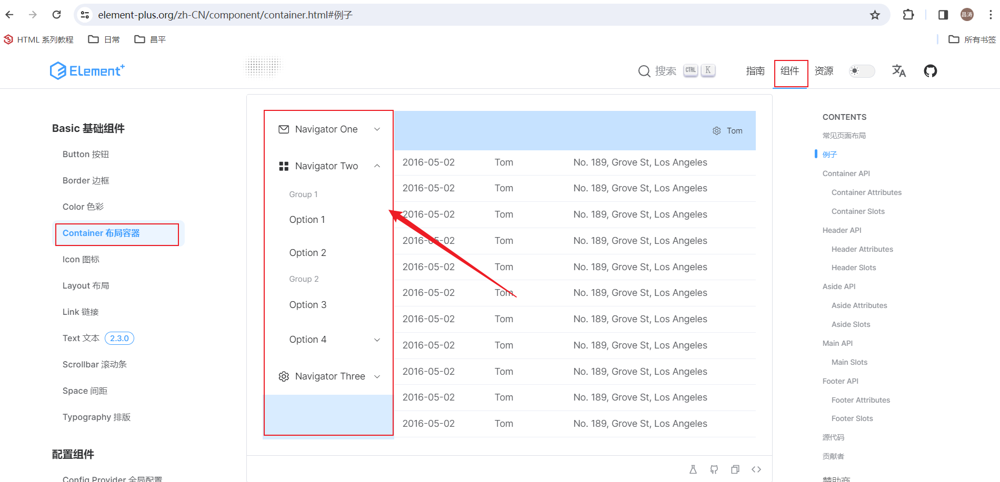 


然后就可以参考其提供的源码，复制到我们的侧边栏部分 `<el-aside> ... </el-aside>`，然后根据我们案例的需要进行改造，改造成我们需要的样子即可。

最终左侧菜单栏的代码如下：

```html
<!-- 左侧菜单 -->
<el-aside width="200px" class="aside">
  <el-scrollbar>
    <el-menu router>
      <!-- 首页菜单 -->
      <el-menu-item index="/index">
        <el-icon><Promotion /></el-icon> 首页
      </el-menu-item>
      
      <!-- 班级管理菜单 -->
      <el-sub-menu index="/manage">
        <template #title>
          <el-icon><Menu /></el-icon> 班级学员管理
        </template>
        <el-menu-item index="/clazz">
          <el-icon><HomeFilled /></el-icon>班级管理
        </el-menu-item>
        <el-menu-item index="/stu">
          <el-icon><UserFilled /></el-icon>学员管理
        </el-menu-item>
      </el-sub-menu>
      
      <!-- 系统信息管理 -->
      <el-sub-menu index="/system">
        <template #title>
          <el-icon><Tools /></el-icon>系统信息管理
        </template>
        <el-menu-item index="/dept">
          <el-icon><HelpFilled /></el-icon>部门管理
        </el-menu-item>
        <el-menu-item index="/emp">
          <el-icon><Avatar /></el-icon>员工管理
        </el-menu-item>
      </el-sub-menu>

      <!-- 数据统计管理 -->
      <el-sub-menu index="/report">
        <template #title>
          <el-icon><Histogram /></el-icon>数据统计管理
        </template>
        <el-menu-item index="/empReport">
          <el-icon><InfoFilled /></el-icon>员工信息统计
        </el-menu-item>
        <el-menu-item index="/stuReport">
          <el-icon><Share /></el-icon>学员信息统计
        </el-menu-item>
        <el-menu-item index="/log">
          <el-icon><Document /></el-icon>日志信息统计
        </el-menu-item>
      </el-sub-menu>
    </el-menu>
  </el-scrollbar>
</el-aside>
```


并在 `<style></style>` 中添加如下样式：

```css
.aside {
  border: 1px solid #ccc;
  height: 690px;
  width: 220px;
}
```


最终，浏览器打开的效果如下：

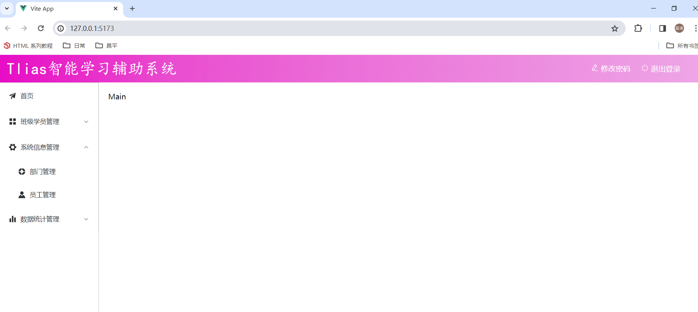 


到目前为止，`layout/index.vue` 中的内容如下：

```html
<script setup lang="ts">

</script>

<template>
   <div class="common-layout">
    <el-container>
      <!-- 顶栏 - header -->
      <el-header class="header">
        <span class="title">Tlias智能学习辅助系统</span>
        <span class="right_tool">
          <a href=""><el-icon><EditPen /></el-icon> 修改密码 &nbsp;&nbsp;&nbsp;&nbsp;</a>
          <a href=""><el-icon><SwitchButton /></el-icon> 退出登录&nbsp;&nbsp;&nbsp;&nbsp;</a>
        </span>
      </el-header>
      

      <!-- 左侧菜单 & 主区域 -->
      <el-container>
        <!-- 左侧菜单 -->
        <el-aside width="200px" class="aside">
          <el-scrollbar>
            <el-menu router>
              <!-- 首页菜单 -->
              <el-menu-item index="/index">
                <el-icon><Promotion /></el-icon> 首页
              </el-menu-item>
              
              <!-- 班级管理菜单 -->
              <el-sub-menu index="/manage">
                <template #title>
                  <el-icon><Menu /></el-icon> 班级学员管理
                </template>
                <el-menu-item index="/clazz">
                  <el-icon><HomeFilled /></el-icon>班级管理
                </el-menu-item>
                <el-menu-item index="/stu">
                  <el-icon><UserFilled /></el-icon>学员管理
                </el-menu-item>
              </el-sub-menu>
              
              <!-- 系统信息管理 -->
              <el-sub-menu index="/system">
                <template #title>
                  <el-icon><Tools /></el-icon>系统信息管理
                </template>
                <el-menu-item index="/dept">
                  <el-icon><HelpFilled /></el-icon>部门管理
                </el-menu-item>
                <el-menu-item index="/emp">
                  <el-icon><Avatar /></el-icon>员工管理
                </el-menu-item>
              </el-sub-menu>

              <!-- 数据统计管理 -->
              <el-sub-menu index="/report">
                <template #title>
                  <el-icon><Histogram /></el-icon>数据统计管理
                </template>
                <el-menu-item index="/empReport">
                  <el-icon><InfoFilled /></el-icon>员工信息统计
                </el-menu-item>
                <el-menu-item index="/stuReport">
                  <el-icon><Share /></el-icon>学员信息统计
                </el-menu-item>
                <el-menu-item index="/log">
                  <el-icon><Document /></el-icon>日志信息统计
                </el-menu-item>
              </el-sub-menu>

            </el-menu>
          </el-scrollbar>
        </el-aside>


        <el-main>Main</el-main>
      </el-container>
    </el-container>
  </div>
</template>

<style scoped>
.header {
  background-image: linear-gradient(to right, #e70cc5, #e94dcf, #eb6fd8, #ec8bdf, #eea5e6);
  line-height: 60px;
}

.title {
  color: white;
  font-size: 35px;
  font-family: 楷体;
  
}

.right_tool {
  float: right;
}

a {
  text-decoration: none;
  color: white;
}

.aside {
  border: 1px solid #ccc;
  height: 690px;
  width: 220px;
}
</style>
```


目前，我们点击左侧的菜单，右侧主区域展示的内容，还不能做到动态变化。 那应该如何做到动态变化呢 ？

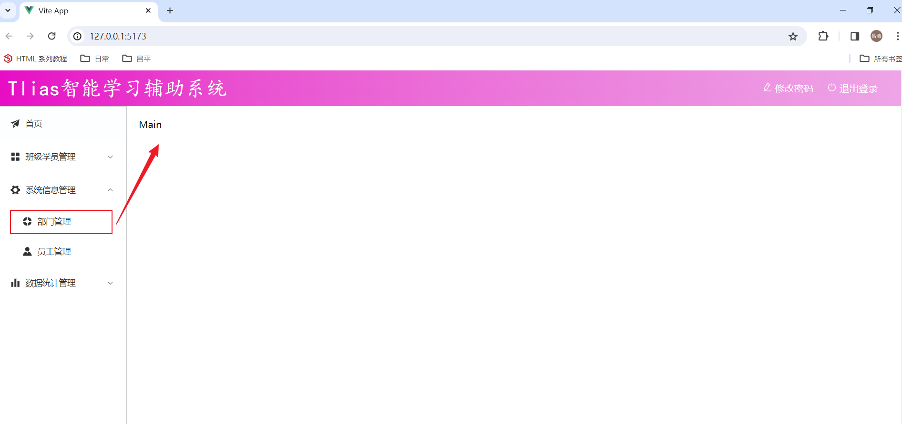 

那要完成这个功能效果，我们就需要用到Vue生态中的路由 `Vue-Router`。


## 4. Vue Router

### 4.1 介绍

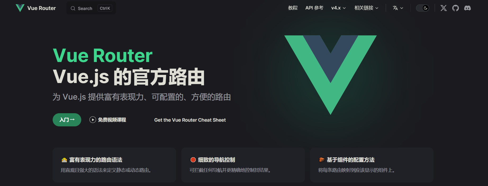 

- Vue Router：Vue的官方路由。 为Vue提供富有表现力、可配置的、方便的路由。
- Vue中的路由，主要定义的是路径与组件之间的对应关系。


比如，我们打开一个网站，点击左侧菜单，地址栏的地址发生变化。 地址栏地址一旦发生变化，在主区域显示对应的页面组件。 

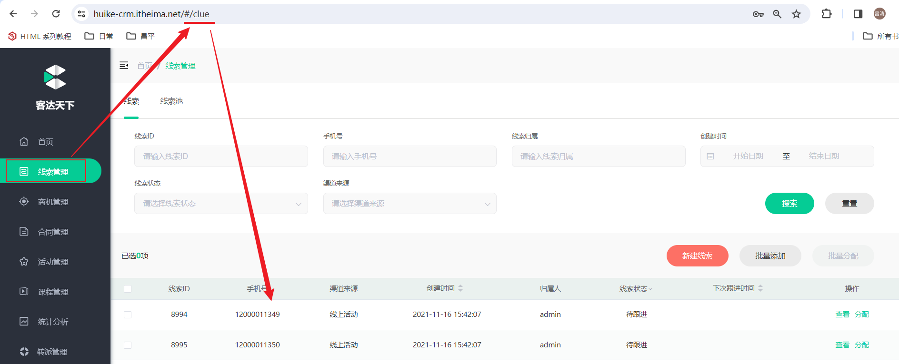 

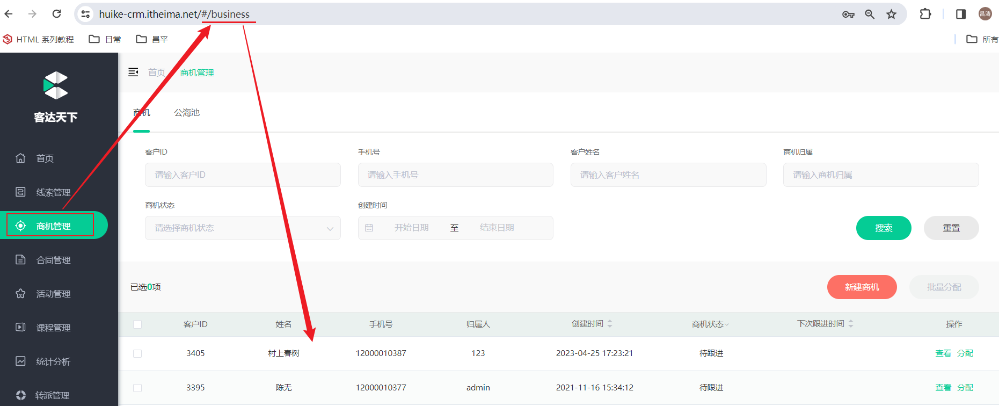 


VueRouter主要由以下三个部分组成，如下所示：

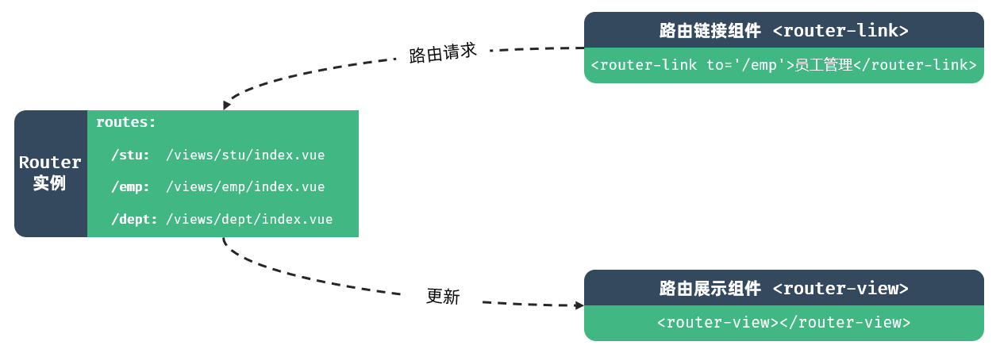 

- VueRouter：路由器类，根据路由请求在路由视图中动态渲染选中的组件
- &lt;router-link&gt;：请求链接组件，浏览器会解析成&lt;a&gt;
- &lt;router-view&gt;：动态视图组件，用来渲染展示与路由路径对应的组件


### 4.2 入门

介绍完了VueRouter之后，接下来，我们就通过一个入门程序，来演示一下VueRouter的使用。

1). 安装 `vue-router` (创建Vue项目时，已经选择)

```shell
npm install vue-router@4
```


2). 在 `main.ts` 入口文件中进行配置，加入如下配置

```ts
import router from './router'

//..... 创建完vue的应用实例后,调用app.use
app.use(router)
```


3). 在 src/views 目录下再定义一个文件夹，在文件夹中再创建一个 vue 组件文件

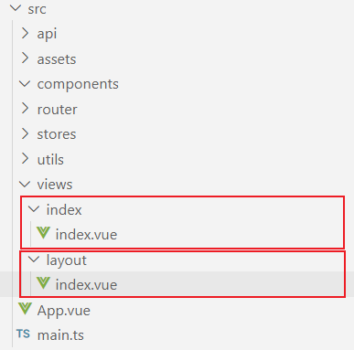 


4). 定义路由

在 `src/router/index.ts` 中定义路由表信息，在其中主要是定义请求路径与组件之间的对应关系。 完整的文件内容如下：

```ts
import { createRouter, createWebHistory } from 'vue-router'

const router = createRouter({
  history: createWebHistory(import.meta.env.BASE_URL),
  routes: [
    {
      path: '/',
      name: 'home',
      component: () => import('../views/layout/index.vue')
    },
    {
      path: '/index',
      name: 'index',
      component: () => import('../views/index/index.vue')
    }
  ]
})

export default router
```


5). 在 `App.vue` 根组件中，定义 `<RouterView></RouterView>` 标签

该标签将用于显示，访问的请求路径对应的组件。

```html
<script setup lang="ts">

</script>

<template>
  <RouterView></RouterView>
</template>

<style scoped>

</style>
```


6). 测试

浏览器访问请求路径   http://127.0.0.1:5173/index，展示如下页面内容（该页面内容，就是我们在 `index/index.vue` 中定义的页面内容）： 

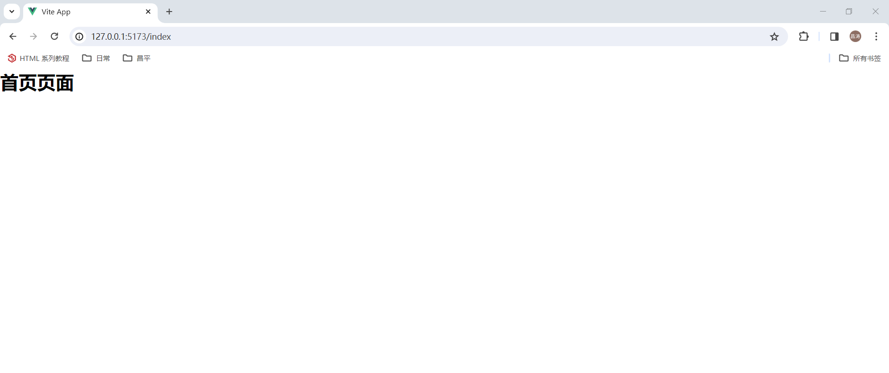 


浏览器访问请求路径 http://127.0.0.1:5173/，展示如下页面内容 （该页面内容，就是我们在 `layout/index.vue` 中定义的页面内容）：

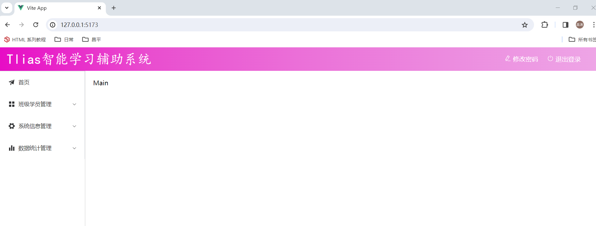 


到此，我们发现，我们请求不同的请求路径，就可以在页面中显示不同的组件。具体的访问流程如下：

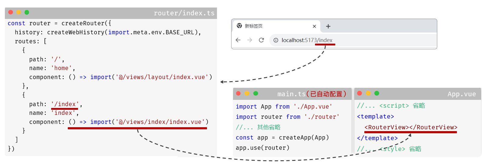 


### 4.3 案例

那接下来，我们就要基于 `VueRouter` 来完成点击 左侧菜单，动态切换主展示区域内容的动态效果。


1). 准备案例的空页面 （资料中已经提供，直接复制到项目的 `src/views` 目录中即可）

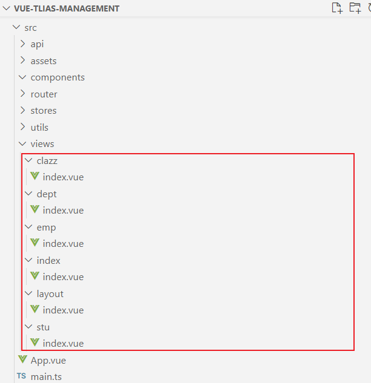 


2). 在 `src/router/index.ts` 中配置路由信息

这里我们用到了Vue中的嵌套路由，具体定义方式，主要是在配置路由信息时，通过`children` 来描述。如你所见，`children` 配置只是另一个路由数组，就像 `routes` 本身一样。因此，你可以根据自己的需要，不断地嵌套视图。

```ts
import { createRouter, createWebHistory } from 'vue-router'

const router = createRouter({
  history: createWebHistory(import.meta.env.BASE_URL),
  routes: [
    {
      path: '/',
      name: 'home',
      component: () => import('../views/layout/index.vue'),
      redirect: '/index',
      children: [
        {
          path: 'index',
          name: 'index',
          component: () => import('../views/index/index.vue') //首页
        },
        {
          path: 'emp',
          name: 'emp',
          component: () => import('../views/emp/index.vue') //员工管理
        },
        {
          path: 'dept',
          name: 'dept',
          component: () => import('../views/dept/index.vue') //部门管理
        },
        {
          path: 'clazz',
          name: 'clazz',
          component: () => import('../views/clazz/index.vue') //班级管理
        },
        {
          path: 'stu',
          name: 'stu',
          component: () => import('../views/stu/index.vue') //学员管理
        }
      ]
    }
  ]
})

export default router
```


3). 完善左侧菜单栏 `layout/index.vue`，菜单栏关联路由

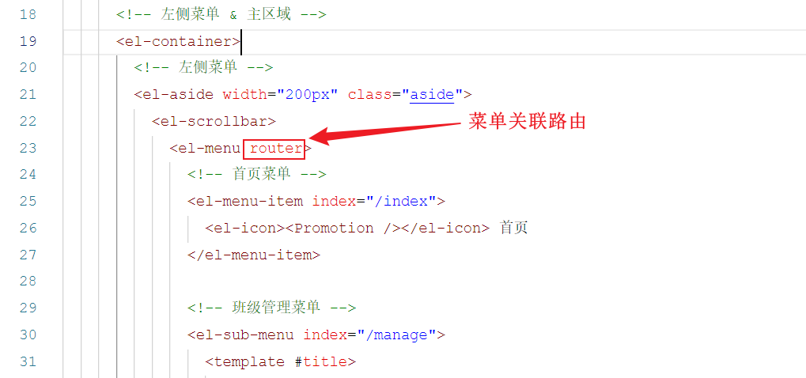 

菜单关联了路由之后，我们点击对应的菜单，就会根据菜单的唯一标识 `index`，在地址栏中请求访问对应的地址。


4). 在Vue组件中，动态展示与路由对应的组件 。

需要在 `layout/index.vue` 中的 `<el-main></el-main>` 中添加动态路由视图组件 `<RouterView></RouterView>` 。如下：

```
<!-- 主展示区域 -->
<el-main>
	<RouterView></RouterView>
</el-main>
```


 最终完整的 `layout/index.vue`  代码如下：

```html
<script setup lang="ts">

</script>

<template>
   <div class="common-layout">
    <el-container>
      <!-- 顶栏 - header -->
      <el-header class="header">
        <span class="title">Tlias智能学习辅助系统</span>
        <span class="right_tool">
          <a href=""><el-icon><EditPen /></el-icon> 修改密码 &nbsp;&nbsp;&nbsp;&nbsp;</a>
          <a href=""><el-icon><SwitchButton /></el-icon> 退出登录&nbsp;&nbsp;&nbsp;&nbsp;</a>
        </span>
      </el-header>
      

      <!-- 左侧菜单 & 主区域 -->
      <el-container>
        <!-- 左侧菜单 -->
        <el-aside width="200px" class="aside">
          <el-scrollbar>
            <el-menu router>
              <!-- 首页菜单 -->
              <el-menu-item index="/index">
                <el-icon><Promotion /></el-icon> 首页
              </el-menu-item>
              
              <!-- 班级管理菜单 -->
              <el-sub-menu index="/manage">
                <template #title>
                  <el-icon><Menu /></el-icon> 班级学员管理
                </template>
                <el-menu-item index="/clazz">
                  <el-icon><HomeFilled /></el-icon>班级管理
                </el-menu-item>
                <el-menu-item index="/stu">
                  <el-icon><UserFilled /></el-icon>学员管理
                </el-menu-item>
              </el-sub-menu>
              
              <!-- 系统信息管理 -->
              <el-sub-menu index="/system">
                <template #title>
                  <el-icon><Tools /></el-icon>系统信息管理
                </template>
                <el-menu-item index="/dept">
                  <el-icon><HelpFilled /></el-icon>部门管理
                </el-menu-item>
                <el-menu-item index="/emp">
                  <el-icon><Avatar /></el-icon>员工管理
                </el-menu-item>
              </el-sub-menu>

              <!-- 数据统计管理 -->
              <el-sub-menu index="/report">
                <template #title>
                  <el-icon><Histogram /></el-icon>数据统计管理
                </template>
                <el-menu-item index="/empReport">
                  <el-icon><InfoFilled /></el-icon>员工信息统计
                </el-menu-item>
                <el-menu-item index="/stuReport">
                  <el-icon><Share /></el-icon>学员信息统计
                </el-menu-item>
                <el-menu-item index="/log">
                  <el-icon><Document /></el-icon>日志信息统计
                </el-menu-item>
              </el-sub-menu>
			
            </el-menu>
          </el-scrollbar>
        </el-aside>

        <!-- 主展示区域 -->
        <el-main>
          <RouterView></RouterView>
        </el-main>
      </el-container>
    </el-container>
  </div>
</template>

<style scoped>
.header {
  background-image: linear-gradient(to right, #e70cc5, #e94dcf, #eb6fd8, #ec8bdf, #eea5e6);
  line-height: 60px;
}

.title {
  color: white;
  font-size: 35px;
  font-family: 楷体;
  
}

.right_tool {
  float: right;
}

a {
  text-decoration: none;
  color: white;
}

.aside {
  border: 1px solid #ccc;
  height: 690px;
  width: 220px;
}
</style>
```


5). 测试

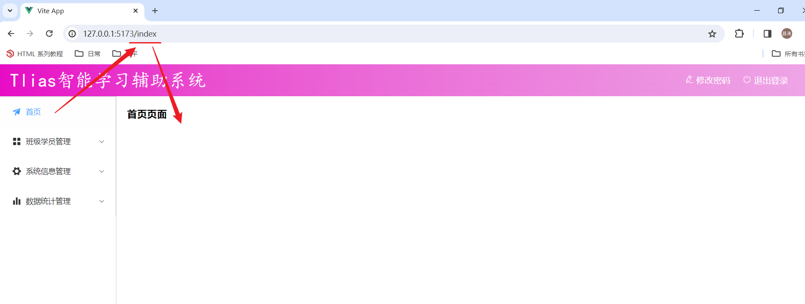 

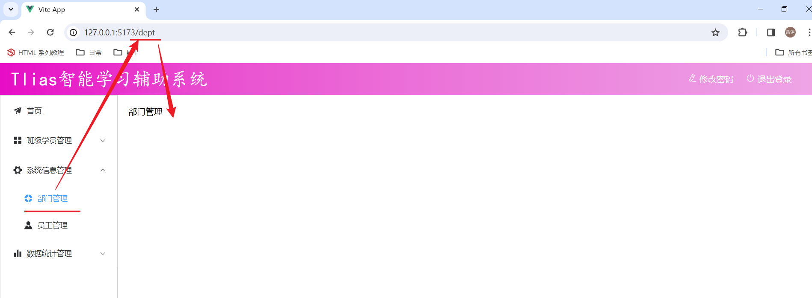 


### 4.4 首页制作

其实首页，我们只需要展示一张图片即可。 直接在 `index/index.vue` 中引入一张图片即可，具体代码如下：

```html
<script setup lang="ts">

</script>

<template>
    
</template>

<style scoped>

</style>
```


最终效果如下：

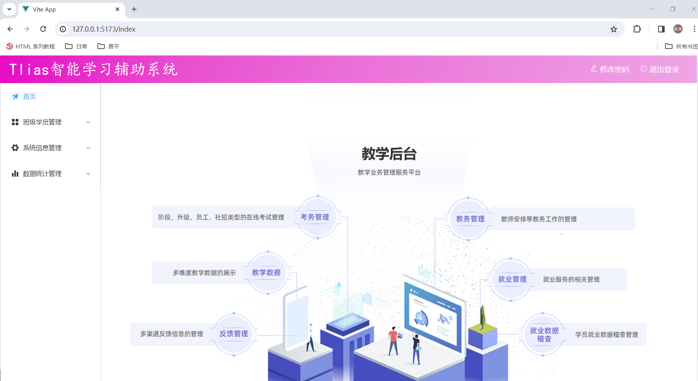 


## 5. 部门管理

部门管理的页面内容，写在 `src/views/dept/index.vue` 中。

### 5.1部门列表

#### 5.1.1. 基本布局

首先，根据页面原型、需求说明、接口文档，先完成页面的基本布局 。 可以参考 `ElementPlus` 中的组件，拷贝过来适当做一个改造。

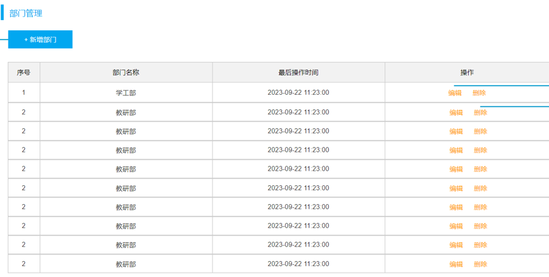 


部门管理组件 `src/views/dept/index.vue` 具体的页面布局代码如下：

```html
<script setup lang="ts">
import {ref} from 'vue'
import type { DeptModelArray } from '@/api/model/model'

//声明列表展示数据
let tableData = ref<DeptModelArray>([])
</script>

<template>
  <h1>部门管理</h1>
  <el-button type="primary" style="float: right" @click="">+ 新增</el-button>
  <br><br>

  <!-- 部门数据表格 -->
  <el-table :data="tableData" border style="width: 100%">
    <el-table-column type="index" label="序号"  width="80"  align="center"/>
    <el-table-column prop="name" label="部门名称" width="250"  align="center"/>
    <el-table-column prop="updateTime" label="最后操作时间" width="300"  align="center"/>
    <el-table-column label="操作"  align="center">
      <template #default="scope">
        <el-button size="small" type="primary" @click="">修改</el-button>
        <el-button size="small" type="danger"  @click="">删除</el-button>
      </template>
    </el-table-column>
  </el-table>
</template>

<style scoped>

</style>
```

表格中每一列展示的属性 `prop` 都是根据接口文档来的，接口文档返回什么样的数据，我们就安装对应的数据格式进行解析。


#### 5.1.2 加载数据

根据需求，需要在新增、修改、删除部门之后，加载最新的部门数据。 在打开页面之后，也需要自动加载部门数据。 那接下来，我们就需要基于axios发送异步请求，动态获取数据。

需要在 `src/views/dept/index.vue` 中增加如下代码，在页面加载完成发送异步请求（https://mock.apifox.com/m1/3161925-0-default/depts），动态加载的Axios。

```html
<script setup lang="ts">
import {ref, onMounted} from 'vue'
import type { DeptModelArray } from '@/api/model/model'
import axios from 'axios'

//声明列表展示数据
let tableData = ref<DeptModelArray>([])

//动态加载数据-查询部门
const queryAll = async () => {
  const result = await axios.get('https://mock.apifox.com/m1/3161925-0-default/depts')
  tableData.value = result.data.data
}

//钩子函数
onMounted(() => {
  queryAll()
})
</script>
```


添加代码后，最终  `src/views/dept/index.vue`  代码如下：

```html
<script setup lang="ts">
import {ref, onMounted} from 'vue'
import type { DeptModelArray } from '@/api/model/model'
import axios from 'axios'

//声明列表展示数据
let tableData = ref<DeptModelArray>([])

//动态加载数据-查询部门
const queryAll = async () => {
  const result = await axios.get('https://mock.apifox.com/m1/3161925-0-default/depts')
  tableData.value = result.data.data
}

//钩子函数
onMounted(() => {
  queryAll()
})
</script>

<template>
  <h1>部门管理</h1>
  <el-button type="primary" style="float: right" @click="">+ 新增</el-button>
  <br><br>

  <!-- 部门数据表格 -->
  <el-table :data="tableData" border style="width: 100%">
    <el-table-column type="index" label="序号"  width="80"  align="center"/>
    <el-table-column prop="name" label="部门名称" width="250"  align="center"/>
    <el-table-column prop="updateTime" label="最后操作时间" width="300"  align="center"/>
    <el-table-column label="操作"  align="center">
      <template #default="scope">
        <el-button size="small" type="primary" @click="">修改</el-button>
        <el-button size="small" type="danger"  @click="">删除</el-button>
      </template>
    </el-table-column>
  </el-table>
</template>

<style scoped>

</style>
```


代码编写完成之后，打开浏览器进行测试 ，我们可以看到数据可以正常的查询出来，并展示在页面中。

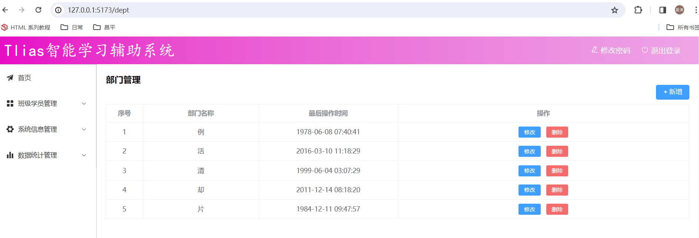 


**思考：直接在Vue组件中，基于axios发送异步请求，存在什么问题？**

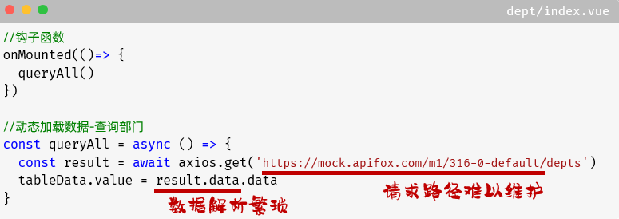 

我们刚才在完成部门列表查询时，是直接基于axios发送异步请求，直接将接口的请求地址放在组件文件 `.vue` 中。 而如果开发一个大型的项目，组件文件可能会很多很多很多，如果前端开发完毕，进行前后端联调测试了，需要修改请求地址，那么此时，就需要找到每一个 `.vue` 文件，然后挨个修改。 所以上述的代码，虽然实现了动态加载数据的功能。 但是存在以下问题：

- 请求路径难以维护
- 数据解析繁琐


#### 5.1.3 程序优化

1). 为了解决上述问题，我们在前端项目开发时，通常会定义一个请求处理的工具类  - `src/utils/request.ts` 。 在这个工具类中，对axios进行了封装。 具体代码如下：

```ts
import axios from 'axios'

//创建axios实例对象
const request = axios.create({
  baseURL: '/api',
  timeout: 600000
})

//axios的响应 response 拦截器
request.interceptors.response.use(
  (response) => { //成功回调
    return response.data
  },
  (error) => { //失败回调
    return Promise.reject(error)
  }
)

export default request
```

 

2). 而与服务端进行异步交互的逻辑，通常会按模块，封装在一个单独的API中，如：`src/api/dept.ts`

```ts
import request from "@/utils/request"
import type { ResultModel } from "./model/model"

//列表查询
export const queryAllApi = () => request.get<any, ResultModel>('/depts')
```


3). 修改 `src/views/dept/index.vue` 中的代码

现在就不需要每次直接调用axios发送异步请求了，只需要将我们定义的对应模块的API导入进来，就可以直接使用了。

```html
<script setup lang="ts">
import {ref, onMounted} from 'vue'
import type { DeptModelArray } from '@/api/model/model'
import {queryAllApi} from '@/api/dept'

//声明列表展示数据
let tableData = ref<DeptModelArray>([])

//动态加载数据-查询部门
const queryAll = async () => {
  const result = await queryAllApi()
  tableData.value = result.data
}

//钩子函数
onMounted(() => {
  queryAll()
})
</script>
```


做完上面这三部之后，我们打开浏览器发现，并不能访问到接口数据。原因是因为，目前请求路径不对。

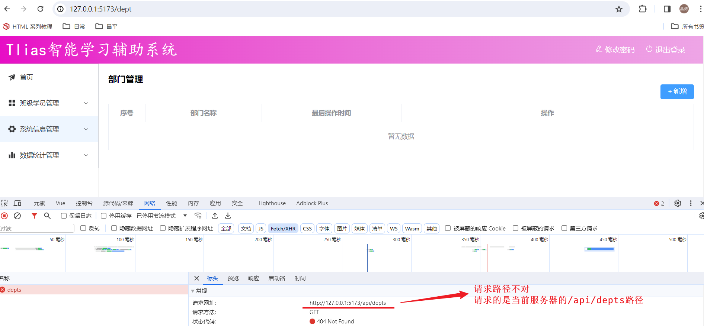 


4). 在 `vite.config.ts` 中配置前端请求服务器的信息

在服务器中配置代理proxy的信息，并在配置代理时，执行目标服务器。 以及url路径重写的规则。

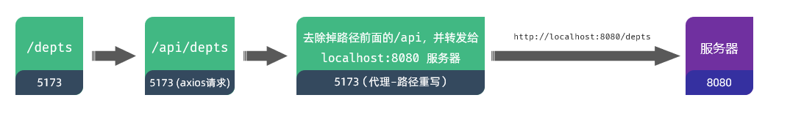 


```ts
  server: {
    proxy: {
      '/api': {
        target: 'http://localhost:8080',
        secure: false,
        changeOrigin: true,
        rewrite: (path) => path.replace(/^\/api/, ''),
      }
    }
  }
```


添加位置如下所示：

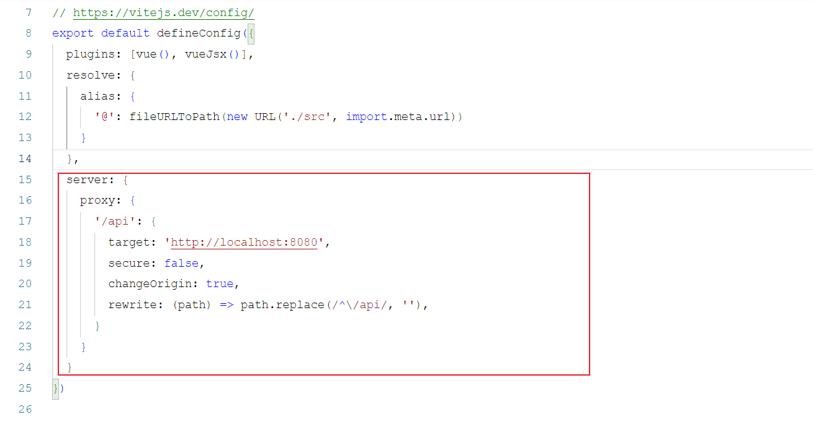 


然后，我们就可以启动服务器端的程序，进行测试了（测试时，记得将之前编写的登录校验的过滤器、拦截器、AOP程序全部注释掉）。

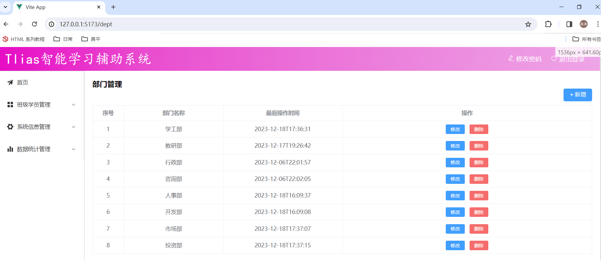 


### 5.2 新增部门

接下来，我们再来完成新增部门的功能实现。

1). 在 `src/views/dept/index.vue` 中完成页面布局，并编写交互逻辑，完成数据绑定。

完整代码如下：

```html
<script setup lang="ts">
import {ref, onMounted} from 'vue'
import type { DeptModelArray, DeptModel } from '@/api/model/model'
import {queryAllApi, addApi} from '@/api/dept'
import { ElMessage } from 'element-plus';

//声明列表展示数据
let tableData = ref<DeptModelArray>([])

//动态加载数据-查询部门
const queryAll = async () => {
  const result = await queryAllApi()
  tableData.value = result.data
}

//钩子函数
onMounted(() => {
  queryAll()
})


//新增部门
const dialogFormVisible = ref<boolean>(false) 
const deptForm = ref<DeptModel>({name: ''})
const formTitle = ref<string>('')

//点击新增按钮触发的函数
const add = () => {
  formTitle.value = '新增部门'
  dialogFormVisible.value = true
  deptForm.value = {name: ''}
}

//点击保存按钮-发送异步请求
const save = async () => {
  const result = await addApi(deptForm.value)
  if(result.code){
    ElMessage.success('操作成功')
  }else{
    ElMessage.error(result.msg)
  }
  dialogFormVisible.value = false
  queryAll()
}

</script>

<template>
  <h1>部门管理</h1>
  <el-button type="primary" style="float: right" @click="add">+ 新增</el-button>
  <br><br>

  <!-- 部门数据表格 -->
  <el-table :data="tableData" border style="width: 100%">
    <el-table-column type="index" label="序号"  width="80"  align="center"/>
    <el-table-column prop="name" label="部门名称" width="250"  align="center"/>
    <el-table-column prop="updateTime" label="最后操作时间" width="300"  align="center"/>
    <el-table-column label="操作"  align="center">
      <template #default="scope">
        <el-button size="small" type="primary" @click="">修改</el-button>
        <el-button size="small" type="danger"  @click="">删除</el-button>
      </template>
    </el-table-column>
  </el-table>

  <!-- 新增部门 / 修改部门对话框 -->
  <el-dialog v-model="dialogFormVisible" :title="formTitle" width="30%">
    <el-form :model="deptForm">
      <el-form-item label="部门名称" label-width="80px">
        <el-input v-model="deptForm.name" autocomplete="off" />
      </el-form-item>
    </el-form>

    <template #footer>
      <span class="dialog-footer">
        <el-button @click="dialogFormVisible = false">取消</el-button>
        <el-button type="primary" @click="save">确定</el-button>
      </span>
    </template>
  </el-dialog>

</template>

<style scoped>

</style>
```


2). 在 `src/api/dept.ts` 中增加如下代码

```ts
//添加部门
export const addApi = (dept:DeptModel) => request.post<any, ResultModel>('/depts', dept)
```


目前  `src/api/dept.ts`  文件中完整代码如下:

```ts
import request from "@/utils/request"
import type { DeptModel, ResultModel } from "./model/model"

//列表查询
export const queryAllApi = () => request.get<any, ResultModel>('/depts')

//添加部门
export const addApi = (dept:DeptModel) => request.post<any, ResultModel>('/depts', dept)
```


打开浏览器进行测试，效果如下：

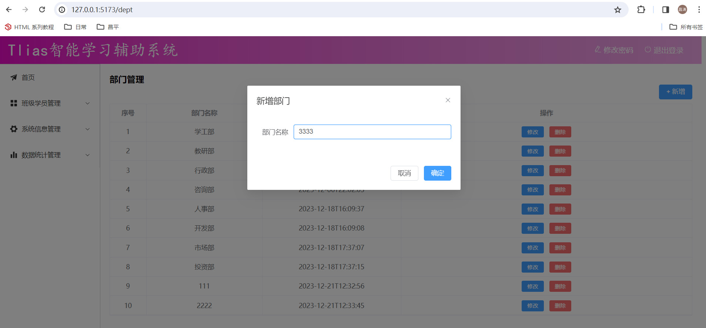 

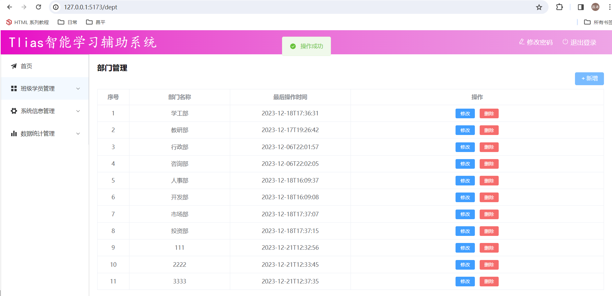 


### 5.3 修改部门

对于修改操作，通常会分为两步进行：

1. 查询回显
2. 保存修改

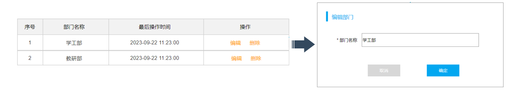 


交互逻辑：

1. 点击 编辑 按钮，根据ID进行查询，弹出对话框，完成页面回显展示。（查询回显）
2. 点击 确定 按钮，保存修改后的数据，完成数据更新操作。（保存修改）


#### 5.3.1 查询回显

1). 在 `src/api/dept.ts` 中定义根据id查询的请求

```ts
//根据ID查询
export const queryInfoApi = (id:number) => request.get(`/depts/${id}`)
```


2). 在 `src/views/dept/index.vue` 中添加根据ID查询回显的逻辑

为修改按钮绑定事件 `<template></template>`:

```html
<el-button size="small" type="primary" @click="update(scope.row.id)">修改</el-button>
```


在 `<script> </script>` 添加JS逻辑：

```ts
//修改部门-查询回显
const update = async (id:number) => {
  formTitle.value = '修改部门'
  dialogFormVisible.value = true
  deptForm.value = {name: ''}

  const result = await queryInfoApi(id)
  deptForm.value = result.data
}
```


到目前为止，完整的  `src/views/dept/index.vue` 代码如下：

```html
<script setup lang="ts">
import {ref, onMounted} from 'vue'
import type { DeptModelArray, DeptModel } from '@/api/model/model'
import {queryAllApi, addApi, queryInfoApi} from '@/api/dept'
import { ElMessage } from 'element-plus';

//声明列表展示数据
let tableData = ref<DeptModelArray>([])

//动态加载数据-查询部门
const queryAll = async () => {
  const result = await queryAllApi()
  tableData.value = result.data
}

//钩子函数
onMounted(() => {
  queryAll()
})


//新增部门
const dialogFormVisible = ref<boolean>(false) 
const deptForm = ref<DeptModel>({name: ''})
const formTitle = ref<string>('')

//点击新增按钮触发的函数
const add = () => {
  formTitle.value = '新增部门'
  dialogFormVisible.value = true
  deptForm.value = {name: ''}
}

//点击保存按钮-发送异步请求
const save = async () => {
  const result = await addApi(deptForm.value)
  if(result.code){
    ElMessage.success('操作成功')
  }else{
    ElMessage.error(result.msg)
  }
  dialogFormVisible.value = false
  queryAll()
}

//修改部门-查询回显
const update = async (id:number) => {
  formTitle.value = '修改部门'
  dialogFormVisible.value = true
  deptForm.value = {name: ''}

  const result = await queryInfoApi(id)
  deptForm.value = result.data
}

</script>

<template>
  <h1>部门管理</h1>
  <el-button type="primary" style="float: right" @click="add">+ 新增</el-button>
  <br><br>

  <!-- 部门数据表格 -->
  <el-table :data="tableData" border style="width: 100%">
    <el-table-column type="index" label="序号"  width="80"  align="center"/>
    <el-table-column prop="name" label="部门名称" width="250"  align="center"/>
    <el-table-column prop="updateTime" label="最后操作时间" width="300"  align="center"/>
    <el-table-column label="操作"  align="center">
      <template #default="scope">
        <el-button size="small" type="primary" @click="update(scope.row.id)">修改</el-button>
        <el-button size="small" type="danger"  @click="">删除</el-button>
      </template>
    </el-table-column>
  </el-table>

  <!-- 新增部门 / 修改部门对话框 -->
  <el-dialog v-model="dialogFormVisible" :title="formTitle" width="30%">
    <el-form :model="deptForm">
      <el-form-item label="部门名称" label-width="80px">
        <el-input v-model="deptForm.name" autocomplete="off" />
      </el-form-item>
    </el-form>

    <template #footer>
      <span class="dialog-footer">
        <el-button @click="dialogFormVisible = false">取消</el-button>
        <el-button type="primary" @click="save">确定</el-button>
      </span>
    </template>
  </el-dialog>

</template>

<style scoped>

</style>
```


#### 5.3.2 保存修改

由于 新增部门 和 修改部门使用的是同一个Dialog对话框，当前点击 “确定” 按钮的时候，有可能执行的是新增操作，也有可能是修改操作。

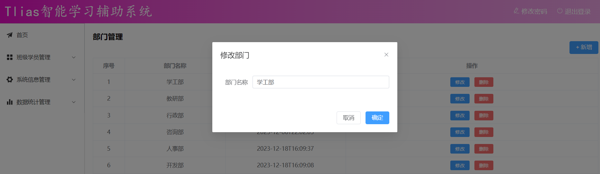 

那应该如何辨别到底是新增，还是修改操作呢 ？

其实，我们只需要根据 `deptForm` 对象的id属性值，来判断即可。 如果没有id，则是新增操作 ；如果有id，则是修改操作。


所以，保存修改功能实现如下：

1). 在 `src/api/dept.ts` 中增加如下修改部门的请求

```ts
//修改部门
export const updateApi = (dept:DeptModel) => request.put<any, ResultModel>('/depts', dept)
```


2). 在 `src/views/dept/index.vue` 中完善(修改) save 函数的逻辑

```ts
//点击保存按钮-发送异步请求
const save = async () => {
  let result = null;
  if(deptForm.value.id){
    result = await updateApi(deptForm.value) //有id, 执行修改操作
  }else {
    result = await addApi(deptForm.value) //没有id, 执行新增操作
  }

  if(result.code){
    ElMessage.success('操作成功')
  }else{
    ElMessage.error(result.msg)
  }
  dialogFormVisible.value = false
  queryAll()
}
```


### 5.4 删除部门

1). 在 `src/api/dept.ts` 中增加如下删除部门的请求

```ts
//删除部门
export const deleteApi = (id:number) => request.delete<any, ResultModel>(`/depts?id=${id}`)
```


2). 在 `src/views/dept/index.vue` 中为什么 删除 按钮绑定事件

```html
<el-button size="small" type="danger"  @click="deleteById(scope.row.id)">删除</el-button>
```


3). 在 `src/views/dept/index.vue`  编写根据ID删除数据的函数 

```ts
//删除部门
const deleteById =async (id:number) => {
  //弹出确认框
  ElMessageBox.confirm('您确认删除此部门吗? ', '确认删除').then( async () => {
    let result = await deleteApi(id)
    if(result.code){ //成功
      ElMessage.success('删除成功')
      queryAll()
    }else {
      ElMessage.error(result.msg)
    }
  }).catch(() => {
    ElMessage.info('取消删除')
  })
}
```


打开浏览器做一个测试:

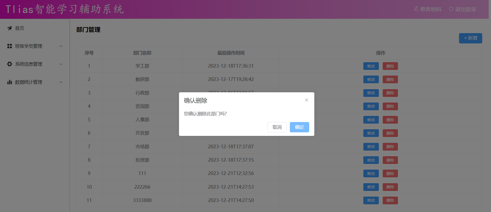 

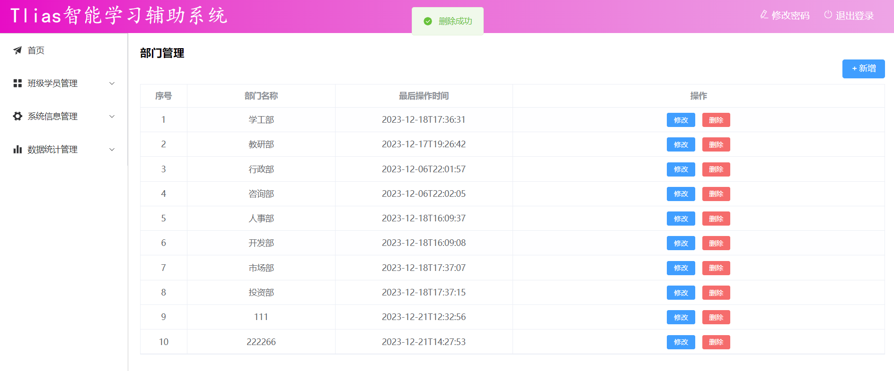 


### 5.5 表单校验

目前，我们已经基本完成了部门管理的增删改查操作。 接下来，我们对部门管理的功能进行，最后一块完善工作，增加表单校验。 从页面原型中，我们可以看到，新增部门的时候部门名称，不能为空，而且长度得在2-10之间。 

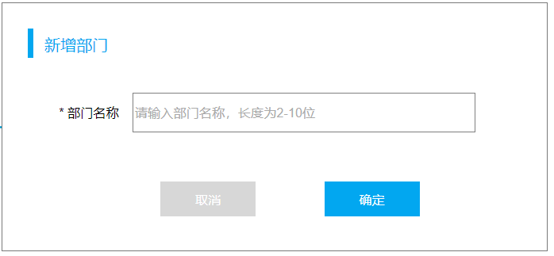 


#### 5.5.1 ElementPlus 参考

Form 组件允许你验证用户的输入是否符合规范，来帮助你找到和纠正错误。`Form` 组件提供了表单验证的功能，只需为 `rules` 属性传入约定的验证规则，并将 `form-Item` 的 `prop` 属性设置为需要验证的特殊键值即可。

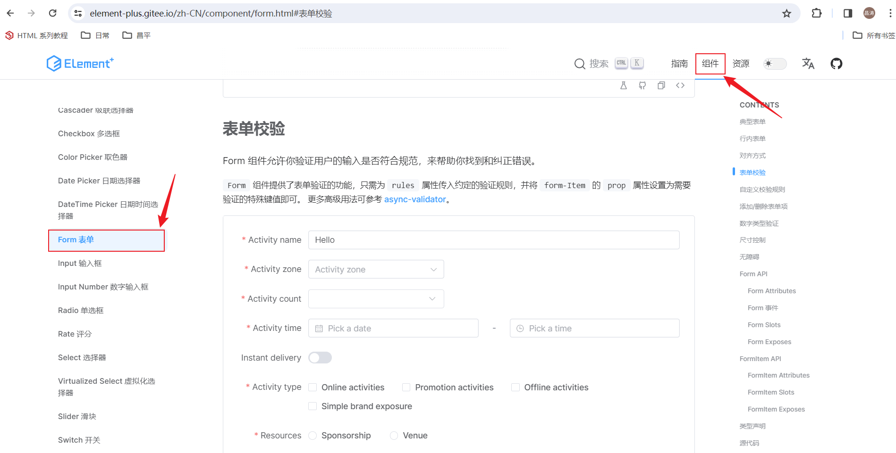


#### 5.5.2 实现

1). 定义表单校验规则

```ts
//定义表单校验规则
const deptFormRef = ref<FormInstance>()
const rules = ref<FormRules<DeptModel>>({
  name: [
    { required: true, message: '部门名称不能为空', trigger: 'blur' },
    { min: 2, max: 10, message: '部门名称长度在2-10个字之间', trigger: 'blur' },
  ]
})
```


2). 将表单校验规则与表单绑定

为表单 `<el-form>` 绑定 `rules` 属性绑定表单校验规则 。 为每一个表单项，指定 `prop` 属性,设置为需要验证的属性名。

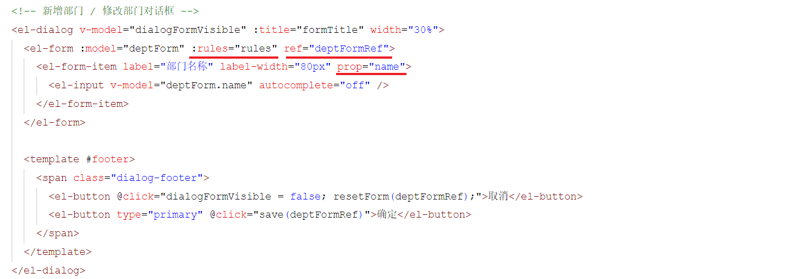   


3). 表单提交时，校验表单，校验通过，则允许提交表单。

修改save方法的逻辑，需要加入表单校验的逻辑。

```ts
//点击保存按钮-发送异步请求
const save = async (form:FormInstance | undefined) => {
  if(!form) return;
  await form.validate(async (valid) => {
    if (valid) {
      let result = null;
      if(deptForm.value.id){
        result = await updateApi(deptForm.value)
      }else {
        result = await addApi(deptForm.value)
      }

      if(result.code){
        ElMessage.success('操作成功')
      }else{
        ElMessage.error(result.msg)
      }
      dialogFormVisible.value = false
      queryAll()
    }
  })
}
```


4). 重置表单校验结果

```ts
//重置表单校验结果
const resetForm = (formEl: FormInstance | undefined) => {
  if (!formEl) return
  formEl.resetFields()
}
```


然后在点击 "新增" / "修改" 按钮的时候，调用 resetForm 函数，重置表单校验结果。

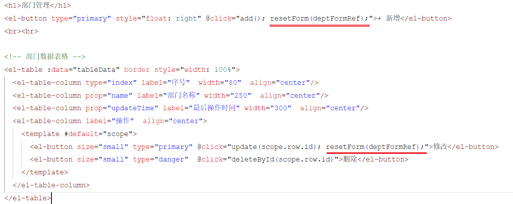 


最终，部门管理的完整代码如下：

1). `src/api/dept.ts`

```ts
import request from "@/utils/request"
import type { DeptModel, ResultModel } from "./model/model"

//列表查询
export const queryAllApi = () => request.get<any, ResultModel>('/depts')

//添加部门
export const addApi = (dept:DeptModel) => request.post<any, ResultModel>('/depts', dept)

//根据ID查询
export const queryInfoApi = (id:number) => request.get(`/depts/${id}`)

//修改部门
export const updateApi = (dept:DeptModel) => request.put<any, ResultModel>('/depts', dept)

//删除部门
export const deleteApi = (id:number) => request.delete<any, ResultModel>(`/depts?id=${id}`)

```


2). `src/views/dept/index.vue`

```html
<script setup lang="ts">
import {ref, onMounted} from 'vue'
import type { DeptModelArray, DeptModel } from '@/api/model/model'
import {queryAllApi, addApi, queryInfoApi, updateApi, deleteApi} from '@/api/dept'
import { ElMessage, ElMessageBox, type FormInstance, type FormRules } from 'element-plus';

//声明列表展示数据
let tableData = ref<DeptModelArray>([])

//动态加载数据-查询部门
const queryAll = async () => {
  const result = await queryAllApi()
  tableData.value = result.data
}

//钩子函数
onMounted(() => {
  queryAll()
})


//新增部门
const dialogFormVisible = ref<boolean>(false) 
const deptForm = ref<DeptModel>({name: ''})
const formTitle = ref<string>('')

//点击新增按钮触发的函数
const add = () => {
  formTitle.value = '新增部门'
  dialogFormVisible.value = true
  deptForm.value = {name: ''}
}

//点击保存按钮-发送异步请求
const save = async (form:FormInstance | undefined) => {
  if(!form) return;
  await form.validate(async (valid) => {
    if (valid) {
      let result = null;
      if(deptForm.value.id){
        result = await updateApi(deptForm.value)
      }else {
        result = await addApi(deptForm.value)
      }

      if(result.code){
        ElMessage.success('操作成功')
      }else{
        ElMessage.error(result.msg)
      }
      dialogFormVisible.value = false
      queryAll()
    }
  })
}

//修改部门-查询回显
const update = async (id:number) => {
  formTitle.value = '修改部门'
  dialogFormVisible.value = true
  deptForm.value = {name: ''}

  const result = await queryInfoApi(id)
  deptForm.value = result.data
}

//删除部门
const deleteById =async (id:number) => {
  //弹出确认框
  ElMessageBox.confirm('您确认删除此部门吗? ', '确认删除').then( async () => {
    let result = await deleteApi(id)
    if(result.code){ //成功
      ElMessage.success('删除成功')
      queryAll()
    }else {
      ElMessage.error(result.msg)
    }
  }).catch(() => {
    ElMessage.info('取消删除')
  })
}

//定义表单校验规则
const deptFormRef = ref<FormInstance>()
const rules = ref<FormRules<DeptModel>>({
  name: [
    { required: true, message: '部门名称不能为空', trigger: 'blur' },
    { min: 2, max: 10, message: '部门名称长度在2-10个字之间', trigger: 'blur' },
  ]
})

//重置表单校验结果
const resetForm = (form: FormInstance | undefined) => {
  if (!form) return
  form.resetFields()
}
</script>

<template>
  <h1>部门管理</h1>
  <el-button type="primary" style="float: right" @click="add(); resetForm(deptFormRef);">+ 新增</el-button>
  <br><br>

  <!-- 部门数据表格 -->
  <el-table :data="tableData" border style="width: 100%">
    <el-table-column type="index" label="序号"  width="80"  align="center"/>
    <el-table-column prop="name" label="部门名称" width="250"  align="center"/>
    <el-table-column prop="updateTime" label="最后操作时间" width="300"  align="center"/>
    <el-table-column label="操作"  align="center">
      <template #default="scope">
        <el-button size="small" type="primary" @click="update(scope.row.id); resetForm(deptFormRef);">修改</el-button>
        <el-button size="small" type="danger"  @click="deleteById(scope.row.id)">删除</el-button>
      </template>
    </el-table-column>
  </el-table>

  <!-- 新增部门 / 修改部门对话框 -->
  <el-dialog v-model="dialogFormVisible" :title="formTitle" width="30%">
    <el-form :model="deptForm" :rules="rules" ref="deptFormRef">
      <el-form-item label="部门名称" label-width="80px" prop="name">
        <el-input v-model="deptForm.name" autocomplete="off" />
      </el-form-item>
    </el-form>

    <template #footer>
      <span class="dialog-footer">
        <el-button @click="dialogFormVisible = false; resetForm(deptFormRef);">取消</el-button>
        <el-button type="primary" @click="save(deptFormRef)">确定</el-button>
      </span>
    </template>
  </el-dialog>

</template>

<style scoped>

</style>

```


