# 员工管理

## 1. 条件分页查询

### 1.1 概述

在页面原型中，我们可以看到在查询员工信息列表时，既需要根据条件动态查询，还需要对查询的结果进行分页处理。

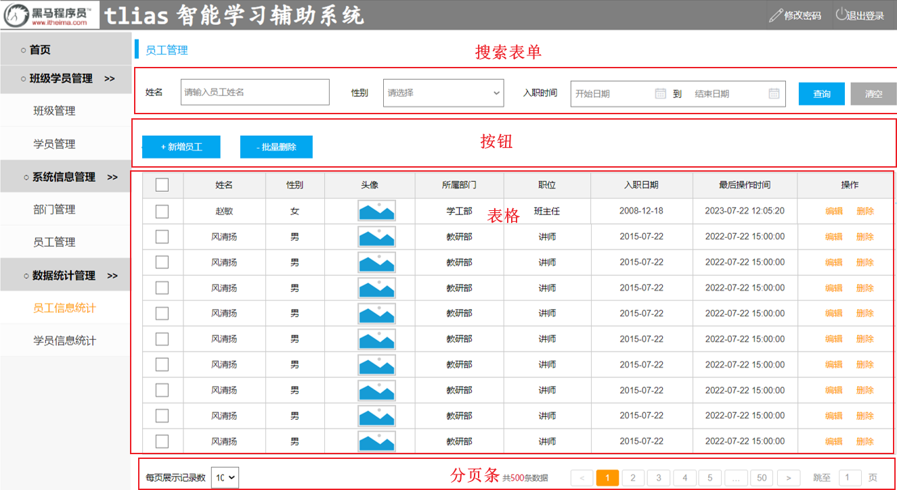 


那要完成这个页面布局，我们就需要用到ElementPlus中提供的组件，包括 Form表单、Button按钮、Table表格、Pagination分页组件。

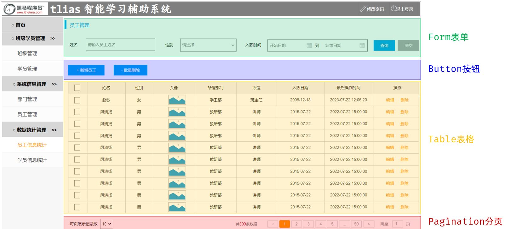 


### 1.2 接口文档

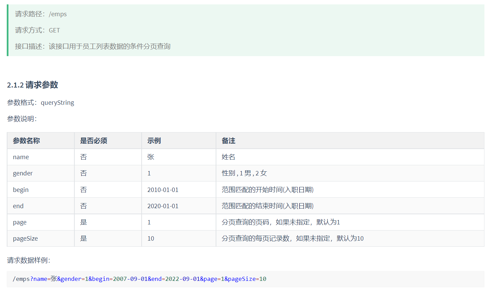 


### 1.3 页面布局

#### 1.3.1 搜索栏

搜索栏制作，主要用到ElementPlus中的组件包括：`Button 组件`  `Form 组件` 。 具体的布局代码如下：

```html
<script setup lang="ts">
import type { SearchEmpModel } from '@/api/model/model';
import {ref, onMounted} from 'vue'

//搜索栏对象声明
const searchEmp = ref<SearchEmpModel>({
  name: '',
  gender: '',
  begin: '',
  end: '',
  date: []
})

</script>

<template>
  <h1>员工管理</h1> <br>
  <!-- 搜索栏 -->
  <el-form :inline="true" :model="searchEmp" class="demo-form-inline">
    <el-form-item label="姓名">
      <el-input v-model="searchEmp.name" placeholder="请输入员工姓名" clearable />
    </el-form-item>
    
    <el-form-item label="性别">
      <el-select v-model="searchEmp.gender" placeholder="请选择" clearable>
        <el-option label="男" value="1" />
        <el-option label="女" value="2" />
      </el-select>
    </el-form-item>

    <el-form-item label="入职时间">
      <el-date-picker v-model="searchEmp.date" type="daterange" range-separator="到" start-placeholder="开始时间" end-placeholder="结束时间"/>
    </el-form-item>

    <el-form-item>
      <el-button type="primary" @click="">查询</el-button>
      <el-button type="default" @click="">重置</el-button>
    </el-form-item>
  </el-form>

  <!-- 按钮 -->
  <el-button type="primary" @click="">+ 新增员工</el-button>
  <el-button type="danger" @click="">- 批量删除</el-button>

  <!-- 表格 -->

  <!-- 分页栏 -->

</template>

<style scoped>

</style>
```


浏览器打开页面，具体效果如下：

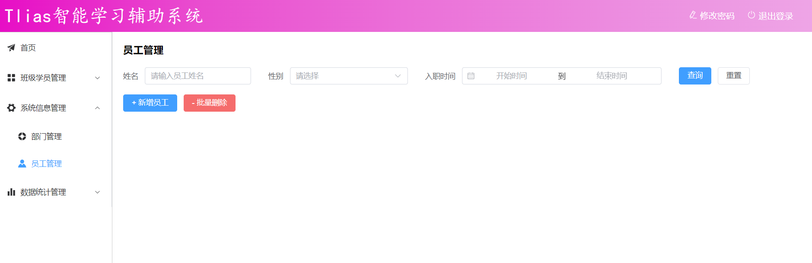 


我们可以在表单中，输入搜索条件，看看表单绑定的数据值。

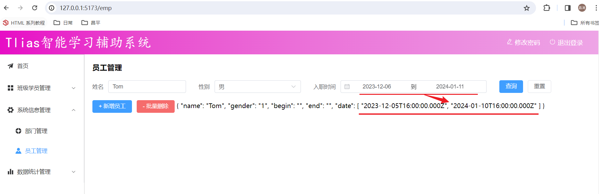 

我们可以看到，日期时间组件中选择的开始时间和结束时间，数据绑定到了 `date` 属性中，是一个数组，里面两个值，一个开始时间、一个结束时间。 而在执行查询时，从接口文档中，我们可以看出，需要的是开始时间 `begin` 和 结束时间 `end`。

而当我们选择的入职时间范围发生变化，应该实时计算出 开始时间 `begin` 和 结束时间 `end`，那这里可以通过Vue框架中的 `watch侦听` 来解决。 


#### 1.3.2 watch侦听对象

**作用：**侦听一个或多个响应式数据源，并在数据源变化时，调用所给的 回调函数。

**语法：**

1). 导入 watch 函数

2). 执行 watch 函数，传入要侦听的响应式数据源（ref对象）和回调函数


**A. 侦听一个响应式对象**

```ts
//演示watch侦听
const myname = ref<string>('')
watch(myname, (newVal, oldVal)=>{
  console.log(`name的值, newVal: ${newVal}, oldVal: ${oldVal}`);
})
```


**B. 侦听对象的单个属性**

```ts
//侦听searchEmp对象中的name的变化
watch(() => searchEmp.value.name,  (newVal , oldVal) => {
   console.log(`name的值, newVal: ${newVal}, oldVal: ${oldVal}`);
})
```


**C. 侦听对象的全部属性（深度侦听）**

```ts
watch(searchEmp, (newVal, oldVal) => {
  console.log(`name的值, newVal: ${newVal.name}, oldVal: ${oldVal.name}`);
}, {deep: true})
```


> watch函数的第三个参数是可选的，常见两个选项：
>
> - deep(boolean)：是否深度侦听，默认浅层侦听。
> - immediate(boolean)：是否在侦听创建时，立即触发回调函数


案例中，入职日期的侦听如下代码如下：

```ts
//侦听searchEmp的date属性
watch(() => searchEmp.value.date, (newVal, oldVal) => {
  if(newVal.length>0) {
    searchEmp.value.begin = newVal[0]
    searchEmp.value.end = newVal[1]
  }else {
    searchEmp.value.begin = ''
    searchEmp.value.end = ''
  }
})
```

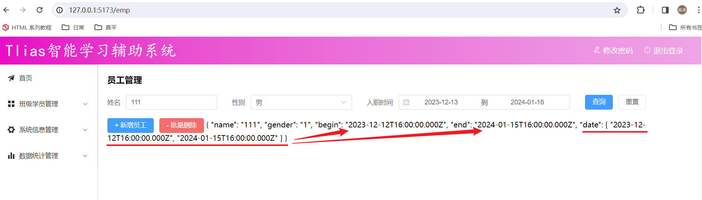 


#### 1.3.3 数据表格

1).  在 `src/views/emp/index.vue` 中的 `<template> </template>`   部分增加如下内容：

```html
 <!-- 表格 -->
 <!-- 列表展示 -->
 <el-table :data="tableData" border style="width: 100%" fit @selection-change="handleSelectionChange">
    <el-table-column type="selection" width="55" />
    <el-table-column prop="name" label="姓名" align="center" width="130px" />
    <el-table-column label="性别" align="center" width="100px">
      <template #default="scope">
        {{ scope.row.gender == 1 ? '男' : '女' }}
      </template>
    </el-table-column>
    <el-table-column prop="image" label="头像" align="center">
      <template #default="scope">
        
      </template>
    </el-table-column>
    <el-table-column prop="deptName" label="所属部门" align="center" />
    <el-table-column prop="job" label="职位" align="center" width="100px">
      <template #default="scope">
        <span v-if="scope.row.job == 1">班主任</span>
        <span v-else-if="scope.row.job == 2">讲师</span>
        <span v-else-if="scope.row.job == 3">学工主管</span>
        <span v-else-if="scope.row.job == 4">教研主管</span>
        <span v-else-if="scope.row.job == 5">咨询师</span>
        <span v-else>其他</span>
      </template>
    </el-table-column>
    <el-table-column prop="entryDate" label="入职时间" align="center" width="130px" />
    <el-table-column prop="updateTime" label="最后修改时间" align="center" />
    <el-table-column label="操作" align="center">
      <template #default="scope">
        <el-button type="primary" size="small" @click="">编辑</el-button>
        <el-button type="danger" size="small" @click="">删除</el-button>
      </template>
    </el-table-column>
  </el-table>
  <br>

  <!-- 分页组件Pagination -->
  <el-pagination
    v-model:current-page="pagination.currentPage"
    v-model:page-size="pagination.pageSize"
    :page-sizes="[5, 10, 20, 50, 100]"
    layout="total, sizes, prev, pager, next, jumper"
    :total="pagination.total"
    @size-change="handleSizeChange"
    @current-change="handleCurrentChange"
  />
```


2). 在 `src/views/emp/index.vue` 中的 `<script> </script>`   部分增加如下内容：

```ts
//列表展示数据
const tableData = ref<EmpModelArray>([])

//复选框
let selectIds = ref<number[]>([])
const handleSelectionChange = (selection: any[]) => {
  selectIds.value = selection.map(item => item.id)
}

//分页组件
const pagination = ref<PaginationParam>({currentPage: 1, pageSize: 5, total: 0})
//每页展示记录数发生变化时触发
const handleSizeChange = (pageSize: number) => {
  pagination.value.pageSize = pageSize
  queryPage()
}
//当前页码发生变化时触发
const handleCurrentChange = (page: number) => {
  pagination.value.currentPage = page
  queryPage()
}

//分页条件查询
const queryPage = async () => {
  
}
```


### 1.4 页面交互

1). 为 "查询" 按钮绑定事件，点击查询按钮调用queryPage函数.

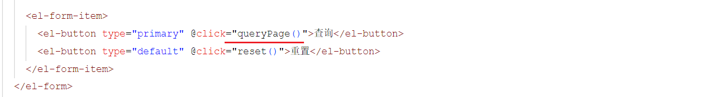 

```ts
//分页条件查询
const queryPage = async () => {
  const result = await queryPageApi(
    searchEmp.value.begin,
    searchEmp.value.end,
    searchEmp.value.gender,
    searchEmp.value.name,
    pagination.value.currentPage,
    pagination.value.pageSize
  )

  if(result.code) {
    tableData.value = result.data.rows
    pagination.value.total = result.data.total
  }
}

//钩子函数
onMounted(() => {
  queryPage()
})
```


2). 为 "重置" 按钮绑定事件 , 点击重置按钮, 清空搜索表单, 并重新查询.

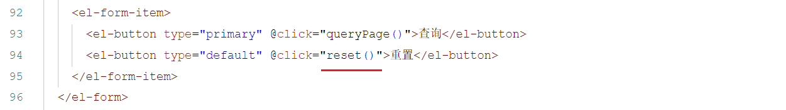 

```ts
//重置
const reset = () => {
  searchEmp.value = {name:'', begin:'', end:'', date: [], gender: ''}
  queryPage()
}
```


到此，员工列表的动态条件分页查询，就已经完成了。  目前 `src/views/emp/index.vue` 中的完整代码如下

```html
<script setup lang="ts">
import type { EmpModelArray, PaginationParam, SearchEmpModel } from '@/api/model/model'
import {ref, onMounted, watch} from 'vue'
import { queryPageApi} from '@/api/emp'

//搜索栏对象声明
const searchEmp = ref<SearchEmpModel>({ name: '', gender: '', begin: '', end: '', date: []})
//列表展示数据
const tableData = ref<EmpModelArray>([])

//复选框
let selectIds = ref<number[]>([])
const handleSelectionChange = (selection: any[]) => {
  selectIds.value = selection.map(item => item.id)
}

//分页组件
const pagination = ref<PaginationParam>({currentPage: 1, pageSize: 5, total: 0})
//每页展示记录数发生变化时触发
const handleSizeChange = (pageSize: number) => {
  pagination.value.pageSize = pageSize
  queryPage()
}

//当前页码发生变化时触发
const handleCurrentChange = (page: number) => {
  pagination.value.currentPage = page
  queryPage()
}

//分页条件查询
const queryPage = async () => {
  const result = await queryPageApi(
    searchEmp.value.begin,
    searchEmp.value.end,
    searchEmp.value.gender,
    searchEmp.value.name,
    pagination.value.currentPage,
    pagination.value.pageSize
  )

  if(result.code) {
    tableData.value = result.data.rows
    pagination.value.total = result.data.total
  }
}

//钩子函数
onMounted(() => {
  queryPage()
})


//重置
const reset = () => {
  searchEmp.value = {name:'', begin:'', end:'', date: [], gender: ''}
  queryPage()
}


//侦听searchEmp的date属性
watch(() => searchEmp.value.date, (newVal, oldVal) => {
  if(newVal.length>0) {
    searchEmp.value.begin = newVal[0]
    searchEmp.value.end = newVal[1]
  }else {
    searchEmp.value.begin = ''
    searchEmp.value.end = ''
  }
})

</script>

<template>
  <h1>员工管理</h1> <br>
  <!-- 搜索栏 -->
  <el-form :inline="true" :model="searchEmp" class="demo-form-inline">
    <el-form-item label="姓名">
      <el-input v-model="searchEmp.name" placeholder="请输入员工姓名" clearable />
    </el-form-item>
    
    <el-form-item label="性别">
      <el-select v-model="searchEmp.gender" placeholder="请选择" clearable>
        <el-option label="男" value="1" />
        <el-option label="女" value="2" />
      </el-select>
    </el-form-item>

    <el-form-item label="入职时间">
      <el-date-picker v-model="searchEmp.date" type="daterange" value-format="YYYY-MM-DD" range-separator="到" start-placeholder="开始时间" end-placeholder="结束时间"/>
    </el-form-item>

    <el-form-item>
      <el-button type="primary" @click="queryPage()">查询</el-button>
      <el-button type="default" @click="reset()">重置</el-button>
    </el-form-item>
  </el-form>

  <!-- 按钮 -->
  <el-button type="primary" @click="">+ 新增员工</el-button>
  <el-button type="danger" @click="">- 批量删除</el-button>
  <br><br>
  

  <!-- 表格 -->
  <!-- 列表展示 -->
  <el-table :data="tableData" border style="width: 100%" fit @selection-change="handleSelectionChange">
    <el-table-column type="selection" width="55" />
    <el-table-column prop="name" label="姓名" align="center" width="130px" />
    <el-table-column label="性别" align="center" width="100px">
      <template #default="scope">
        {{ scope.row.gender == 1 ? '男' : '女' }}
      </template>
    </el-table-column>
    <el-table-column prop="image" label="头像" align="center">
      <template #default="scope">
        
      </template>
    </el-table-column>
    <el-table-column prop="deptName" label="所属部门" align="center" />
    <el-table-column prop="job" label="职位" align="center" width="100px">
      <template #default="scope">
        <span v-if="scope.row.job == 1">班主任</span>
        <span v-else-if="scope.row.job == 2">讲师</span>
        <span v-else-if="scope.row.job == 3">学工主管</span>
        <span v-else-if="scope.row.job == 4">教研主管</span>
        <span v-else-if="scope.row.job == 5">咨询师</span>
        <span v-else>其他</span>
      </template>
    </el-table-column>
    <el-table-column prop="entryDate" label="入职时间" align="center" width="130px" />
    <el-table-column prop="updateTime" label="最后修改时间" align="center" />
    <el-table-column label="操作" align="center">
      <template #default="scope">
        <el-button type="primary" size="small" @click="">编辑</el-button>
        <el-button type="danger" size="small" @click="">删除</el-button>
      </template>
    </el-table-column>
  </el-table>
  <br>

  <!-- 分页组件Pagination -->
  <el-pagination
    v-model:current-page="pagination.currentPage"
    v-model:page-size="pagination.pageSize"
    :page-sizes="[5, 10, 20, 50, 100]"
    layout="total, sizes, prev, pager, next, jumper"
    :total="pagination.total"
    @size-change="handleSizeChange"
    @current-change="handleCurrentChange"
  />
  
</template>

<style scoped>

</style>
```


最终，打开浏览器效果如下：

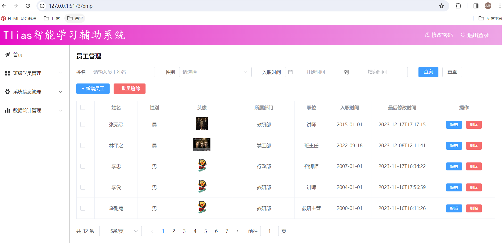 


## 2. 新增员工

### 2.1 需求分析

通过页面原型，我们可以看到，新增员工的表单提交的数据，包括员工的基本数据，员工的工作经历数据。 

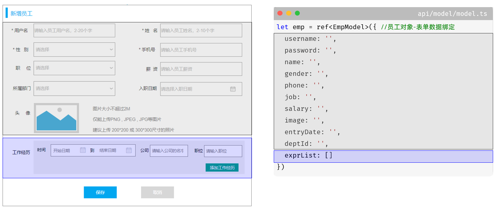 


### 2.2 页面布局

#### 2.2.1 介绍

我们看到这个表单，每一行放了两个表单项。 而头像这一行，是一个表单项，这里呢，我们可以使用 `ElementPlus` 提供的 `layout` 布局来实现。通过基础的 24 分栏，迅速简便地创建布局。

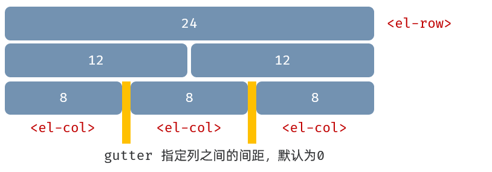 


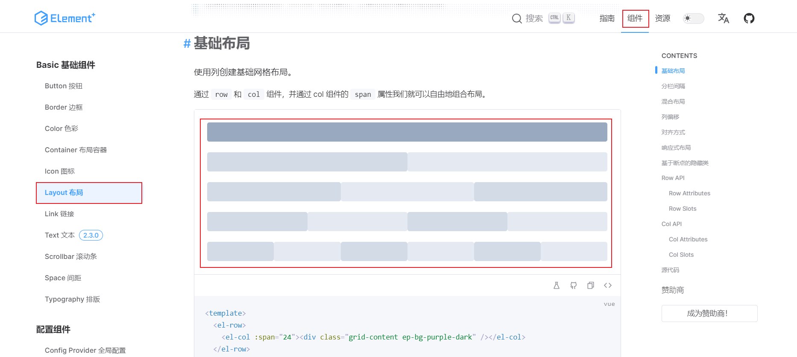 


#### 2.2.2 基本信息

先来完成员工基本信息表单的制作。 具体的代码如下：

1). `<template> </template>` 中的布局代码如下

```html
<!-- 新增员工/修改员工-Dialog -->
  <!-- 新增/修改员工对话框 -->
  <el-dialog v-model="dialogFormVisible" :title="formTitle">
    <el-form :model="emp" >
      <!-- 第一行 -->
      <el-row>
        <el-col :span="12">
          <el-form-item label="用户名" :label-width="labelWidth" prop="username">
            <el-input v-model="emp.username" />
          </el-form-item>
        </el-col>
        <el-col :span="12">
          <el-form-item label="姓名" :label-width="labelWidth" prop="name">
            <el-input v-model="emp.name" />
          </el-form-item>
        </el-col>
      </el-row>
      
      <!-- 第二行 -->
      <el-row>
        <el-col :span="12">
          <el-form-item label="性别" :label-width="labelWidth"  prop="gender">
            <el-select v-model="emp.gender" placeholder="请选择" style="width: 100%;">
              <el-option v-for="gender in genders" :label="gender.name" :value="gender.value" />
            </el-select>
          </el-form-item>
        </el-col>
        <el-col :span="12">
          <el-form-item label="手机号" :label-width="labelWidth"  prop="phone">
            <el-input v-model="emp.phone" />
          </el-form-item>
        </el-col>
      </el-row>

      <!-- 第三行 -->
      <el-row>
        <el-col :span="12">
          <el-form-item label="薪资" :label-width="labelWidth"  prop="salary">
            <el-input v-model="emp.salary" />
          </el-form-item>
        </el-col>
        <el-col :span="12">
          <el-form-item label="入职日期" :label-width="labelWidth">
            <el-date-picker v-model="emp.entryDate" type="date" placeholder="请选择入职日期" value-format="YYYY-MM-DD" style="width: 100%;"/>
          </el-form-item>
        </el-col>
      </el-row>

      <!-- 第四行 -->
      <el-row>
        <el-col :span="12">
          <el-form-item label="所属部门" :label-width="labelWidth">
            <el-select v-model="emp.deptId" placeholder="请选择" style="width: 100%;">
              <el-option v-for="dept in depts" :label="dept.name" :value="dept.id" />
            </el-select>
          </el-form-item>
        </el-col>
        <el-col :span="12">
          <el-form-item label="职位" :label-width="labelWidth">
            <el-select v-model="emp.job" placeholder="请选择" style="width: 100%;">
              <el-option v-for="job in jobs" :label="job.name" :value="job.value" />
            </el-select>
          </el-form-item>
        </el-col>
      </el-row>

      <!-- 第五行 -->
      <el-row :gutter="10">
        <el-col :span="24">
          <el-form-item label="头像" label-width="80px">
            <el-upload class="avatar-uploader" 
              action="/api/upload" 
              :show-file-list="false"
              :on-success="handleAvatarSuccess" 
              :before-upload="beforeAvatarUpload">
              
              <el-icon v-else class="avatar-uploader-icon"><Plus /></el-icon>
            </el-upload>
          </el-form-item>
        </el-col>
      </el-row>
    </el-form>

    <template #footer>
      <span class="dialog-footer">
        <el-button @click="dialogFormVisible = false; ">取消</el-button>
        <el-button type="primary" @click="">保存</el-button>
      </span>
    </template>

  </el-dialog>
```


2).  `<script> </script>` 中的代码如下

```ts
//钩子函数 - 添加调用queryAllDept() 代码
onMounted(() => {
  queryPage()
  queryAllDept()
})

//查询所有部门
const depts = ref<DeptModelArray>([])
const queryAllDept = async () => {
  const result = await queryAllApi()
  if(result.code) {
    depts.value = result.data
  }
}


//----------- 新增 / 修改 ---------------------------
//职位列表数据
const jobs = ref([{ name: '班主任', value: 1 },{ name: '讲师', value: 2 },{ name: '学工主管', value: 3 },{ name: '教研主管', value: 4 },{ name: '咨询师', value: 5 },{ name: '其他', value: 6 }])
//性别列表数据
const genders = ref([{ name: '男', value: 1 }, { name: '女', value: 2 }])

let dialogFormVisible = ref<boolean>(false) //控制新增/修改的对话框的显示与隐藏
let labelWidth = ref<number>(80) //form表单label的宽度
let formTitle = ref<string>('') //表单的标题
let emp = ref<EmpModel>({ //员工对象-表单数据绑定
  username: '',
  password: '',
  name: '',
  gender: '',
  phone: '',
  job: '',
  salary: '',
  image: '',
  entryDate: '',
  deptId: '',
  exprList: []
})


//文件上传
// let imageUrl = ref<string>()
const handleAvatarSuccess: UploadProps['onSuccess'] = (response, uploadFile) => {
   emp.value.image = response.data; 
}

const beforeAvatarUpload: UploadProps['beforeUpload'] = (rawFile) => {
  if (rawFile.type !== 'image/jpeg' && rawFile.type !== 'image/png') {
    ElMessage.error('图片格式不支持!')
    return false
  } else if (rawFile.size / 1024 / 1024 > 10) {
    ElMessage.error('图片大小不能超过 10 MB!')
    return false
  }
  return true
}

//新增员工-打开对话框
const add = () => {
  dialogFormVisible.value = true
  formTitle.value = '新增员工'
}

//清空表单
const clearEmp = () => {
  emp.value = {
    username: '',
    password: '',
    name: '',
    gender: '',
    phone: '',
    job: '',
    salary: '',
    image: '',
    entryDate: '',
    deptId: '',
    exprList: new Array<EmpExprModel>()
  }
}
```


3). `<style> </style>` 的css样式代码如下:

```css
  .avatar-uploader .avatar {
    width: 78px;
    height: 78px;
    display: block;
  }
  .avatar-uploader .el-upload:hover {
    border-color: var(--el-color-primary);
  }
  .el-icon.avatar-uploader-icon {
    font-size: 28px;
    color: #8c939d;
    width: 78px;
    height: 78px;
    text-align: center;
    border: 1px dashed #ccc;
    border-radius: 5px;
  }
```


打开浏览器，看到新增员工的表单呈现出来了：

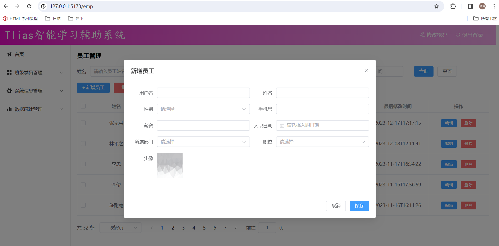 


#### 2.2.3 工作经历

##### 2.2.3.1 思路

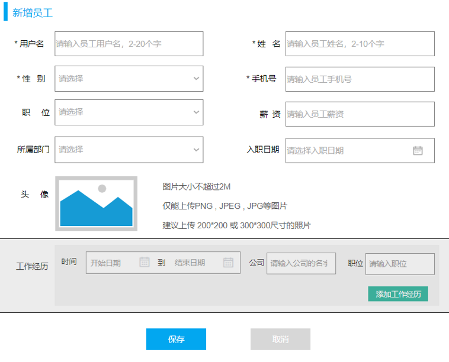 

新增员工的基本信息表单已经制作完成了，那接下来，要制作的是员工的工作经历。 员工的过往工作经历可能是多条，点击 "添加员工工作经历" 按钮，如何增加一个条目 ？ 点击每一条后面的删除按钮，需要删除当前条件？

- Vue是基于数据驱动视图展示的。
- "添加" 时，我们可以往数组中添加数据。
- "删除" 时，可以删除数组中的元素。
- 一旦数据发生变化，视图中的展示就会发生变化。 


##### 2.2.3.2 实现

1). 在 `<template> </template>` 中定义的表单中，增加如下代码：

```html
 <!-- 第六行 -->
      <!-- 第六行 -->
      <el-row :gutter="10">
        <el-col :span="24">
          <el-form-item label="工作经历" :label-width="labelWidth">
            <el-button type="success" size="small" @click="addWorkItem">+ 添加工作经历</el-button>
          </el-form-item>
        </el-col>
      </el-row>

      <!-- 第七...行 -->
      <el-row :gutter="5" v-for="expr in emp.exprList">
        <el-col :span="10">
          <el-form-item label="时间" size="small" :label-width="labelWidth">
            <el-date-picker v-model="expr.exprDate" type="daterange" range-separator="至" start-placeholder="开始时间" end-placeholder="结束时间" value-format="YYYY-MM-DD"/>
          </el-form-item>
        </el-col>
        
        <el-col :span="6">
          <el-form-item label="公司" size="small">
            <el-input v-model="expr.company" placeholder="公司名称"/>
          </el-form-item>
        </el-col>

        <el-col :span="6">
          <el-form-item label="职位" size="small">
            <el-input v-model="expr.job"  placeholder="职位名称"/>
          </el-form-item>
        </el-col>

        <el-col :span="2">
          <el-form-item size="small">
            <el-button type="danger" @click="delWorkItem(expr)">- 删除</el-button>
          </el-form-item>
        </el-col>
      </el-row>
```


2). 在 `<script> </script>` 中增加如下代码：

```ts
//动态添加工作经历 .
const addWorkItem = () => {
  emp.value.exprList.push({exprDate: [],begin: '',end: '',company: '',job: ''})
}

//动态删除工作经历 .
const delWorkItem = (expr: EmpExprModel) => {
  if(emp.value.exprList) {
    const index = emp.value.exprList.indexOf(expr)
    if(index != -1){
      emp.value.exprList.splice(index,1)
    }
  }
}

//监听-emp员工对象中的工作经历数据
watch(emp, (newVal, oldVal) => {
  if(emp.value.exprList) {
    emp.value.exprList.forEach(expr => {
      expr.begin = expr.exprDate[0]
      expr.end = expr.exprDate[1]
    })
  }
}, {deep: true})
```


打开浏览器，点击 新增员工，点击 “添加员工工作经历” 测试：

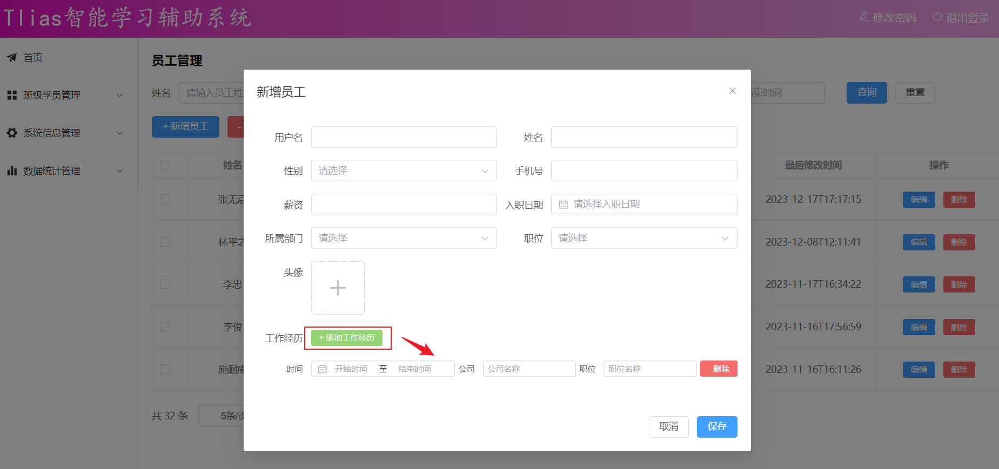 


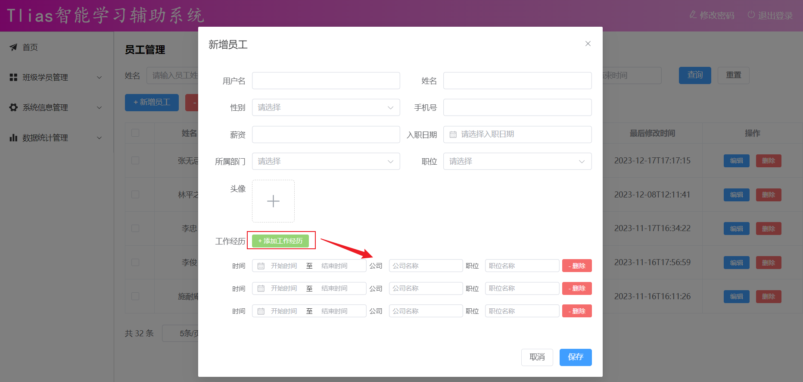 


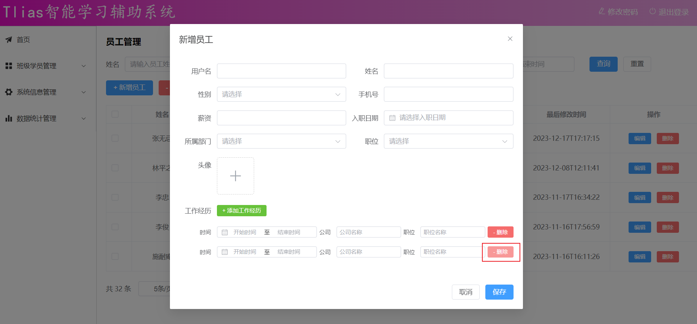 


### 2.3 页面交互

基本的页面布局，我们完成之后，接下来，就需要完成页面的交互操作。 当点击 “保存”  按钮，需要执行如下操作：

1. 点击保存之后，发送异步请求到服务端，提交数据。
2. 保存完毕之后，如果成功，关闭对话框，重新加载列表数据。
3. 保存完毕之后，如果失败，提示错误信息。


具体操作如下：

1). 为 "保存按钮"  绑定事件

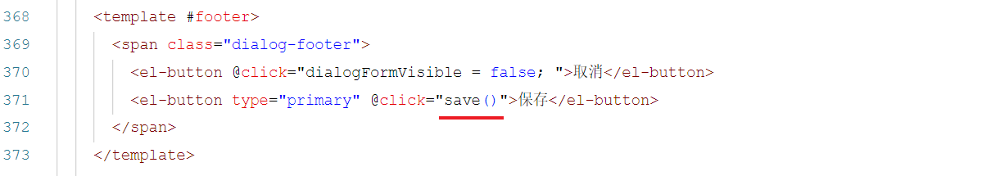 


2). 在 `<script></script>` 中定义函数

```ts
//-------------保存员工信息 
const save = async () => {
  //表单校验
  let result = await addApi(emp.value)
  if(result.code) {
    ElMessage.success('操作成功')
    dialogFormVisible.value = false
    queryPage()
  }else {
    ElMessage.error(result.msg)
  }
}

```


### 2.4 表单校验

结合页面原型及接口文档，梳理校验规则：

| 字段   | 是否必填 | 其他限制                    |
| ------ | -------- | --------------------------- |
| 用户名 | 是       | 长度2-20                    |
| 姓名   | 是       | 2-10                        |
| 性别   | 是       |                             |
| 手机号 | 是       | 符合手机号规则，正则        |
| 薪资   | 否       | 全为数字，第一位不为0，正则 |

1). 参照 `Element Plus` 中的Form表单组件，定义校验规则；

```ts
//表单校验规则
const empFormRef = ref<FormInstance>()
const rules = ref<FormRules<EmpModel>>({
  username: [
    { required: true, message: '用户名为必填项', trigger: 'blur' },
    { min: 2, max: 20, message: '用户名长度为2-20个字', trigger: 'blur' }
  ],
  name: [
    { required: true, message: '姓名为必填项', trigger: 'blur' },
    { min: 2, max: 10, message: '姓名长度为2-10个字', trigger: 'blur' }
  ],
  gender: [{ required: true, message: '性别为必填项', trigger: 'change' }],
  phone: [
    { required: true, message: '手机号为必填项', trigger: 'blur' },
    { pattern: /^1[3-9]\d{9}$/g, message: '请输入合法的手机号', trigger: 'blur' }
  ],
  salary: [
    { pattern: /^[1-9]\d*$/g, message: '请输入合法的数字', trigger: 'blur' }
  ]
})
```


2). 将校验规则与Form表单组件进行属性绑定；

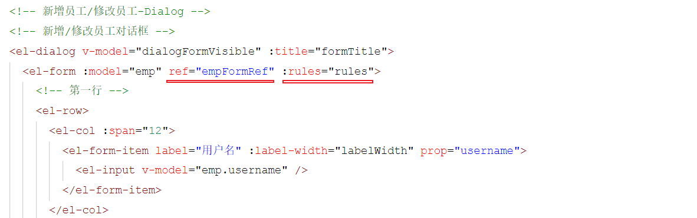 


3). 在保存员工时，进行表单校验，校验通过再提交数据；

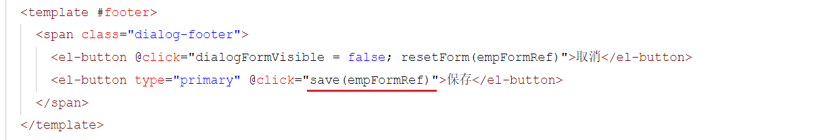 


完善 `save` 函数，完善后的代码如下：

```ts
const save = async (form: FormInstance|undefined) => {
  if(!form) return;
  //表单校验
  form.validate(async (valid) => {
    if(valid) {
      let result = await addApi(emp.value)
      if(result.code) {
        ElMessage.success('操作成功')
        dialogFormVisible.value = false
        queryPage()
      }else {
        ElMessage.error(result.msg)
      } 
    }
  })
}
```


4). 点击取消、新增、修改时，重置表单校验规则；

```ts
//重置表单
const resetForm = (empForm: FormInstance | undefined) => {
  if (!empForm) return
  empForm.resetFields()
}
```

新增员工时，重置表单校验规则：

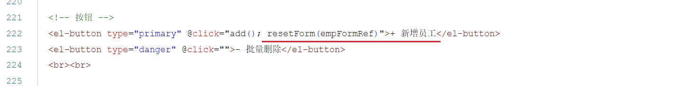 

点击取消时，重置表单校验规则：

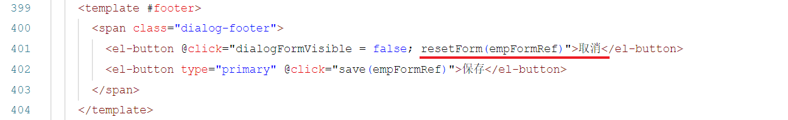 


打开浏览器，访问测试：

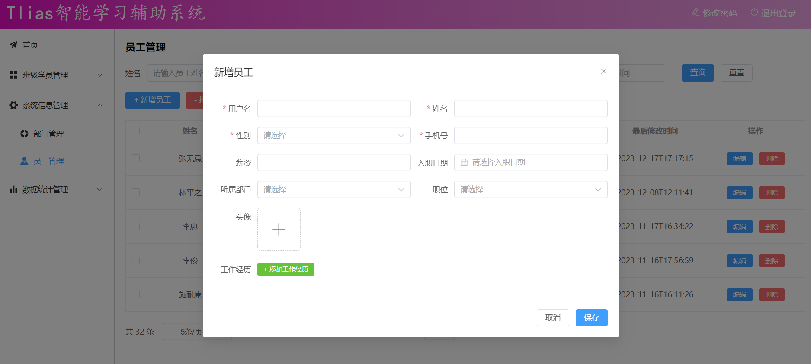 

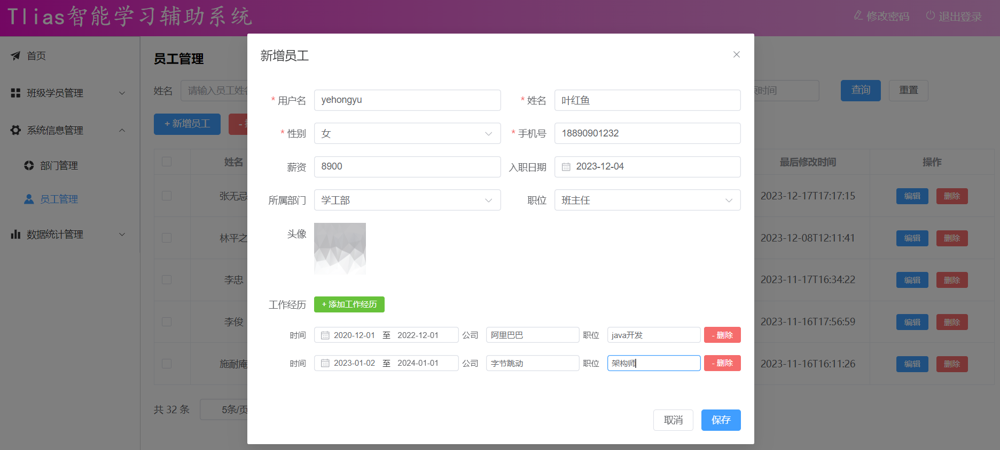 

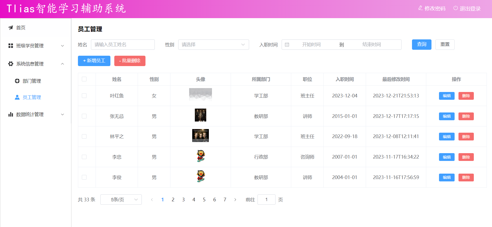 


到此呢，关于员工列表的动态条件分页查询。 新增员工的功能，我们都已经实现了，目前 `src/views/emp/index.vue` 文件的代码如下:

```html
<script setup lang="ts">
import type { DeptModelArray, EmpExprModel, EmpModel, EmpModelArray, PaginationParam, SearchEmpModel } from '@/api/model/model'
import { ref, onMounted, watch } from 'vue'
import { addApi, queryPageApi } from '@/api/emp'
import { queryAllApi } from '@/api/dept'
import { ElMessage, type FormInstance, type FormRules, type UploadProps } from 'element-plus';

//搜索栏对象声明
const searchEmp = ref<SearchEmpModel>({ name: '', gender: '', begin: '', end: '', date: []})
//列表展示数据
const tableData = ref<EmpModelArray>([])

//复选框
let selectIds = ref<number[]>([])
const handleSelectionChange = (selection: any[]) => {
  selectIds.value = selection.map(item => item.id)
}

//分页组件
const pagination = ref<PaginationParam>({currentPage: 1, pageSize: 5, total: 0})
//每页展示记录数发生变化时触发
const handleSizeChange = (pageSize: number) => {
  pagination.value.pageSize = pageSize
  queryPage()
}
//当前页码发生变化时触发
const handleCurrentChange = (page: number) => {
  pagination.value.currentPage = page
  queryPage()
}

//分页条件查询
const queryPage = async () => {
  const result = await queryPageApi(
    searchEmp.value.begin,
    searchEmp.value.end,
    searchEmp.value.gender,
    searchEmp.value.name,
    pagination.value.currentPage,
    pagination.value.pageSize
  )

  if(result.code) {
    tableData.value = result.data.rows
    pagination.value.total = result.data.total
  }
}

//钩子函数
onMounted(() => {
  queryPage()
  queryAllDept()
})

//查询所有部门
const depts = ref<DeptModelArray>([])
const queryAllDept = async () => {
  const result = await queryAllApi()
  if(result.code) {
    depts.value = result.data
  }
}


//重置
const reset = () => {
  searchEmp.value = {name:'', begin:'', end:'', date: [], gender: ''}
  queryPage()
}


//侦听searchEmp的date属性
watch(() => searchEmp.value.date, (newVal, oldVal) => {
  if(newVal.length>0) {
    searchEmp.value.begin = newVal[0]
    searchEmp.value.end = newVal[1]
  }else {
    searchEmp.value.begin = ''
    searchEmp.value.end = ''
  }
})


//----------- 新增 / 修改 ---------------------------
//职位列表数据
const jobs = ref([{ name: '班主任', value: 1 },{ name: '讲师', value: 2 },{ name: '学工主管', value: 3 },{ name: '教研主管', value: 4 },{ name: '咨询师', value: 5 },{ name: '其他', value: 6 }])
//性别列表数据
const genders = ref([{ name: '男', value: 1 }, { name: '女', value: 2 }])

let dialogFormVisible = ref<boolean>(false) //控制新增/修改的对话框的显示与隐藏
let labelWidth = ref<number>(80) //form表单label的宽度
let formTitle = ref<string>('') //表单的标题
let emp = ref<EmpModel>({ //员工对象-表单数据绑定
  username: '',
  password: '',
  name: '',
  gender: '',
  phone: '',
  job: '',
  salary: '',
  image: '',
  entryDate: '',
  deptId: '',
  exprList: []
})


//文件上传
// let imageUrl = ref<string>()
const handleAvatarSuccess: UploadProps['onSuccess'] = (response, uploadFile) => {
   emp.value.image = response.data; 
}

const beforeAvatarUpload: UploadProps['beforeUpload'] = (rawFile) => {
  if (rawFile.type !== 'image/jpeg' && rawFile.type !== 'image/png') {
    ElMessage.error('图片格式不支持!')
    return false
  } else if (rawFile.size / 1024 / 1024 > 10) {
    ElMessage.error('图片大小不能超过 10 MB!')
    return false
  }
  return true
}

//新增员工-打开对话框
const add = () => {
  dialogFormVisible.value = true
  formTitle.value = '新增员工'
}


//动态添加工作经历 .
const addWorkItem = () => {
  emp.value.exprList.push({exprDate: [],begin: '',end: '',company: '',job: ''})
}

//动态删除工作经历 .
const delWorkItem = (expr: EmpExprModel) => {
  if(emp.value.exprList) {
    const index = emp.value.exprList.indexOf(expr)
    if(index != -1){
      emp.value.exprList.splice(index,1)
    }
  }
}


//-------------保存员工信息 
const save = async (form: FormInstance|undefined) => {
  if(!form) return;
  //表单校验
  form.validate(async (valid) => {
    if(valid) {
      let result = await addApi(emp.value)
      if(result.code) {
        ElMessage.success('操作成功')
        dialogFormVisible.value = false
        queryPage()
      }else {
        ElMessage.error(result.msg)
      } 
    }
  })
}

//表单校验规则
const empFormRef = ref<FormInstance>()
const rules = ref<FormRules<EmpModel>>({
  username: [
    { required: true, message: '用户名为必填项', trigger: 'blur' },
    { min: 2, max: 20, message: '用户名长度为2-20个字', trigger: 'blur' }
  ],
  name: [
    { required: true, message: '姓名为必填项', trigger: 'blur' },
    { min: 2, max: 10, message: '姓名长度为2-10个字', trigger: 'blur' }
  ],
  gender: [{ required: true, message: '性别为必填项', trigger: 'change' }],
  phone: [
    { required: true, message: '手机号为必填项', trigger: 'blur' },
    { pattern: /^1[3-9]\d{9}$/g, message: '请输入合法的手机号', trigger: 'blur' }
  ],
  salary: [
    { pattern: /^[1-9]\d*$/g, message: '请输入合法的数字', trigger: 'blur' }
  ]
})

//重置表单
const resetForm = (empForm: FormInstance | undefined) => {
  if (!empForm) return
  empForm.resetFields()
}

//清空表单
const clearEmp = () => {
  emp.value = {
    username: '',
    password: '',
    name: '',
    gender: '',
    phone: '',
    job: '',
    salary: '',
    image: '',
    entryDate: '',
    deptId: '',
    exprList: new Array<EmpExprModel>()
  }
}
</script>

<template>
  <h1>员工管理</h1> <br>
  <!-- 搜索栏 -->
  <el-form :inline="true" :model="searchEmp" class="demo-form-inline">
    <el-form-item label="姓名">
      <el-input v-model="searchEmp.name" placeholder="请输入员工姓名" clearable />
    </el-form-item>
    
    <el-form-item label="性别">
      <el-select v-model="searchEmp.gender" placeholder="请选择" clearable>
        <el-option label="男" value="1" />
        <el-option label="女" value="2" />
      </el-select>
    </el-form-item>

    <el-form-item label="入职时间">
      <el-date-picker v-model="searchEmp.date" type="daterange" value-format="YYYY-MM-DD" range-separator="到" start-placeholder="开始时间" end-placeholder="结束时间"/>
    </el-form-item>

    <el-form-item>
      <el-button type="primary" @click="queryPage()">查询</el-button>
      <el-button type="default" @click="reset()">重置</el-button>
    </el-form-item>
  </el-form>

  <!-- 按钮 -->
  <el-button type="primary" @click="add(); resetForm(empFormRef); clearEmp()">+ 新增员工</el-button>
  <el-button type="danger" @click="">- 批量删除</el-button>
  <br><br>
  


  <!-- 表格 -->
  <!-- 列表展示 -->
  <el-table :data="tableData" border style="width: 100%" fit @selection-change="handleSelectionChange">
    <el-table-column type="selection" width="55" />
    <el-table-column prop="name" label="姓名" align="center" width="130px" />
    <el-table-column label="性别" align="center" width="100px">
      <template #default="scope">
        {{ scope.row.gender == 1 ? '男' : '女' }}
      </template>
    </el-table-column>
    <el-table-column prop="image" label="头像" align="center">
      <template #default="scope">
        
      </template>
    </el-table-column>
    <el-table-column prop="deptName" label="所属部门" align="center" />
    <el-table-column prop="job" label="职位" align="center" width="100px">
      <template #default="scope">
        <span v-if="scope.row.job == 1">班主任</span>
        <span v-else-if="scope.row.job == 2">讲师</span>
        <span v-else-if="scope.row.job == 3">学工主管</span>
        <span v-else-if="scope.row.job == 4">教研主管</span>
        <span v-else-if="scope.row.job == 5">咨询师</span>
        <span v-else>其他</span>
      </template>
    </el-table-column>
    <el-table-column prop="entryDate" label="入职时间" align="center" width="130px" />
    <el-table-column prop="updateTime" label="最后修改时间" align="center" />
    <el-table-column label="操作" align="center">
      <template #default="scope">
        <el-button type="primary" size="small" @click="">编辑</el-button>
        <el-button type="danger" size="small" @click="">删除</el-button>
      </template>
    </el-table-column>
  </el-table>
  <br>

  <!-- 分页组件Pagination -->
  <el-pagination
    v-model:current-page="pagination.currentPage"
    v-model:page-size="pagination.pageSize"
    :page-sizes="[5, 10, 20, 50, 100]"
    layout="total, sizes, prev, pager, next, jumper"
    :total="pagination.total"
    @size-change="handleSizeChange"
    @current-change="handleCurrentChange"
  />
  

  <!-- 新增员工/修改员工-Dialog -->
  <!-- 新增/修改员工对话框 -->
  <el-dialog v-model="dialogFormVisible" :title="formTitle">
    <el-form :model="emp" ref="empFormRef" :rules="rules">
      <!-- 第一行 -->
      <el-row>
        <el-col :span="12">
          <el-form-item label="用户名" :label-width="labelWidth" prop="username">
            <el-input v-model="emp.username" />
          </el-form-item>
        </el-col>
        <el-col :span="12">
          <el-form-item label="姓名" :label-width="labelWidth" prop="name">
            <el-input v-model="emp.name" />
          </el-form-item>
        </el-col>
      </el-row>
      
      <!-- 第二行 -->
      <el-row>
        <el-col :span="12">
          <el-form-item label="性别" :label-width="labelWidth"  prop="gender">
            <el-select v-model="emp.gender" placeholder="请选择" style="width: 100%;">
              <el-option v-for="gender in genders" :label="gender.name" :value="gender.value" />
            </el-select>
          </el-form-item>
        </el-col>
        <el-col :span="12">
          <el-form-item label="手机号" :label-width="labelWidth"  prop="phone">
            <el-input v-model="emp.phone" />
          </el-form-item>
        </el-col>
      </el-row>

      <!-- 第三行 -->
      <el-row>
        <el-col :span="12">
          <el-form-item label="薪资" :label-width="labelWidth"  prop="salary">
            <el-input v-model="emp.salary" />
          </el-form-item>
        </el-col>
        <el-col :span="12">
          <el-form-item label="入职日期" :label-width="labelWidth">
            <el-date-picker v-model="emp.entryDate" type="date" placeholder="请选择入职日期" value-format="YYYY-MM-DD" style="width: 100%;"/>
          </el-form-item>
        </el-col>
      </el-row>

      <!-- 第四行 -->
      <el-row>
        <el-col :span="12">
          <el-form-item label="所属部门" :label-width="labelWidth">
            <el-select v-model="emp.deptId" placeholder="请选择" style="width: 100%;">
              <el-option v-for="dept in depts" :label="dept.name" :value="dept.id" />
            </el-select>
          </el-form-item>
        </el-col>
        <el-col :span="12">
          <el-form-item label="职位" :label-width="labelWidth">
            <el-select v-model="emp.job" placeholder="请选择" style="width: 100%;">
              <el-option v-for="job in jobs" :label="job.name" :value="job.value" />
            </el-select>
          </el-form-item>
        </el-col>
      </el-row>

      <!-- 第五行 -->
      <el-row :gutter="10">
        <el-col :span="24">
          <el-form-item label="头像" label-width="80px">
            <el-upload class="avatar-uploader" 
              action="/api/upload" 
              :show-file-list="false"
              :on-success="handleAvatarSuccess" 
              :before-upload="beforeAvatarUpload">
              
              <el-icon v-else class="avatar-uploader-icon"><Plus /></el-icon>
            </el-upload>
          </el-form-item>
        </el-col>
      </el-row>


      <!-- 第六行 -->
      <!-- 第六行 -->
      <el-row :gutter="10">
        <el-col :span="24">
          <el-form-item label="工作经历" :label-width="labelWidth">
            <el-button type="success" size="small" @click="addWorkItem">+ 添加工作经历</el-button>
          </el-form-item>
        </el-col>
      </el-row>

      <!-- 第七...行 -->
      <el-row :gutter="5" v-for="expr in emp.exprList">
        <el-col :span="10">
          <el-form-item label="时间" size="small" :label-width="labelWidth">
            <el-date-picker v-model="expr.exprDate" type="daterange" range-separator="至" start-placeholder="开始时间" end-placeholder="结束时间" value-format="YYYY-MM-DD"/>
          </el-form-item>
        </el-col>
        
        <el-col :span="6">
          <el-form-item label="公司" size="small">
            <el-input v-model="expr.company" placeholder="公司名称"/>
          </el-form-item>
        </el-col>

        <el-col :span="6">
          <el-form-item label="职位" size="small">
            <el-input v-model="expr.job"  placeholder="职位名称"/>
          </el-form-item>
        </el-col>

        <el-col :span="2">
          <el-form-item size="small">
            <el-button type="danger" @click="delWorkItem(expr)">- 删除</el-button>
          </el-form-item>
        </el-col>
      </el-row>

    </el-form>

    <template #footer>
      <span class="dialog-footer">
        <el-button @click="dialogFormVisible = false; resetForm(empFormRef)">取消</el-button>
        <el-button type="primary" @click="save(empFormRef)">保存</el-button>
      </span>
    </template>

  </el-dialog>

</template>

<style scoped>
  .avatar-uploader .avatar {
    width: 78px;
    height: 78px;
    display: block;
  }
  .avatar-uploader .el-upload:hover {
    border-color: var(--el-color-primary);
  }
  .el-icon.avatar-uploader-icon {
    font-size: 28px;
    color: #8c939d;
    width: 78px;
    height: 78px;
    text-align: center;
    border: 1px dashed #ccc;
    border-radius: 5px;
  }
</style>
```


