# 员工管理


## 1. 修改员工

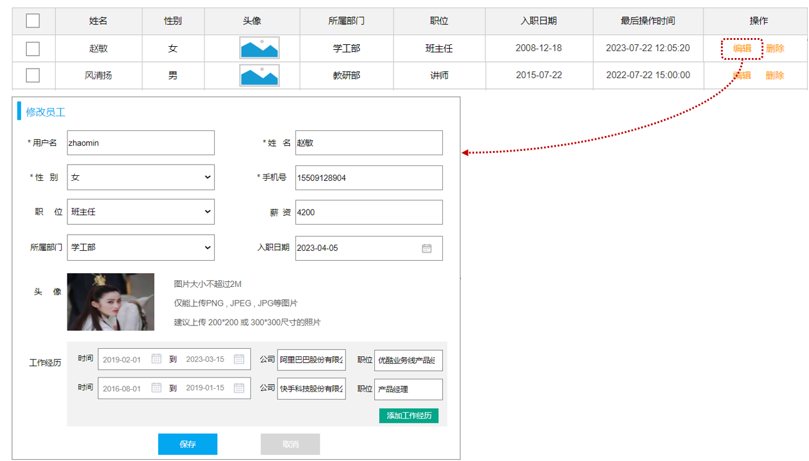 

对于修改功能，分为两步实现：

1. 点击 “编辑” 根据ID查询员工的信息，回显展示。
2. 点击 “保存” 按钮，修改员工的信息 。


### 1.1 回显展示

1). 为 "编辑" 按钮绑定事件

```html
<el-button type="primary" size="small" @click="updateEmp(scope.row.id) ;resetForm(empFormRef)">编辑</el-button>
```


2). 在 `<script> </script>` 中定义 `updateEmp` 函数

```ts
//修改员工-回显
const updateEmp = async (id:number) => {
  clearEmp()
  dialogFormVisible.value = true
  formTitle.value = '修改员工'

  let result = await queryInfoApi(id)
  if(result.code){
    emp.value = result.data

    //处理工作经历中的时间范围
    let exprList = emp.value.exprList;
    if(exprList && exprList.length > 0){
      exprList.forEach(expr => {
        expr.exprDate = [expr.begin, expr.end]
      })
    }
  }
}
```


打开浏览器，点击 编辑 按钮，测试数据回显：

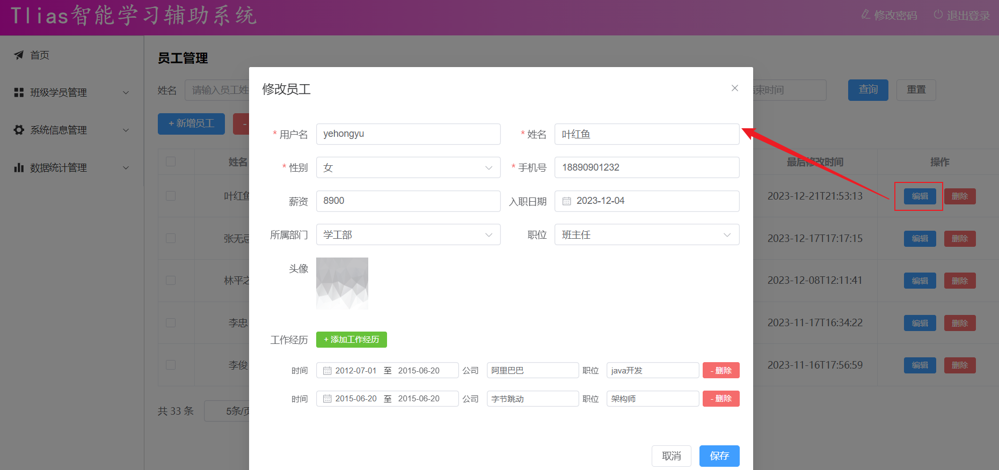  


### 1.2 修改员工

完成了数据回显展示之后，接下来，我们就来完成保存修改操作。 由于修改员工与新增员工共用一个 `Dialog`对话框。 点击保存按钮时，我们只需要根据 id 来判别是新增员工，还是修改员工。 

那我们就需要对保存员工的函数，进行完善优化。 最终代码如下：

```ts
//-------------保存员工信息 
const save = async (form: FormInstance|undefined) => {
  if(!form) return;
  //表单校验
  form.validate(async (valid) => {
    if(valid) {
      let result = null;
      if(emp.value.id){ //存在id, 修改
        result = await updateApi(emp.value)
      }else {  //不存在id, 新增
        result = await addApi(emp.value)
      }

      if(result.code) {
        ElMessage.success('操作成功')
        dialogFormVisible.value = false
        queryPage()
      }else {
        ElMessage.error(result.msg)
      } 
    }
  })
}
```


打开浏览器，测试修改员工信息操作：

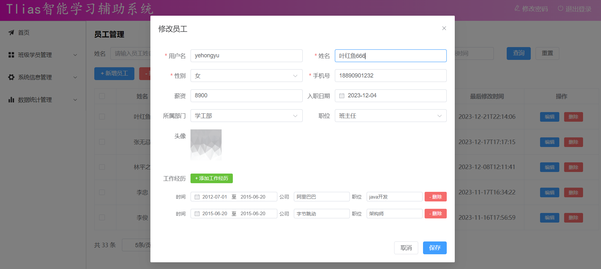 

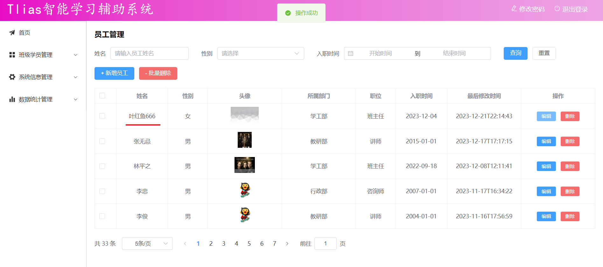 


到目前为止，`src/views/emp/index.vue` 中完整的代码如下：

```html
<script setup lang="ts">
import type { DeptModelArray, EmpExprModel, EmpModel, EmpModelArray, PaginationParam, SearchEmpModel } from '@/api/model/model'
import {ref, onMounted, watch} from 'vue'
import { addApi, queryInfoApi, queryPageApi, updateApi} from '@/api/emp'
import { queryAllApi} from '@/api/dept'
import { ElMessage, type FormInstance, type FormRules, type UploadProps } from 'element-plus';

//搜索栏对象声明
const searchEmp = ref<SearchEmpModel>({ name: '', gender: '', begin: '', end: '', date: []})
//列表展示数据
const tableData = ref<EmpModelArray>([])

//复选框
let selectIds = ref<number[]>([])
const handleSelectionChange = (selection: any[]) => {
  selectIds.value = selection.map(item => item.id)
}

//分页组件
const pagination = ref<PaginationParam>({currentPage: 1, pageSize: 5, total: 0})
//每页展示记录数发生变化时触发
const handleSizeChange = (pageSize: number) => {
  pagination.value.pageSize = pageSize
  queryPage()
}
//当前页码发生变化时触发
const handleCurrentChange = (page: number) => {
  pagination.value.currentPage = page
  queryPage()
}

//分页条件查询
const queryPage = async () => {
  const result = await queryPageApi(
    searchEmp.value.begin,
    searchEmp.value.end,
    searchEmp.value.gender,
    searchEmp.value.name,
    pagination.value.currentPage,
    pagination.value.pageSize
  )

  if(result.code) {
    tableData.value = result.data.rows
    pagination.value.total = result.data.total
  }
}

//钩子函数
onMounted(() => {
  queryPage()
  queryAllDept()
})

//查询所有部门
const depts = ref<DeptModelArray>([])
const queryAllDept = async () => {
  const result = await queryAllApi()
  if(result.code) {
    depts.value = result.data
  }
}


//重置
const reset = () => {
  searchEmp.value = {name:'', begin:'', end:'', date: [], gender: ''}
  queryPage()
}


//侦听searchEmp的date属性
watch(() => searchEmp.value.date, (newVal, oldVal) => {
  // 需要判断newVal的长度，因为date是一个数组，并且做了初始化，只判空的话永远都不会进入else分支，会赋值为undefined，导致后端类型转换异常
  if (newVal.length > 0) {
    console.log(`----newVal: ${newVal}-----oldVal: ${oldVal}`);
    searchEmp.value.begin = newVal[0]
    searchEmp.value.end = newVal[1]
  } else {
    console.log(`***************newVal: ${newVal}*******oldVal: ${oldVal}`);
    searchEmp.value.begin = ''
    searchEmp.value.end = ''
  }
})


//----------- 新增 / 修改 ---------------------------
//职位列表数据
const jobs = ref([{ name: '班主任', value: 1 },{ name: '讲师', value: 2 },{ name: '学工主管', value: 3 },{ name: '教研主管', value: 4 },{ name: '咨询师', value: 5 },{ name: '其他', value: 6 }])
//性别列表数据
const genders = ref([{ name: '男', value: 1 }, { name: '女', value: 2 }])

let dialogFormVisible = ref<boolean>(false) //控制新增/修改的对话框的显示与隐藏
let labelWidth = ref<number>(80) //form表单label的宽度
let formTitle = ref<string>('') //表单的标题
let emp = ref<EmpModel>({ //员工对象-表单数据绑定
  username: '',
  password: '',
  name: '',
  gender: '',
  phone: '',
  job: '',
  salary: '',
  image: '',
  entryDate: '',
  deptId: '',
  exprList: []
})


//文件上传
// let imageUrl = ref<string>()
const handleAvatarSuccess: UploadProps['onSuccess'] = (response, uploadFile) => {
   emp.value.image = response.data; 
}

const beforeAvatarUpload: UploadProps['beforeUpload'] = (rawFile) => {
  if (rawFile.type !== 'image/jpeg' && rawFile.type !== 'image/png') {
    ElMessage.error('图片格式不支持!')
    return false
  } else if (rawFile.size / 1024 / 1024 > 10) {
    ElMessage.error('图片大小不能超过 10 MB!')
    return false
  }
  return true
}

//新增员工-打开对话框
const add = () => {
  dialogFormVisible.value = true
  formTitle.value = '新增员工'
}


//动态添加工作经历 .
const addWorkItem = () => {
  emp.value.exprList.push({exprDate: [],begin: '',end: '',company: '',job: ''})
}

//动态删除工作经历 .
const delWorkItem = (expr: EmpExprModel) => {
  if(emp.value.exprList) {
    const index = emp.value.exprList.indexOf(expr)
    if(index != -1){
      emp.value.exprList.splice(index,1)
    }
  }
}


//-------------保存员工信息 
const save = async (form: FormInstance|undefined) => {
  if(!form) return;
  //表单校验
  form.validate(async (valid) => {
    if(valid) {
      let result = null;
      if(emp.value.id){ //存在id, 修改
        result = await updateApi(emp.value)
      }else {  //不存在id, 新增
        result = await addApi(emp.value)
      }

      if(result.code) {
        ElMessage.success('操作成功')
        dialogFormVisible.value = false
        queryPage()
      }else {
        ElMessage.error(result.msg)
      } 
    }
  })
}

//表单校验规则
const empFormRef = ref<FormInstance>()
const rules = ref<FormRules<EmpModel>>({
  username: [
    { required: true, message: '用户名为必填项', trigger: 'blur' },
    { min: 2, max: 20, message: '用户名长度为2-20个字', trigger: 'blur' }
  ],
  name: [
    { required: true, message: '姓名为必填项', trigger: 'blur' },
    { min: 2, max: 10, message: '姓名长度为2-10个字', trigger: 'blur' }
  ],
  gender: [{ required: true, message: '性别为必填项', trigger: 'change' }],
  phone: [
    { required: true, message: '手机号为必填项', trigger: 'blur' },
    { pattern: /^1[3-9]\d{9}$/g, message: '请输入合法的手机号', trigger: 'blur' }
  ],
  salary: [
    { pattern: /^[1-9]\d*$/g, message: '请输入合法的数字', trigger: 'blur' }
  ]
})

//重置表单
const resetForm = (empForm: FormInstance | undefined) => {
  if (!empForm) return
  empForm.resetFields()
}

//清空表单
const clearEmp = () => {
  emp.value = {
    username: '',
    password: '',
    name: '',
    gender: '',
    phone: '',
    job: '',
    salary: '',
    image: '',
    entryDate: '',
    deptId: '',
    exprList: new Array<EmpExprModel>()
  }
}


//修改员工-回显
const updateEmp = async (id:number) => {
  clearEmp()
  dialogFormVisible.value = true
  formTitle.value = '修改员工'

  let result = await queryInfoApi(id)
  if(result.code){
    emp.value = result.data

    //处理工作经历中的时间范围
    let exprList = emp.value.exprList;
    if(exprList && exprList.length > 0){
      exprList.forEach(expr => {
        expr.exprDate = [expr.begin, expr.end]
      })
    }
  }
}

//监听-emp员工对象中的工作经历数据
watch(emp, (newVal, oldVal) => {
  if(emp.value.exprList) {
    emp.value.exprList.forEach(expr => {
      // 注意：在编辑员工--进行数据回显时，不会给emp的exprList对象中的exprDate赋值，所以需要判断
      if(expr.exprDate && expr.exprDate.length > 0) {
        expr.begin = expr.exprDate[0];
        expr.end = expr.exprDate[1];
      }
    })
  }
}, {deep: true})

</script>

<template>
  <h1>员工管理</h1> <br>
  <!-- 搜索栏 -->
  <el-form :inline="true" :model="searchEmp" class="demo-form-inline">
    <el-form-item label="姓名">
      <el-input v-model="searchEmp.name" placeholder="请输入员工姓名" clearable />
    </el-form-item>
    
    <el-form-item label="性别">
      <el-select v-model="searchEmp.gender" placeholder="请选择" clearable>
        <el-option label="男" value="1" />
        <el-option label="女" value="2" />
      </el-select>
    </el-form-item>

    <el-form-item label="入职时间">
      <el-date-picker v-model="searchEmp.date" type="daterange" value-format="YYYY-MM-DD" range-separator="到" start-placeholder="开始时间" end-placeholder="结束时间"/>
    </el-form-item>

    <el-form-item>
      <el-button type="primary" @click="queryPage()">查询</el-button>
      <el-button type="default" @click="reset()">重置</el-button>
    </el-form-item>
  </el-form>

  <!-- 按钮 -->
  <el-button type="primary" @click="add(); resetForm(empFormRef); clearEmp()">+ 新增员工</el-button>
  <el-button type="danger" @click="">- 批量删除</el-button>
  <br><br>
  


  <!-- 表格 -->
  <!-- 列表展示 -->
  <el-table :data="tableData" border style="width: 100%" fit @selection-change="handleSelectionChange">
    <el-table-column type="selection" width="55" />
    <el-table-column prop="name" label="姓名" align="center" width="130px" />
    <el-table-column label="性别" align="center" width="100px">
      <template #default="scope">
        {{ scope.row.gender == 1 ? '男' : '女' }}
      </template>
    </el-table-column>
    <el-table-column prop="image" label="头像" align="center">
      <template #default="scope">
        
      </template>
    </el-table-column>
    <el-table-column prop="deptName" label="所属部门" align="center" />
    <el-table-column prop="job" label="职位" align="center" width="100px">
      <template #default="scope">
        <span v-if="scope.row.job == 1">班主任</span>
        <span v-else-if="scope.row.job == 2">讲师</span>
        <span v-else-if="scope.row.job == 3">学工主管</span>
        <span v-else-if="scope.row.job == 4">教研主管</span>
        <span v-else-if="scope.row.job == 5">咨询师</span>
        <span v-else>其他</span>
      </template>
    </el-table-column>
    <el-table-column prop="entryDate" label="入职时间" align="center" width="130px" />
    <el-table-column prop="updateTime" label="最后修改时间" align="center" />
    <el-table-column label="操作" align="center">
      <template #default="scope">
        <el-button type="primary" size="small" @click="updateEmp(scope.row.id) ;resetForm(empFormRef)">编辑</el-button>
        <el-button type="danger" size="small" @click="">删除</el-button>
      </template>
    </el-table-column>
  </el-table>
  <br>

  <!-- 分页组件Pagination -->
  <el-pagination
    v-model:current-page="pagination.currentPage"
    v-model:page-size="pagination.pageSize"
    :page-sizes="[5, 10, 20, 50, 100]"
    layout="total, sizes, prev, pager, next, jumper"
    :total="pagination.total"
    @size-change="handleSizeChange"
    @current-change="handleCurrentChange"
  />
  

  <!-- 新增员工/修改员工-Dialog -->
  <!-- 新增/修改员工对话框 -->
  <el-dialog v-model="dialogFormVisible" :title="formTitle">
    <el-form :model="emp" ref="empFormRef" :rules="rules">
      <!-- 第一行 -->
      <el-row>
        <el-col :span="12">
          <el-form-item label="用户名" :label-width="labelWidth" prop="username">
            <el-input v-model="emp.username" />
          </el-form-item>
        </el-col>
        <el-col :span="12">
          <el-form-item label="姓名" :label-width="labelWidth" prop="name">
            <el-input v-model="emp.name" />
          </el-form-item>
        </el-col>
      </el-row>
      
      <!-- 第二行 -->
      <el-row>
        <el-col :span="12">
          <el-form-item label="性别" :label-width="labelWidth"  prop="gender">
            <el-select v-model="emp.gender" placeholder="请选择" style="width: 100%;">
              <el-option v-for="gender in genders" :label="gender.name" :value="gender.value" />
            </el-select>
          </el-form-item>
        </el-col>
        <el-col :span="12">
          <el-form-item label="手机号" :label-width="labelWidth"  prop="phone">
            <el-input v-model="emp.phone" />
          </el-form-item>
        </el-col>
      </el-row>

      <!-- 第三行 -->
      <el-row>
        <el-col :span="12">
          <el-form-item label="薪资" :label-width="labelWidth"  prop="salary">
            <el-input v-model="emp.salary" />
          </el-form-item>
        </el-col>
        <el-col :span="12">
          <el-form-item label="入职日期" :label-width="labelWidth">
            <el-date-picker v-model="emp.entryDate" type="date" placeholder="请选择入职日期" value-format="YYYY-MM-DD" style="width: 100%;"/>
          </el-form-item>
        </el-col>
      </el-row>

      <!-- 第四行 -->
      <el-row>
        <el-col :span="12">
          <el-form-item label="所属部门" :label-width="labelWidth">
            <el-select v-model="emp.deptId" placeholder="请选择" style="width: 100%;">
              <el-option v-for="dept in depts" :label="dept.name" :value="dept.id" />
            </el-select>
          </el-form-item>
        </el-col>
        <el-col :span="12">
          <el-form-item label="职位" :label-width="labelWidth">
            <el-select v-model="emp.job" placeholder="请选择" style="width: 100%;">
              <el-option v-for="job in jobs" :label="job.name" :value="job.value" />
            </el-select>
          </el-form-item>
        </el-col>
      </el-row>

      <!-- 第五行 -->
      <el-row :gutter="10">
        <el-col :span="24">
          <el-form-item label="头像" label-width="80px">
            <el-upload class="avatar-uploader" 
              action="/api/upload" 
              :show-file-list="false"
              :on-success="handleAvatarSuccess" 
              :before-upload="beforeAvatarUpload">
              
              <el-icon v-else class="avatar-uploader-icon"><Plus /></el-icon>
            </el-upload>
          </el-form-item>
        </el-col>
      </el-row>


      <!-- 第六行 -->
      <!-- 第六行 -->
      <el-row :gutter="10">
        <el-col :span="24">
          <el-form-item label="工作经历" :label-width="labelWidth">
            <el-button type="success" size="small" @click="addWorkItem">+ 添加工作经历</el-button>
          </el-form-item>
        </el-col>
      </el-row>

      <!-- 第七...行 -->
      <el-row :gutter="5" v-for="expr in emp.exprList">
        <el-col :span="10">
          <el-form-item label="时间" size="small" :label-width="labelWidth">
            <el-date-picker v-model="expr.exprDate" type="daterange" range-separator="至" start-placeholder="开始时间" end-placeholder="结束时间" value-format="YYYY-MM-DD"/>
          </el-form-item>
        </el-col>
        
        <el-col :span="6">
          <el-form-item label="公司" size="small">
            <el-input v-model="expr.company" placeholder="公司名称"/>
          </el-form-item>
        </el-col>

        <el-col :span="6">
          <el-form-item label="职位" size="small">
            <el-input v-model="expr.job"  placeholder="职位名称"/>
          </el-form-item>
        </el-col>

        <el-col :span="2">
          <el-form-item size="small">
            <el-button type="danger" @click="delWorkItem(expr)">- 删除</el-button>
          </el-form-item>
        </el-col>
      </el-row>

    </el-form>

    <template #footer>
      <span class="dialog-footer">
        <el-button @click="dialogFormVisible = false; resetForm(empFormRef)">取消</el-button>
        <el-button type="primary" @click="save(empFormRef)">保存</el-button>
      </span>
    </template>

  </el-dialog>

</template>

<style scoped>
  .avatar-uploader .avatar {
    width: 78px;
    height: 78px;
    display: block;
  }
  .avatar-uploader .el-upload:hover {
    border-color: var(--el-color-primary);
  }
  .el-icon.avatar-uploader-icon {
    font-size: 28px;
    color: #8c939d;
    width: 78px;
    height: 78px;
    text-align: center;
    border: 1px dashed #ccc;
    border-radius: 5px;
  }
</style>
```


## 2. 删除员工

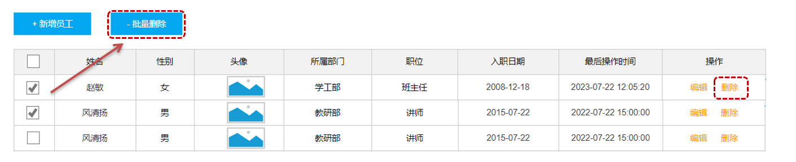 

在删除员工信息时，有两个操作入口：

- 点击每条记录之后的“删除”按钮，删除当前这条记录；

- 选择前面的复选框，选中要删除的员工，点击“批量删除”之后，会批量删除员工信息；


### 2.1 删除单个

**1). 为 "删除" 按钮  绑定事件**

为 "删除" 按钮绑定事件:

```html
<el-button type="danger" size="small" @click="delById(scope.row.id)">删除</el-button>
```


**2). 在 `<script> </script>` 中定义函数**

```ts
//------- 删除员工
//根据ID删除单个员工
const delById = async (id:number) => {
  ElMessageBox.confirm('您确认删除此数据吗?' , '删除员工', {confirmButtonText:'确认', cancelButtonText:'取消',type:'warning'})
    .then(async () => {
      let result =  await deleteApi(`${id}`)
      if(result.code) {
        ElMessage.success('删除成功')
        queryPage()
      }else {
        ElMessage.error(result.msg)
      }
    }).catch(() => {
      ElMessage.info('取消删除')
    })
}
```


打开浏览器，测试一下：

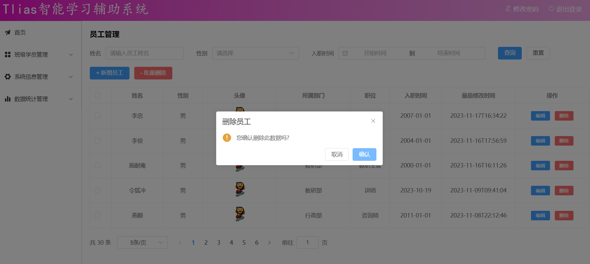 


### 2.2 批量删除

**1). 为复选框绑定事件 `@selection-change`** 

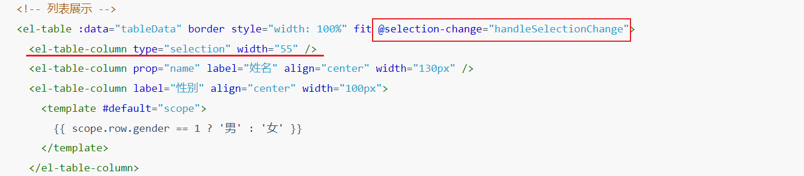 


**2). 定义 `handleSelectionChange` 函数**

```js
const selectIds = ref<(number | undefined)[]>([]) //封装勾选的id
const handleSelectionChange = (val: EmpModel[]) => {
  selectIds.value = val.map(e => e.id) //map方法-遍历数组并对其中的元素进行进一步的处理, 并将结果封装到一个新的数组中
}
```


**3). 为  "批量删除" 按钮绑定事件**

为 "批量删除" 按钮绑定事件:

```html
<el-button type="danger" @click="delByIds()">- 批量删除</el-button>
```


**4). 在 `<script> </script>` 中定义函数**

```ts
//批量删除员工
const delByIds = async () => {
  ElMessageBox.confirm('您确认删除此数据吗?' , '删除员工', {confirmButtonText:'确认', cancelButtonText:'取消',type:'warning'})
    .then(async () => {
      let result =  await deleteApi(selectIds.value.join(','))
      if(result.code) {
        ElMessage.success('删除成功')
        queryPage()
      }else {
        ElMessage.error(result.msg)
      }
    }).catch(() => {
      ElMessage.info('取消删除')
    })
}
```


打开浏览器，测试一下：

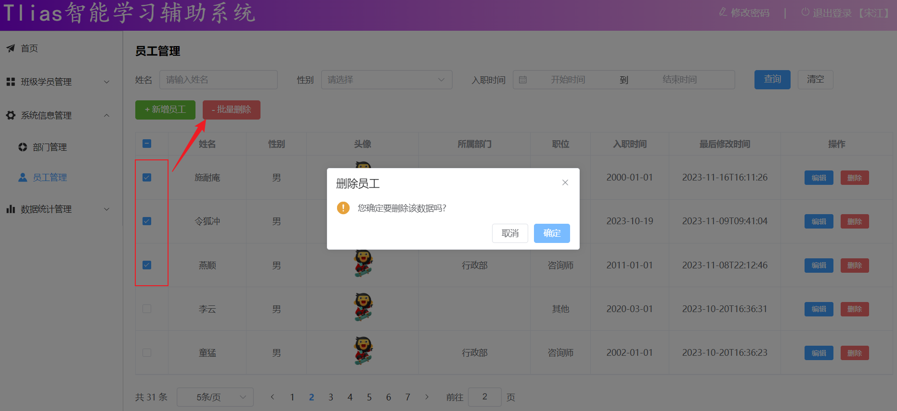 


到此呢，关于员工管理的基本的增删改查功能，我们已经完成了。 目前为止，`src/views/emp/index.vue` 的完整代码如下：

```html
<script setup lang="ts">
import type { DeptModelArray, EmpExprModel, EmpModel, EmpModelArray, PaginationParam, SearchEmpModel } from '@/api/model/model'
import {ref, onMounted, watch} from 'vue'
import { addApi, queryInfoApi, queryPageApi, updateApi, deleteApi} from '@/api/emp'
import { queryAllApi} from '@/api/dept'
import { ElMessage, ElMessageBox, type FormInstance, type FormRules, type UploadProps } from 'element-plus';

//搜索栏对象声明
const searchEmp = ref<SearchEmpModel>({ name: '', gender: '', begin: '', end: '', date: []})
//列表展示数据
const tableData = ref<EmpModelArray>([])

//复选框
let selectIds = ref<number[]>([])
const handleSelectionChange = (selection: any[]) => {
  selectIds.value = selection.map(item => item.id)
}

//分页组件
const pagination = ref<PaginationParam>({currentPage: 1, pageSize: 5, total: 0})
//每页展示记录数发生变化时触发
const handleSizeChange = (pageSize: number) => {
  pagination.value.pageSize = pageSize
  queryPage()
}
//当前页码发生变化时触发
const handleCurrentChange = (page: number) => {
  pagination.value.currentPage = page
  queryPage()
}

//分页条件查询
const queryPage = async () => {
  const result = await queryPageApi(
    searchEmp.value.begin,
    searchEmp.value.end,
    searchEmp.value.gender,
    searchEmp.value.name,
    pagination.value.currentPage,
    pagination.value.pageSize
  )

  if(result.code) {
    tableData.value = result.data.rows
    pagination.value.total = result.data.total
  }
}

//钩子函数
onMounted(() => {
  queryPage()
  queryAllDept()
})

//查询所有部门
const depts = ref<DeptModelArray>([])
const queryAllDept = async () => {
  const result = await queryAllApi()
  if(result.code) {
    depts.value = result.data
  }
}


//重置
const reset = () => {
  searchEmp.value = {name:'', begin:'', end:'', date: [], gender: ''}
  queryPage()
}


//侦听searchEmp的date属性
watch(() => searchEmp.value.date, (newVal, oldVal) => {
  if(newVal.length>0) {
    searchEmp.value.begin = newVal[0]
    searchEmp.value.end = newVal[1]
  }else {
    searchEmp.value.begin = ''
    searchEmp.value.end = ''
  }
})


//----------- 新增 / 修改 ---------------------------
//职位列表数据
const jobs = ref([{ name: '班主任', value: 1 },{ name: '讲师', value: 2 },{ name: '学工主管', value: 3 },{ name: '教研主管', value: 4 },{ name: '咨询师', value: 5 },{ name: '其他', value: 6 }])
//性别列表数据
const genders = ref([{ name: '男', value: 1 }, { name: '女', value: 2 }])

let dialogFormVisible = ref<boolean>(false) //控制新增/修改的对话框的显示与隐藏
let labelWidth = ref<number>(80) //form表单label的宽度
let formTitle = ref<string>('') //表单的标题
let emp = ref<EmpModel>({ //员工对象-表单数据绑定
  username: '',
  password: '',
  name: '',
  gender: '',
  phone: '',
  job: '',
  salary: '',
  image: '',
  entryDate: '',
  deptId: '',
  exprList: []
})


//文件上传
// let imageUrl = ref<string>()
const handleAvatarSuccess: UploadProps['onSuccess'] = (response, uploadFile) => {
   emp.value.image = response.data; 
}

const beforeAvatarUpload: UploadProps['beforeUpload'] = (rawFile) => {
  if (rawFile.type !== 'image/jpeg' && rawFile.type !== 'image/png') {
    ElMessage.error('图片格式不支持!')
    return false
  } else if (rawFile.size / 1024 / 1024 > 10) {
    ElMessage.error('图片大小不能超过 10 MB!')
    return false
  }
  return true
}

//新增员工-打开对话框
const add = () => {
  dialogFormVisible.value = true
  formTitle.value = '新增员工'
}


//动态添加工作经历 .
const addWorkItem = () => {
  emp.value.exprList.push({exprDate: [],begin: '',end: '',company: '',job: ''})
}

//动态删除工作经历 .
const delWorkItem = (expr: EmpExprModel) => {
  if(emp.value.exprList) {
    const index = emp.value.exprList.indexOf(expr)
    if(index != -1){
      emp.value.exprList.splice(index,1)
    }
  }
}


//-------------保存员工信息 
const save = async (form: FormInstance|undefined) => {
  if(!form) return;
  //表单校验
  form.validate(async (valid) => {
    if(valid) {
      let result = null;
      if(emp.value.id){ //存在id, 修改
        result = await updateApi(emp.value)
      }else {  //不存在id, 新增
        result = await addApi(emp.value)
      }

      if(result.code) {
        ElMessage.success('操作成功')
        dialogFormVisible.value = false
        queryPage()
      }else {
        ElMessage.error(result.msg)
      } 
    }
  })
}

//表单校验规则
const empFormRef = ref<FormInstance>()
const rules = ref<FormRules<EmpModel>>({
  username: [
    { required: true, message: '用户名为必填项', trigger: 'blur' },
    { min: 2, max: 20, message: '用户名长度为2-20个字', trigger: 'blur' }
  ],
  name: [
    { required: true, message: '姓名为必填项', trigger: 'blur' },
    { min: 2, max: 10, message: '姓名长度为2-10个字', trigger: 'blur' }
  ],
  gender: [{ required: true, message: '性别为必填项', trigger: 'change' }],
  phone: [
    { required: true, message: '手机号为必填项', trigger: 'blur' },
    { pattern: /^1[3-9]\d{9}$/g, message: '请输入合法的手机号', trigger: 'blur' }
  ],
  salary: [
    { pattern: /^[1-9]\d*$/g, message: '请输入合法的数字', trigger: 'blur' }
  ]
})

//重置表单
const resetForm = (empForm: FormInstance | undefined) => {
  if (!empForm) return
  empForm.resetFields()
}

//清空表单
const clearEmp = () => {
  emp.value = {
    username: '',
    password: '',
    name: '',
    gender: '',
    phone: '',
    job: '',
    salary: '',
    image: '',
    entryDate: '',
    deptId: '',
    exprList: new Array<EmpExprModel>()
  }
}


//修改员工-回显
const updateEmp = async (id:number) => {
  clearEmp()
  dialogFormVisible.value = true
  formTitle.value = '修改员工'

  let result = await queryInfoApi(id)
  if(result.code){
    emp.value = result.data

    //处理工作经历中的时间范围
    let exprList = emp.value.exprList;
    if(exprList && exprList.length > 0){
      exprList.forEach(expr => {
        expr.exprDate = [expr.begin, expr.end]
      })
    }
  }
}

//监听-emp员工对象中的工作经历数据
watch(emp, (newVal, oldVal) => {
  if(emp.value.exprList) {
    emp.value.exprList.forEach(expr => {
      // 注意：在编辑员工--进行数据回显时，不会给emp的exprList对象中的exprDate赋值，所以需要判断
      if(expr.exprDate && expr.exprDate.length > 0) {
        expr.begin = expr.exprDate[0];
        expr.end = expr.exprDate[1];
      }
    })
  }
}, {deep: true})


//------- 删除员工
//根据ID删除单个员工
const delById = async (id:number) => {
  ElMessageBox.confirm('您确认删除此数据吗?' , '删除员工', {confirmButtonText:'确认', cancelButtonText:'取消',type:'warning'})
    .then(async () => {
      let result =  await deleteApi(`${id}`)
      if(result.code) {
        ElMessage.success('删除成功')
        queryPage()
      }else {
        ElMessage.error(result.msg)
      }
    }).catch(() => {
      ElMessage.info('取消删除')
    })
}

//批量删除员工
const delByIds = async () => {
  ElMessageBox.confirm('您确认删除此数据吗?' , '删除员工', {confirmButtonText:'确认', cancelButtonText:'取消',type:'warning'})
    .then(async () => {
      let result =  await deleteApi(selectIds.value.join(','))
      if(result.code) {
        ElMessage.success('删除成功')
        queryPage()
      }else {
        ElMessage.error(result.msg)
      }
    }).catch(() => {
      ElMessage.info('取消删除')
    })
}

</script>

<template>
  <h1>员工管理</h1> <br>
  <!-- 搜索栏 -->
  <el-form :inline="true" :model="searchEmp" class="demo-form-inline">
    <el-form-item label="姓名">
      <el-input v-model="searchEmp.name" placeholder="请输入员工姓名" clearable />
    </el-form-item>
    
    <el-form-item label="性别">
      <el-select v-model="searchEmp.gender" placeholder="请选择" clearable>
        <el-option label="男" value="1" />
        <el-option label="女" value="2" />
      </el-select>
    </el-form-item>

    <el-form-item label="入职时间">
      <el-date-picker v-model="searchEmp.date" type="daterange" value-format="YYYY-MM-DD" range-separator="到" start-placeholder="开始时间" end-placeholder="结束时间"/>
    </el-form-item>

    <el-form-item>
      <el-button type="primary" @click="queryPage()">查询</el-button>
      <el-button type="default" @click="reset()">重置</el-button>
    </el-form-item>
  </el-form>

  <!-- 按钮 -->
  <el-button type="primary" @click="add(); resetForm(empFormRef); clearEmp()">+ 新增员工</el-button>
  <el-button type="danger" @click="delByIds()">- 批量删除</el-button>
  <br><br>
  


  <!-- 表格 -->
  <!-- 列表展示 -->
  <el-table :data="tableData" border style="width: 100%" fit @selection-change="handleSelectionChange">
    <el-table-column type="selection" width="55" />
    <el-table-column prop="name" label="姓名" align="center" width="130px" />
    <el-table-column label="性别" align="center" width="100px">
      <template #default="scope">
        {{ scope.row.gender == 1 ? '男' : '女' }}
      </template>
    </el-table-column>
    <el-table-column prop="image" label="头像" align="center">
      <template #default="scope">
        
      </template>
    </el-table-column>
    <el-table-column prop="deptName" label="所属部门" align="center" />
    <el-table-column prop="job" label="职位" align="center" width="100px">
      <template #default="scope">
        <span v-if="scope.row.job == 1">班主任</span>
        <span v-else-if="scope.row.job == 2">讲师</span>
        <span v-else-if="scope.row.job == 3">学工主管</span>
        <span v-else-if="scope.row.job == 4">教研主管</span>
        <span v-else-if="scope.row.job == 5">咨询师</span>
        <span v-else>其他</span>
      </template>
    </el-table-column>
    <el-table-column prop="entryDate" label="入职时间" align="center" width="130px" />
    <el-table-column prop="updateTime" label="最后修改时间" align="center" />
    <el-table-column label="操作" align="center">
      <template #default="scope">
        <el-button type="primary" size="small" @click="updateEmp(scope.row.id) ;resetForm(empFormRef)">编辑</el-button>
        <el-button type="danger" size="small" @click="delById(scope.row.id)">删除</el-button>
      </template>
    </el-table-column>
  </el-table>
  <br>

  <!-- 分页组件Pagination -->
  <el-pagination
    v-model:current-page="pagination.currentPage"
    v-model:page-size="pagination.pageSize"
    :page-sizes="[5, 10, 20, 50, 100]"
    layout="total, sizes, prev, pager, next, jumper"
    :total="pagination.total"
    @size-change="handleSizeChange"
    @current-change="handleCurrentChange"
  />
  

  <!-- 新增员工/修改员工-Dialog -->
  <!-- 新增/修改员工对话框 -->
  <el-dialog v-model="dialogFormVisible" :title="formTitle">
    <el-form :model="emp" ref="empFormRef" :rules="rules">
      <!-- 第一行 -->
      <el-row>
        <el-col :span="12">
          <el-form-item label="用户名" :label-width="labelWidth" prop="username">
            <el-input v-model="emp.username" />
          </el-form-item>
        </el-col>
        <el-col :span="12">
          <el-form-item label="姓名" :label-width="labelWidth" prop="name">
            <el-input v-model="emp.name" />
          </el-form-item>
        </el-col>
      </el-row>
      
      <!-- 第二行 -->
      <el-row>
        <el-col :span="12">
          <el-form-item label="性别" :label-width="labelWidth"  prop="gender">
            <el-select v-model="emp.gender" placeholder="请选择" style="width: 100%;">
              <el-option v-for="gender in genders" :label="gender.name" :value="gender.value" />
            </el-select>
          </el-form-item>
        </el-col>
        <el-col :span="12">
          <el-form-item label="手机号" :label-width="labelWidth"  prop="phone">
            <el-input v-model="emp.phone" />
          </el-form-item>
        </el-col>
      </el-row>

      <!-- 第三行 -->
      <el-row>
        <el-col :span="12">
          <el-form-item label="薪资" :label-width="labelWidth"  prop="salary">
            <el-input v-model="emp.salary" />
          </el-form-item>
        </el-col>
        <el-col :span="12">
          <el-form-item label="入职日期" :label-width="labelWidth">
            <el-date-picker v-model="emp.entryDate" type="date" placeholder="请选择入职日期" value-format="YYYY-MM-DD" style="width: 100%;"/>
          </el-form-item>
        </el-col>
      </el-row>

      <!-- 第四行 -->
      <el-row>
        <el-col :span="12">
          <el-form-item label="所属部门" :label-width="labelWidth">
            <el-select v-model="emp.deptId" placeholder="请选择" style="width: 100%;">
              <el-option v-for="dept in depts" :label="dept.name" :value="dept.id" />
            </el-select>
          </el-form-item>
        </el-col>
        <el-col :span="12">
          <el-form-item label="职位" :label-width="labelWidth">
            <el-select v-model="emp.job" placeholder="请选择" style="width: 100%;">
              <el-option v-for="job in jobs" :label="job.name" :value="job.value" />
            </el-select>
          </el-form-item>
        </el-col>
      </el-row>

      <!-- 第五行 -->
      <el-row :gutter="10">
        <el-col :span="24">
          <el-form-item label="头像" label-width="80px">
            <el-upload class="avatar-uploader" 
              action="/api/upload" 
              :show-file-list="false"
              :on-success="handleAvatarSuccess" 
              :before-upload="beforeAvatarUpload">
              
              <el-icon v-else class="avatar-uploader-icon"><Plus /></el-icon>
            </el-upload>
          </el-form-item>
        </el-col>
      </el-row>


      <!-- 第六行 -->
      <!-- 第六行 -->
      <el-row :gutter="10">
        <el-col :span="24">
          <el-form-item label="工作经历" :label-width="labelWidth">
            <el-button type="success" size="small" @click="addWorkItem">+ 添加工作经历</el-button>
          </el-form-item>
        </el-col>
      </el-row>

      <!-- 第七...行 -->
      <el-row :gutter="5" v-for="expr in emp.exprList">
        <el-col :span="10">
          <el-form-item label="时间" size="small" :label-width="labelWidth">
            <el-date-picker v-model="expr.exprDate" type="daterange" range-separator="至" start-placeholder="开始时间" end-placeholder="结束时间" value-format="YYYY-MM-DD"/>
          </el-form-item>
        </el-col>
        
        <el-col :span="6">
          <el-form-item label="公司" size="small">
            <el-input v-model="expr.company" placeholder="公司名称"/>
          </el-form-item>
        </el-col>

        <el-col :span="6">
          <el-form-item label="职位" size="small">
            <el-input v-model="expr.job"  placeholder="职位名称"/>
          </el-form-item>
        </el-col>

        <el-col :span="2">
          <el-form-item size="small">
            <el-button type="danger" @click="delWorkItem(expr)">- 删除</el-button>
          </el-form-item>
        </el-col>
      </el-row>

    </el-form>

    <template #footer>
      <span class="dialog-footer">
        <el-button @click="dialogFormVisible = false; resetForm(empFormRef)">取消</el-button>
        <el-button type="primary" @click="save(empFormRef)">保存</el-button>
      </span>
    </template>

  </el-dialog>

</template>

<style scoped>
  .avatar-uploader .avatar {
    width: 78px;
    height: 78px;
    display: block;
  }
  .avatar-uploader .el-upload:hover {
    border-color: var(--el-color-primary);
  }
  .el-icon.avatar-uploader-icon {
    font-size: 28px;
    color: #8c939d;
    width: 78px;
    height: 78px;
    text-align: center;
    border: 1px dashed #ccc;
    border-radius: 5px;
  }
</style>
```


## 3. 登录

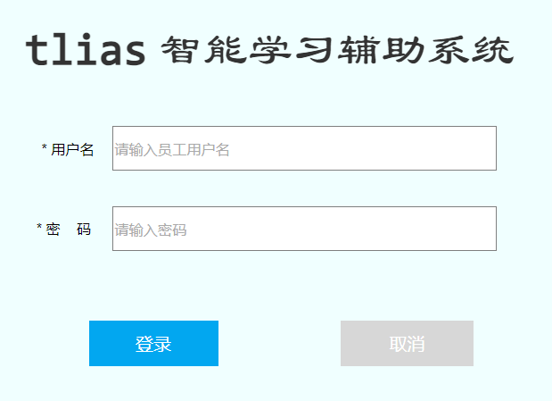 


### 3.1 基本功能实现

1). 导入资料中提供的登录页面的背景图片。 【`04. 登录认证-基础文件/bg1.jpg` ---------> 将该文件复制到项目的 `src/assets` 目录中】

2). 导入资料中提供的登录页面的组件。【`04. 登录认证-基础文件/login` ---------> 将该目录复制到项目的 `src/views` 目录中】

3). 导入资料中提供的登录的api文件。【`04. 登录认证-基础文件/login.ts` ---------> 将该文件复制到项目的 `src/api` 目录中】

4). 在 `login/index.vue` 中编写登录操作交互的逻辑，最终整个文件的代码如下：

```html
<script setup lang="ts">
  import { ref } from 'vue'
  import { loginApi } from '@/api/login'
  import type { LoginEmp } from '@/api/model/model'
  import {useRouter} from 'vue-router'
  import { ElMessage } from 'element-plus' 
  
  let loginForm = ref<LoginEmp>({username:'', password:''})

  //登录
  const router = useRouter(); 
  const login = async () => {
    let result = await loginApi(loginForm.value);
    if(result.code == 1){
      ElMessage.success('登录成功')
      router.push('/index')
    }else {
      ElMessage.error('用户名或密码错误')
    }
  }

  //清空
  const clear = async () => {
    loginForm.value = {username:'', password:''}
  }
</script>

<template>
  <div id="container">
    <div class="login-form">
      <el-form label-width="80px">
        <p class="title">Tlias智能学习辅助系统</p>
        <el-form-item label="用户名" prop="username">
          <el-input v-model="loginForm.username" placeholder="请输入用户名"></el-input>
        </el-form-item>

        <el-form-item label="密码" prop="password">
          <el-input type="password" v-model="loginForm.password" placeholder="请输入密码"></el-input>
        </el-form-item>

        <el-form-item>
          <el-button class="button" type="primary" @click="login">登 录</el-button>
          <el-button class="button" type="info" @click="clear">重 置</el-button>
        </el-form-item>
      </el-form>
    </div>
  </div>
</template>

<style scoped>
#container {
  padding: 10%;
  height: 410px;
  background-image: url('../../assets/bg1.jpg');
  background-repeat: no-repeat;
  background-size: cover;
}

.login-form {
  max-width: 400px;
  padding: 30px;
  margin: 0 auto;
  border: 1px solid #e0e0e0;
  border-radius: 10px;
  box-shadow: 0 0 10px rgba(0, 0, 0, 0.5);
  background-color: white;
}

.title {
  font-size: 30px;
  font-family: '楷体';
  text-align: center;
  margin-bottom: 30px;
  font-weight: bold;
}

.button {
  margin-top: 30px;
  width: 120px;
}
</style>
```


打开浏览器测试：

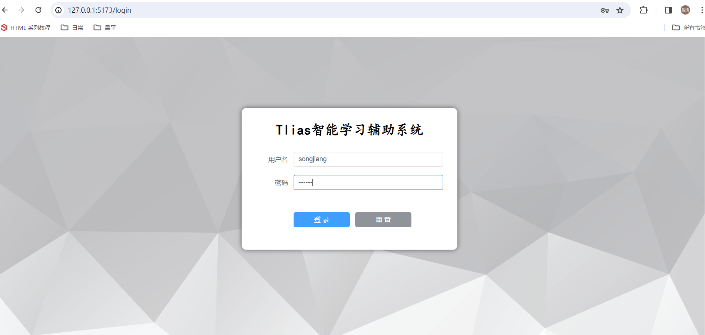 

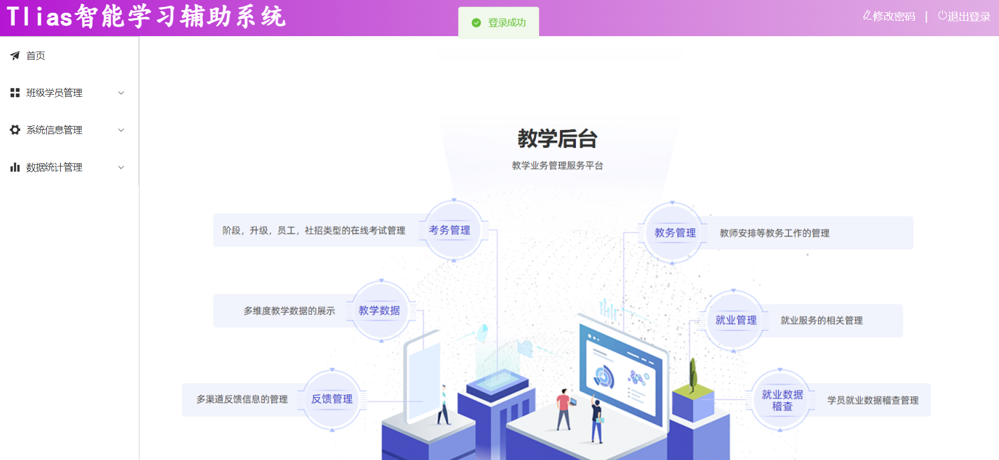 


通过测试，我们看到，已经登录成功了。 但是呢，登录成功后，我们并没有对服务器端返回的token进行存储。  那么也就意味着，再后续的请求中，我们是没有办法直接获取到token，并在后续的每一次请求中，把这个token传递给服务端的。 

所以，接下来，我们就需要考虑的是token的存储。 我们需要考虑将token存储起来，并且还得保证，存储之后各个vue组件都可以获取到这个token。 那这里我们就可以借助于 Vue3 中提供的 `Pinia状态管理工具` 来解决这个问题。 


### 3.2 Pinia存储令牌

#### 3.2.1 分析

问题：目前执行登录操作，登录成功之后，并没有将令牌信息起来，在后续的每次操作中，也就拿不到登录时的令牌信息了。

方案：需要在登录成功后，将令牌等信息存储起来。 在后续的请求中，再将令牌取出来，携带到服务端。

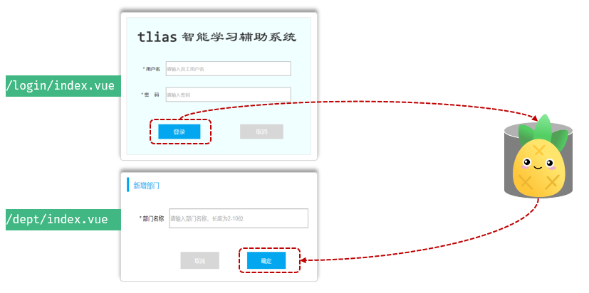 


> 如果在项目的多个组件中，要共享数据，可以使用Vue3中提供的状态管理库 Pinia。


#### 3.2.2 Pinia

Pinia 是 Vue 的专属状态管理库，它允许你跨组件或页面共享状态。 也就意味着，我们可以使用 `Pinia` 来存储数据，而这些数据是可以跨组件/页面来访问的。

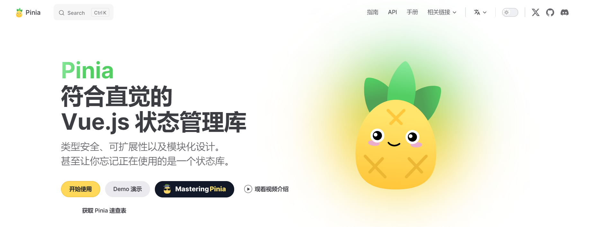 


Store是保存状态和业务逻辑的实体、承载着全局状态。（有点像一个永远存在的组件，每个组件都可以读取数据、存入数据）。

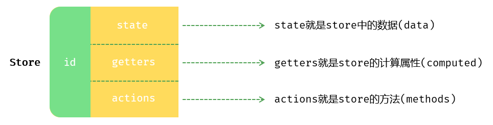 

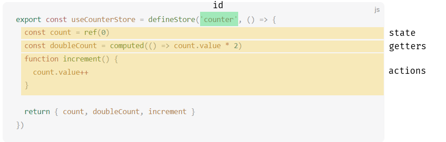 


#### 3.2.3 定义Store

参照官方文档：https://pinia.vuejs.org/zh/core-concepts/

1). 将`stores/counter.ts` 文件重命名为 `stores/loginEmp.ts`，并定义如下内容：

```ts
import { ref } from 'vue'
import { defineStore } from 'pinia'
import type {LoginInfo} from '@/api/model/model'

export const useLoginEmpStore = defineStore('loginEmp', () => {
  const loginEmp = ref<LoginInfo>({})
  const setLoginEmp = (emp: LoginInfo) => { //存入
    loginEmp.value = emp;
  }
  const getLoginEmp = () => { //获取
    return loginEmp.value;
  }
  const clearLoginEmp = () => { //清除
    loginEmp.value = {}
  }
  return { loginEmp, setLoginEmp, getLoginEmp, clearLoginEmp }
})
```


#### 3.2.4 使用Pinia

在登录完成后，需要使用定义的Store，往State中存储令牌信息 。 然后在后续访问服务器端接口的时候，需要从Pinia中再获取令牌信息，然后在请求头中携带到服务端。

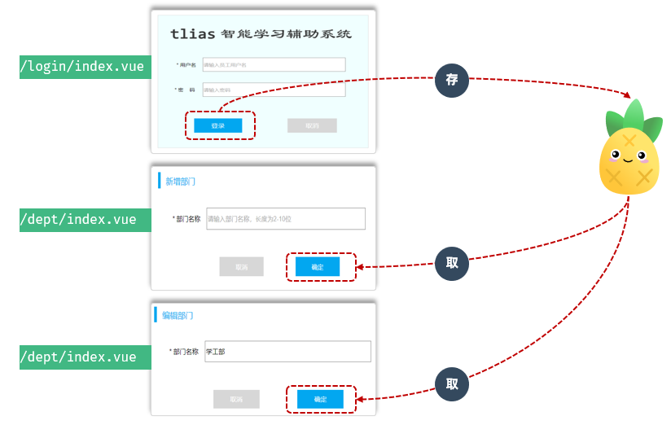 


**1). 在用户登录成功之后，往 `Pinia` 中存入数据。 在 `login/index.vue` 中，添加操作 `Pinia` 存储数据的代码：**

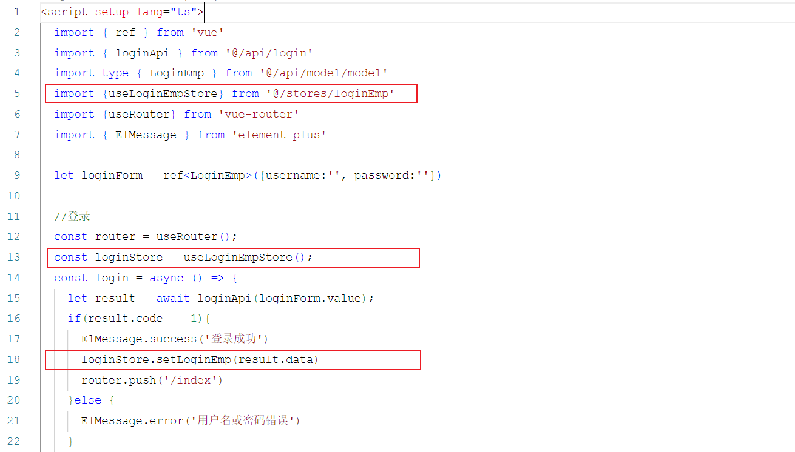 


登录成功之后，已经将令牌存储起来了。那么在后续的每一次请求中，都需要将令牌携带到服务端。 那我们就需要在每一次请求中，都需要将令牌在请求头 `token` 中携带到服务端，服务端需要对令牌进行校验，如果成功，直接访问。 如果令牌校验失败，服务器端会返回401状态码，此时前端需要跳转到登录页面。


**2). 在后续的每一次Ajax请求中获取Pinia中的令牌，在请求头中将令牌携带到服务端。**

如果在每一次ajax请求中，都去操作pinia，从pinia中获取令牌信息，会非常繁琐（因为一个项目中，ajax请求会非常多）。

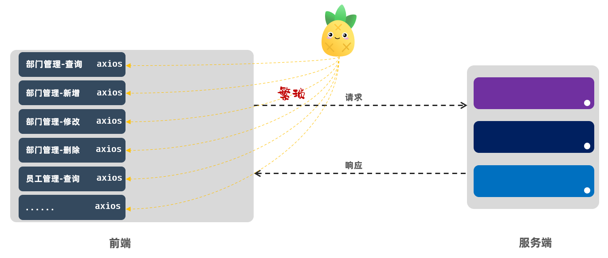 


那这里呢，我们可以通过axios的拦截器 Interceptors 来简化操作。 我们可以在axios的请求拦截器中，在这个统一的入口中，拦截请求，并从Pinia中获取令牌，然后在请求服务端的时候，在请求头中携带令牌访问。

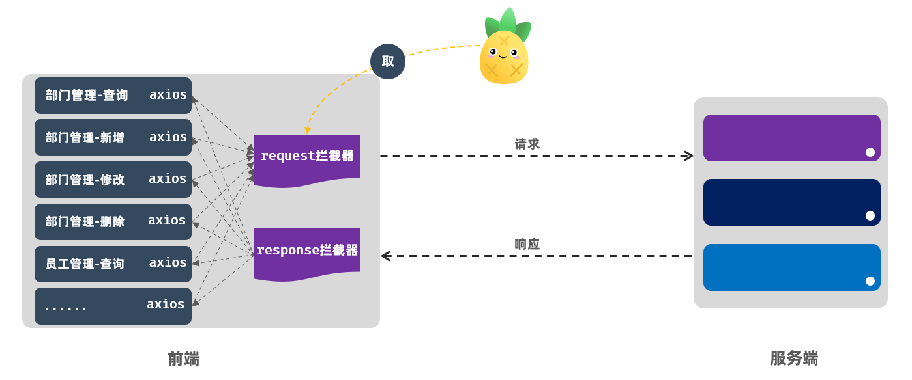 


此时，我们就需要在 `utils/request.ts` 中，定义请求拦截器，并在请求拦截器中获取pinia中存储的令牌数据，在请求服务端的时候，在请求头中携带 `token` 访问服务器端。

```ts
//axios的响应 request 拦截器
request.interceptors.request.use((config) => {
  // 在发送请求之前做些什么 --> 携带令牌到服务端 --- header : token
  const loginEmp = loginEmpStore.getLoginEmp();
  if(loginEmp && loginEmp.token){
    config.headers['token'] = loginEmp.token
  }
  return config;
}, (error) => {
  // 对请求错误做些什么
  return Promise.reject(error);
});
```


打开浏览器测试：

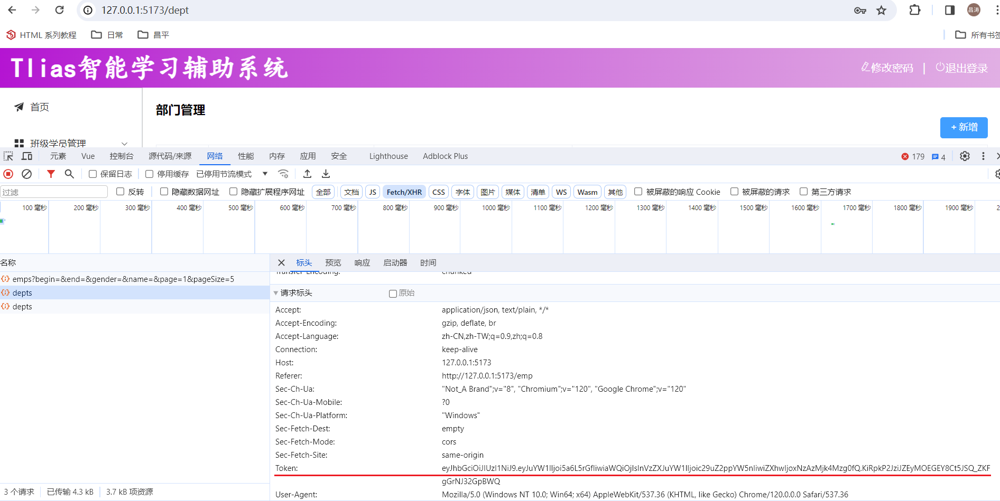 


### 3.3 功能完善

#### 3.3.1 功能完善1 

目前，即使用户未登录的情况下访问服务器，服务器会响应401状态码，但是前端并不会跳转到登录页面。

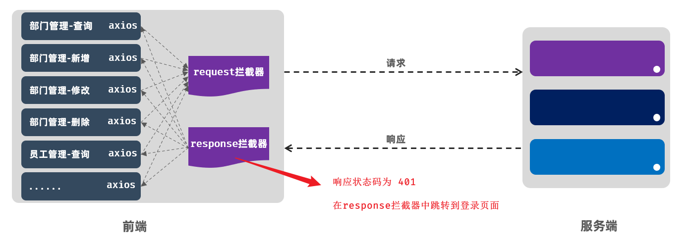 


具体代码实现如下：

```ts
//axios的响应 response 拦截器
request.interceptors.response.use(
  (response) => { //成功回调
    return response.data
  },
  (error) => { //失败回调
    if(error.response.status == 401){ //跳转登录页面
      ElMessage.error('登录失效, 请重新登录')
      router.push('/login')
    }else {
      ElMessage.error('接口访问异常')
    }
    return Promise.reject(error)
  }
)
```


#### 3.3.2 功能完善2

问题：页面刷新之后，pinia中存储的令牌数据，就消失了，再次请求就获取不到令牌数据了。

原因：页面刷新，原来的Vue实例卸载，Pinia的Store是挂载在Vue实例上的，故刷新后原有的数据也就丢失了。

方案：Pinia持久化（基于[pinia-plugin-persistedstate](https://prazdevs.github.io/pinia-plugin-persistedstate/zh/)）。


**具体代码如下：**

**1). 在 `main.ts` 中引入持久化插件 `pinia-plugin-persistedstate`**

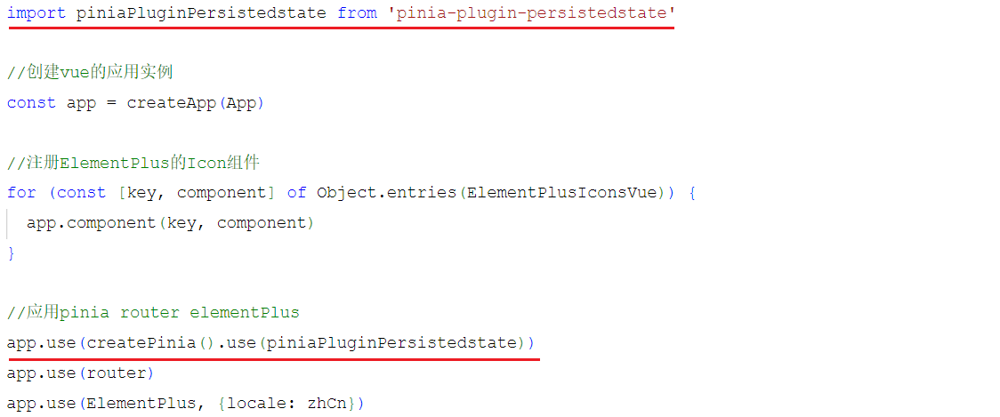 

```typescript
import piniaPluginPersistedstate from 'pinia-plugin-persistedstate'

app.use(createPinia().use(piniaPluginPersistedstate))
```


**2). 在定义 Store 时，指定Pinia持久化的参数。**

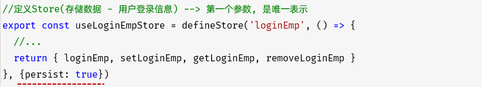 

```
{persist: true}
```


打开浏览器，测试：

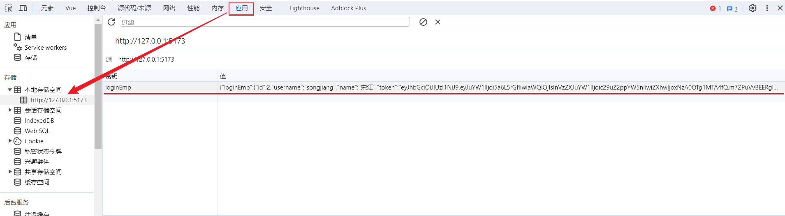 

测试完毕后，我们看到，Pinia已经将存储的数据，放在了浏览器的本地存储中，即使浏览器刷新，pinia中的数据依然存在。


### 3.4 退出登录

1). 为 `layout/index.vue` 组件中的 "退出登录" 按钮，绑定事件

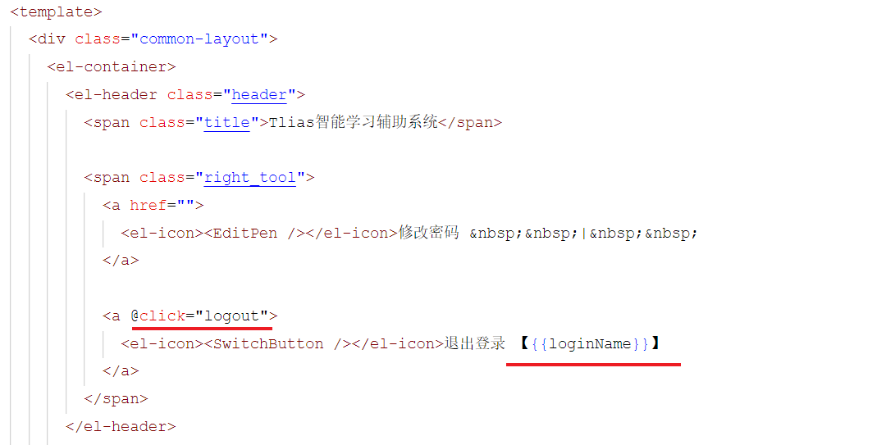 


2). 在 `<script> </script>` 中定义退出的逻辑

```html
<script lang="ts" setup>
  import { ref } from 'vue'
  import { ElMessage, ElMessageBox } from 'element-plus' 
  import router from '@/router'
  import { useLoginEmpStore } from '@/stores/loginEmp'
  
  const loginName = ref()
  	
  const loginStore = useLoginEmpStore();
  loginName.value = loginStore.getLoginEmp().name;
  
  //退出 
  const logout = () => {
    ElMessageBox.confirm('您确认退出登录吗?' , '退出登录', {confirmButtonText:'确认', cancelButtonText:'取消', type:'warning'})
    .then(async () => {
      loginStore.clearLoginEmp();
      router.push('/login')
      ElMessage.success('退出成功')
    }).catch(() => {
      ElMessage.info('取消退出')
    })
  }
</script>
```


打开浏览器测试效果：

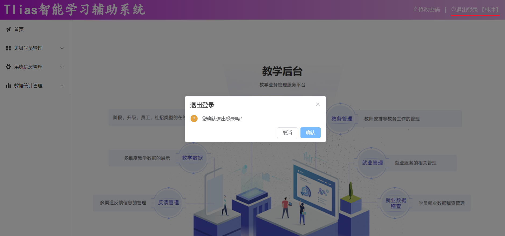 


## 4. 打包部署

到此呢，部门管理、员工管理、登录认证的功能，我们都已经完成了。 那接下来，我们就来说一下前端工程的打包部署。 前端项目最终开发完毕之后，是需要打包，然后部署在nginx服务器上运行的 。

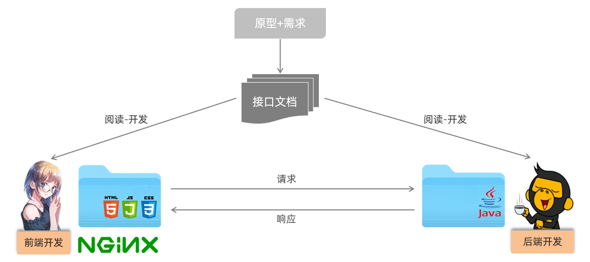 


### 4.1 打包

直接双击npm脚本中的 `build` 即可将项目打包，打包后的文件会出现在 `dist` 目录中。

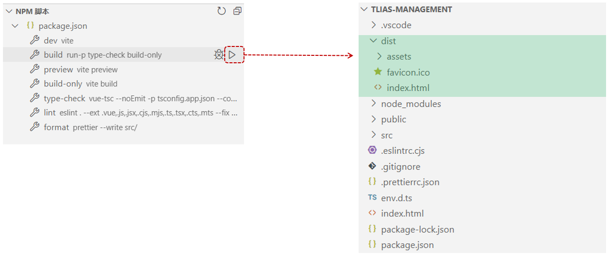 


### 4.2 部署

打包完成之后，就可以将打包后的项目，部署到 `nginx` 服务器上了，记得将nginx解压到一个没有中文不带空格的目录中 。

然后直接将 `dist` 目录中的内容，拷贝到nginx的解压目录中的 `html` 中即可。

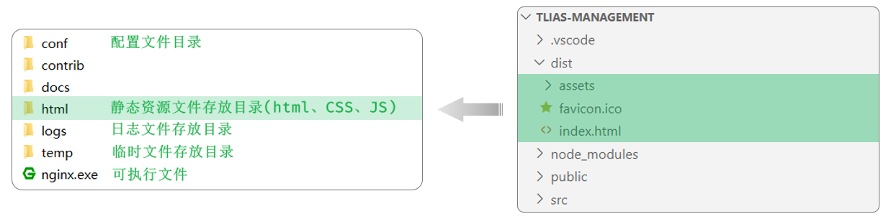 


然后，在nginx服务器的核心配置文件 `conf/nginx` 中，在  `http` 配置块里面 添加如下反向代理的配置：

```conf
server {
    listen       90;
    server_name  localhost;
    client_max_body_size 10m;

    location / {
        root   html;
        index  index.html index.htm;
        try_files $uri $uri/ /index.html;
    }
	
    location ^~ /api/ {
        rewrite ^/api/(.*)$ /$1 break;
        proxy_pass http://localhost:8080;
    }
	
    error_page   500 502 503 504  /50x.html;
    location = /50x.html {
    	root   html;
    }
}
```


然后就可以双击 `nginx.exe` 启动项目了。 访问 http://localhost:90

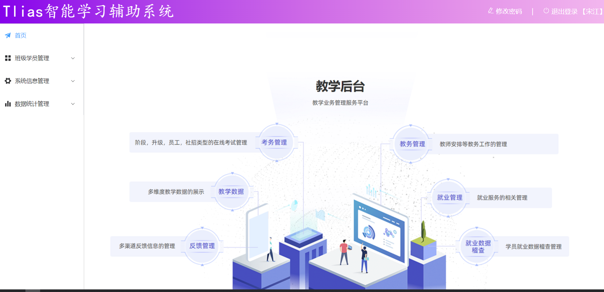


